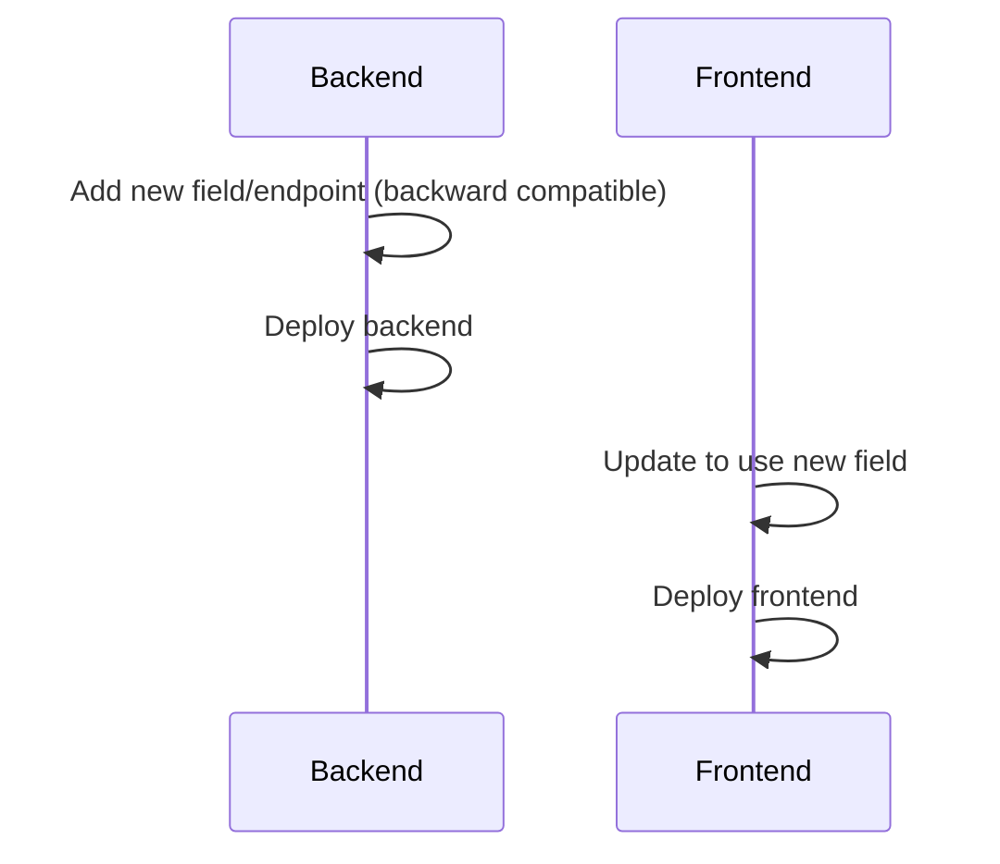
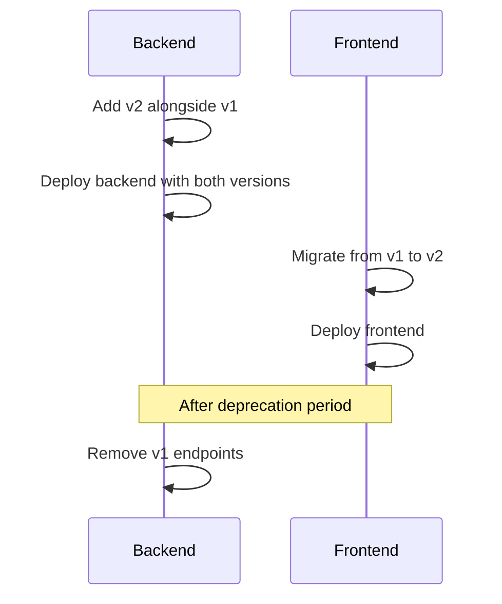

# Frontend/Backend API Coordination

Process for coordinating API changes between frontend and backend development.

## Overview

EZ Platform uses a **contract-first approach** where API contracts are defined before implementation. This ensures frontend and backend remain synchronized and reduces integration issues.

## API Contract Locations

| Component | Location |
|-----------|----------|
| Backend Controllers | `src/Services/*/Controllers/` |
| API Response Types | `src/Services/Shared/Models/` |
| Message Contracts | `src/Services/Shared/Messages/` |
| Frontend API Clients | `src/Frontend/src/services/*-api-client.ts` |
| Frontend Types | `src/Frontend/src/types/` |

## Change Process

### Step 1: Document the Change

When proposing an API change, create a GitHub issue or PR description with:

```markdown
## API Change Proposal

**Endpoint:** POST /api/v1/datasources
**Change:** Add optional `archiveSettings` field to request body
**Type:** Non-breaking (new optional field)

### Current Request
```json
{
  "name": "My Source",
  "connectionType": "ftp",
  "connectionSettings": { ... }
}
```

### Proposed Request
```json
{
  "name": "My Source",
  "connectionType": "ftp",
  "connectionSettings": { ... },
  "archiveSettings": {
    "enabled": true,
    "retentionDays": 30
  }
}
```

### Migration Notes
- Existing clients continue to work (field is optional)
- New clients can use archiveSettings immediately
```

### Step 2: Classify the Change

| Classification | Definition | Example |
|----------------|------------|---------|
| **Non-breaking** | Additive changes that don't affect existing clients | New optional field, new endpoint |
| **Breaking** | Changes that require client updates | Required field change, response structure change, endpoint removal |

### Step 3: Version Strategy

EZ Platform uses URL versioning: `/api/v1/...`

**Non-breaking changes:**
- Add to current version (`v1`)
- Deploy backend first, then frontend
- Both can deploy independently

**Breaking changes:**
1. Backend adds new version (`v2`) alongside old (`v1`)
2. Frontend migrates to `v2`
3. Old version (`v1`) removed after deprecation period
4. **Deprecation period: 2 releases minimum**

### Step 4: Implementation Order

**For non-breaking changes:**



**For breaking changes:**



## API Client Patterns

### TypeScript API Client Structure

```typescript
// src/Frontend/src/services/datasources-api-client.ts
import { DataSource, CreateDataSourceRequest, ApiResponse } from '../types';

const API_BASE_URL = import.meta.env.VITE_API_URL || '/api/v1';

export class DataSourcesApiClient {
  private async request<T>(
    endpoint: string,
    options: RequestInit = {}
  ): Promise<ApiResponse<T>> {
    const url = `${API_BASE_URL}/datasources${endpoint}`;

    const response = await fetch(url, {
      headers: {
        'Content-Type': 'application/json',
        'Accept': 'application/json',
        ...options.headers,
      },
      ...options,
    });

    return response.json();
  }

  async getAll(): Promise<ApiResponse<DataSource[]>> {
    return this.request('');
  }

  async create(data: CreateDataSourceRequest): Promise<ApiResponse<DataSource>> {
    return this.request('', {
      method: 'POST',
      body: JSON.stringify(data),
    });
  }

  async update(id: string, data: UpdateDataSourceRequest): Promise<ApiResponse<DataSource>> {
    return this.request(`/${id}`, {
      method: 'PUT',
      body: JSON.stringify(data),
    });
  }

  async delete(id: string): Promise<ApiResponse<void>> {
    return this.request(`/${id}`, {
      method: 'DELETE',
    });
  }
}

export const dataSourcesApiClient = new DataSourcesApiClient();
```

### Response Wrapper Interface

```typescript
// src/Frontend/src/types/api.ts
export interface ApiResponse<T> {
  isSuccess: boolean;
  data?: T;
  error?: {
    message: string;       // Hebrew message for display
    messageEnglish: string; // English message for logs
    code?: string;         // Error code for programmatic handling
  };
}
```

### Error Handling Pattern

```typescript
// In component or hook
const handleApiCall = async () => {
  const response = await dataSourcesApiClient.create(formData);

  if (response.isSuccess && response.data) {
    message.success(t('datasources.created'));
    return response.data;
  }

  // Display localized error to user
  message.error(response.error?.message || t('errors.unknown'));

  // Log English error for debugging
  console.error('API Error:', response.error?.messageEnglish);

  throw new Error(response.error?.messageEnglish);
};
```

## Communication Channels

| Channel | Purpose |
|---------|---------|
| GitHub Issues | API change proposals and discussion |
| PR Reviews | Cross-team review requirement for API changes |
| CHANGELOG.md | Document API changes per release |
| Slack/Teams | Real-time coordination during implementation |

## Checklist for API Changes

Use this checklist when making API changes:

### Planning
- [ ] Change documented in GitHub issue/PR
- [ ] Breaking/non-breaking classification determined
- [ ] Version strategy decided (v1 additive or v2 migration)
- [ ] Deprecation timeline set (if breaking)

### Backend Implementation
- [ ] Controller endpoint updated/added
- [ ] Request/Response models updated in `Shared/Models`
- [ ] API documentation updated (Swagger/OpenAPI)
- [ ] Unit tests added for new behavior
- [ ] Integration tests updated

### Frontend Implementation
- [ ] TypeScript types updated in `types/`
- [ ] API client updated in `services/*-api-client.ts`
- [ ] Components updated to use new API
- [ ] E2E tests updated if behavior changed

### Documentation
- [ ] CHANGELOG entry added
- [ ] API documentation updated
- [ ] Migration guide written (if breaking)

## Common Pitfalls

### 1. Undocumented Changes

**Problem:** API changes made without documentation lead to frontend/backend sync issues.

**Solution:** Always create an issue or PR description before implementing.

### 2. Missing Type Updates

**Problem:** Backend changes without corresponding frontend type updates cause runtime errors.

**Solution:** Update `src/Frontend/src/types/` whenever backend models change.

### 3. Skipping Deprecation

**Problem:** Removing old endpoints immediately breaks existing clients.

**Solution:** Always provide a deprecation period of at least 2 releases.

### 4. Inconsistent Naming

**Problem:** Different field names in backend vs frontend cause confusion.

**Solution:** Use identical field names across the stack. If different naming conventions are required (e.g., camelCase in JS, PascalCase in C#), configure serialization settings.

### 5. Missing Error Handling

**Problem:** Frontend assumes success without checking `isSuccess` flag.

**Solution:** Always check `isSuccess` before accessing `data`.

```typescript
// BAD
const data = response.data; // May be undefined

// GOOD
if (response.isSuccess && response.data) {
  const data = response.data;
}
```

## Example: Adding a New Field

### Scenario
Add `lastModifiedBy` field to DataSource response.

### Backend (C#)
```csharp
// src/Services/Shared/Models/DataSourceResponse.cs
public class DataSourceResponse
{
    public string Id { get; set; }
    public string Name { get; set; }
    // NEW: Add field
    public string LastModifiedBy { get; set; }
}
```

### Frontend (TypeScript)
```typescript
// src/Frontend/src/types/datasource.ts
export interface DataSource {
  id: string;
  name: string;
  // NEW: Add field
  lastModifiedBy?: string; // Optional for backward compatibility
}
```

### Result
- Existing frontend code continues to work
- New frontend code can display `lastModifiedBy`
- No version change needed (non-breaking)
