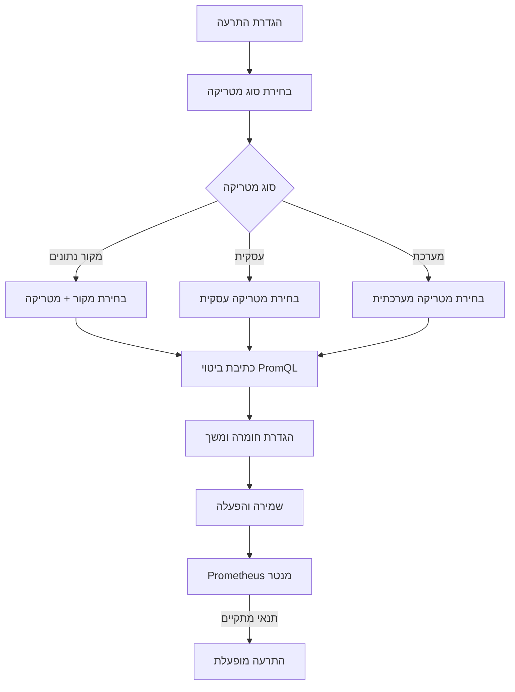

# ניהול התרעות

## סקירה כללית

מערכת ההתרעות של EZ Platform מאפשרת ליצור כללי התראה המבוססים על ביטויי PromQL שמנטרים את ביצועי המערכת והנתונים. כאשר תנאי ההתרעה מתקיים, המערכת מפעילה התראה בהתאם לחומרה שהוגדרה.

המערכת תומכת בשלושה סוגי התרעות:
- **התרעות מקור נתונים** (כחול) -- מטריקות הקשורות למקור נתונים ספציפי
- **התרעות עסקיות** (ירוק) -- מטריקות עסקיות גלובליות (רשומות מעובדות, קבצים, חביון)
- **התרעות מערכת** (כתום) -- מטריקות תשתית (CPU, זיכרון, דיסק, רשת, Kubernetes)

---

## תרשים זרימת התרעות

---

## דף ניהול ההתרעות

### טבלת ההתרעות

דף ההתרעות מציג טבלה עם כל ההתרעות המוגדרות במערכת:

| עמודה | תיאור |
|--------|--------|
| **שם** | שם ההתרעה עם תיאור מקוצר |
| **מטריקה** | שם המטריקה עם תגית צבעונית לפי סוג (כחול=מקור, ירוק=עסקית, כתום=מערכת) |
| **חומרה** | קריטי (אדום), אזהרה (כתום), מידע (כחול) |
| **ביטוי** | ביטוי PromQL של ההתרעה |
| **סטטוס** | מופעל / מושבת |
| **תוויות** | תגיות סינון (עד 3 מוצגות) |
| **פעולות** | עריכה, מחיקה |

### סינון וחיפוש

בחלק העליון של הדף מופיעים מסנני חיפוש מתקדמים:

- **חיפוש חופשי** -- חיפוש לפי שם, ביטוי, תיאור או שם מטריקה
- **סינון לפי חומרה** -- קריטי, אזהרה, מידע
- **סינון לפי סטטוס** -- מופעל, מושבת
- **סינון לפי קטגוריה** -- מסנן מדורג
- **סינון לפי מקור נתונים** -- מסנן מדורג
- **סינון לפי מטריקה** -- מסנן מדורג

---

## יצירת התרעה חדשה

### שלב 1: פתיחת טופס ההתרעה

לחץ על כפתור **"הוסף התרעה"** בפינה העליונה של דף ההתרעות. ייפתח חלון דיאלוג ליצירת התרעה חדשה.

### שלב 2: בחירת סוג המטריקה

בחר את סוג המטריקה עליה תבוסס ההתרעה:

#### מטריקות מקור נתונים (23 מטריקות)
מטריקות הקשורות למקור נתונים ספציפי. בחר קטגוריה ומקור נתונים לסינון.

#### מטריקות עסקיות (23 מטריקות ב-7 קטגוריות)

| קטגוריה | מטריקות עיקריות |
|----------|-----------------|
| **רשומות** | רשומות מעובדות, רשומות שגויות, רשומות שדולגו, רשומות פלט, dead letter |
| **קבצים** | קבצים מעובדים, קבצים ממתינים, גודל קובץ בבתים |
| **נפח** | בתים מעובדים, בתים בפלט |
| **משימות** | משימות פעילות, משימות שהושלמו, משימות שנכשלו, batches |
| **חביון** | משך עיבוד, חביון end-to-end, זמן המתנה בתור, חביון אימות |
| **אימות** | אחוז שגיאות אימות |
| **הודעות** | הודעות שנשלחו, הודעות שהתקבלו |

#### מטריקות מערכת (25 מטריקות ב-7 קטגוריות)

| קטגוריה | מטריקות עיקריות |
|----------|-----------------|
| **CPU** | שניות CPU תהליך, שימוש CPU תהליך, CPU צומת |
| **זיכרון** | זיכרון תהליך (resident/virtual), GC heap, זיכרון צומת |
| **דיסק** | מקום פנוי, גודל כולל |
| **רשת** | בתים שהתקבלו, בתים שנשלחו |
| **HTTP** | בקשות כולל, משך בקשה, בקשות בתהליך |
| **Kubernetes** | סטטוס Pod, replicas זמינים, CPU/זיכרון container |
| **בריאות** | up status, משך scrape |

### שלב 3: בניית ביטוי PromQL

ישנן שתי דרכים לבנות ביטוי PromQL:

#### שימוש בתבניות מוכנות (7 תבניות + מותאם אישית)

| תבנית | ביטוי | שימוש |
|--------|--------|--------|
| **קצב גבוה** | `rate({metric}[{duration}]) > {threshold}` | זיהוי קצב חריג של אירועים |
| **אחוז מעל סף** | `({numerator} / {denominator}) * 100 > {threshold}` | אחוז שגיאות, אחוז כשלים |
| **השוואת ערך** | `{metric} {operator} {threshold}` | ערך מעל/מתחת לסף |
| **זיהוי היעדרות** | `absent({metric}[{duration}])` | מטריקה שהפסיקה לדווח |
| **זיהוי קפיצה** | שינוי באחוזים לאורך זמן | קפיצה חריגה בערכים |
| **ממוצע מעל סף** | `avg_over_time({metric}[{duration}]) > {threshold}` | ממוצע חורג |
| **סכום חורג** | `sum(rate({metric}[{duration}])) > {threshold}` | סכום מצטבר חורג |
| **מותאם אישית** | ביטוי חופשי | כתיבת PromQL ידנית |

כל תבנית מציעה שדות פרמטרים דינמיים שממלאים אוטומטית את הביטוי הסופי.

#### כתיבה ידנית של PromQL

ניתן גם לכתוב ביטוי PromQL ישירות. המערכת מבצעת אימות בזמן אמת:
- בדיקת סוגריים מאוזנים
- אין רווחים כפולים
- קיום פונקציה או מטריקה תקינה

לחיצה על תגית שם מטריקה מוסיפה אותה אוטומטית לביטוי.

### שלב 4: הגדרת פרמטרים

| פרמטר | תיאור | ערכים |
|--------|--------|--------|
| **שם ההתרעה** | שם ייחודי (מתחיל באות, אלפאנומרי + קו תחתון) | טקסט |
| **תיאור** | הסבר על ההתרעה | טקסט חופשי |
| **חומרה** | רמת חומרה | קריטי (אדום), אזהרה (כתום), מידע (כחול) |
| **For (משך)** | כמה זמן התנאי צריך להתקיים לפני הפעלת ההתרעה | לדוגמה: `5m`, `1h` |
| **Keep Firing For** | כמה זמן להמשיך לדווח אחרי שהתנאי כבר לא מתקיים | לדוגמה: `10m` |
| **מופעל/מושבת** | האם ההתרעה פעילה | מתג |

### שלב 5: שמירה

לחץ **"שמור"** ליצירת ההתרעה. ההתרעה תתווסף לרשימה ותתחיל לפעול מיד (אם מופעלת).

---

## הגדרות גלובליות

לשונית **"הגדרות"** בדף ההתרעות מאפשרת לקבוע הגדרות גלובליות:

| הגדרה | תיאור |
|--------|--------|
| **נמעני דוא"ל** | כתובות דוא"ל לקבלת התראות (ברירת מחדל) |
| **Webhook URL (Slack)** | כתובת Webhook לשליחת התראות ל-Slack |
| **תדירות התראות** | מיידית, כל 5 דקות, כל 15 דקות, כל שעה |
| **הפעלה/השבתה גלובלית** | מתג להפעלה/השבתה של כל ההתרעות |
| **תבנית דוא"ל** | התאמה אישית של תבנית הודעת דוא"ל |
| **תבנית Slack** | התאמה אישית של תבנית הודעת Slack |

---

## יצירת מדד (Metric) חדש

בנוסף להתרעות, ניתן ליצור מדדים מותאמים אישית שמנטרים היבטים ספציפיים של מקורות הנתונים. מדדים אלו נרשמים ב-Prometheus וניתנים לצפייה ב-Grafana.

### אשף יצירת מדד

נווט אל אשף יצירת המדד דרך **כפתור "יצירת מדד"** בדף ההתרעות או ישירות דרך הנתיב `/metrics/create`.

האשף מנחה בארבעה שלבים:

| שלב | תיאור |
|------|--------|
| **מידע בסיסי** | שם המדד, תיאור, בחירת מקור נתונים |
| **ביטוי PromQL** | הגדרת ביטוי Prometheus לחישוב הערך. סוגי מדדים: Counter (מונה), Gauge (מד), Histogram (היסטוגרמה) |
| **התראות** | הגדרת כללי התראה אופציונליים על המדד (חומרה, סף, משך) |
| **סיכום** | סקירת כל ההגדרות לפני שמירה |

---

## טיפים

- **התחל מתבניות** -- השתמש בתבניות המוכנות במקום לכתוב PromQL מאפס
- **הגדר For** -- תמיד הגדר משך "For" (לפחות 5 דקות) כדי למנוע התרעות על תנודות רגעיות
- **חומרה נכונה** -- השתמש ב"קריטי" רק למצבים שדורשים תגובה מיידית, "אזהרה" לבעיות שצריך לטפל בהן, "מידע" לניטור שוטף
- **בדוק ביטויים** -- לפני שמירה, ודא שהביטוי מחזיר תוצאות ב-Grafana (http://localhost:3001)

