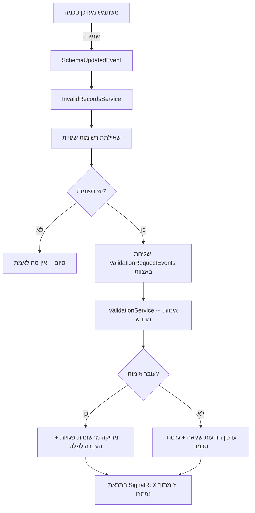

# אימות מחדש אוטומטי של רשומות שגויות

## סקירה כללית

כאשר סכמת אימות של מקור נתונים מתעדכנת, ייתכן שרשומות שנכשלו בעבר כבר עומדות בכללים החדשים. תכונת **אימות מחדש אוטומטי** מזהה את שינוי הסכמה ומבצעת בדיקה חוזרת של כל הרשומות הלא תקינות -- ללא התערבות ידנית.

רשומות שעוברות בהצלחה את האימות החדש מועברות אוטומטית לצינור העיבוד ונשלחות ליעדי הפלט. רשומות שעדיין נכשלות מתעדכנות עם הודעות שגיאה חדשות המשקפות את הסכמה המעודכנת.

**יתרונות עיקריים:**
- חיסכון בעבודה ידנית -- אין צורך לבדוק כל רשומה בנפרד
- שחרור רשומות תקועות אוטומטית לאחר תיקון הסכמה
- מעקב גרסאות סכמה לכל רשומה

---

## תרשים זרימה

---

## אימות מחדש אוטומטי -- איך זה עובד?

### הפעלה אוטומטית בעת שינוי סכמה

כאשר אתה שומר שינוי בסכמת JSON Schema של מקור נתונים, המערכת מפעילה אוטומטית אימות מחדש של כל הרשומות הלא תקינות של אותו מקור. **אין צורך באישור נוסף** -- התהליך מתחיל ברקע מיד עם השמירה.

### מגבלת קצב לנתונים גדולים

עבור מקורות עם מספר רב של רשומות שגויות (מעל 1,000), המערכת מבצעת את האימות באצוות:
- **100 רשומות** בכל אצווה
- **השהיה של שנייה** בין אצוות
- מניעת עומס על שירות האימות

### התראות בזמן אמת

בסיום האימות מחדש, מוצגת הודעת toast:

> **"X מתוך Y רשומות נפתרו על ידי שינוי הסכמה"**

ההודעה נעלמת לאחר כ-10 שניות. בנוסף, דשבורד הסטטיסטיקות בדף רשומות לא תקינות מתעדכן בזמן אמת דרך SignalR.

---

## כפתור "אמת מחדש הכל"

בנוסף לאימות האוטומטי, ניתן להפעיל אימות מחדש ידנית משני מיקומים:

### מיקום 1: דף רשומות לא תקינות

בכותרת הדף, לצד כפתורי "מחק הכל" ו"ייצא JSON", מופיע כפתור **"אמת מחדש הכל"**. לחיצה על הכפתור מציגה חלונית אישור עם מספר הרשומות שיאומתו מחדש.

הכפתור מכבד את המסננים הפעילים -- אם סיננת לפי מקור נתונים ספציפי, רק הרשומות המסוננות יאומתו מחדש.

### מיקום 2: לשונית סכמה בעריכת מקור נתונים

בלשונית Schema בטופס עריכת מקור נתונים, מופיע כפתור **"אמת מחדש הכל"** עם תג המראה את מספר הרשומות השגויות. הכפתור מכוון לאותו מקור נתונים בלבד.

:::info מתי להשתמש בכפתור הידני?
האימות האוטומטי מכסה 95% מהמקרים. הכפתור הידני מיועד למקרי קצה:
- רשומות שהגיעו **אחרי** שינוי הסכמה
- כשלים זמניים במהלך האימות האוטומטי
- רשומות שתוקנו ידנית ומוכנות לאימות חוזר
:::

---

## גרסאות סכמה

### מעקב אוטומטי אחר גרסאות

המערכת מנהלת מספר גרסה (SchemaVersion) לכל מקור נתונים. בכל פעם שהסכמה משתנה, מספר הגרסה עולה אוטומטית ב-1.

| שדה | תיאור |
|-----|--------|
| **SchemaVersion** | מספר גרסת הסכמה הנוכחית של מקור הנתונים. עולה אוטומטית בכל שינוי סכמה |
| **ValidatedWithSchemaVersion** | מספר גרסת הסכמה שנגדה אומתה הרשומה. מתעדכן בכל אימות מחדש |

### תגיות גרסה על רשומות

בדף רשומות לא תקינות, כל רשומה מציגה תגית המראה באיזו גרסת סכמה היא אומתה לאחרונה. תגית זו מאפשרת לזהות בקלות אילו רשומות עברו אימות מחדש ואילו טרם נבדקו מול הסכמה העדכנית.

---

## TTL -- שמירת רשומות שגויות

רשומות שגויות צורכות מקום במסד הנתונים. כדי למנוע הצטברות בלתי מבוקרת, המערכת מוחקת אוטומטית רשומות שפג תוקפן.

### ברירת מחדל גלובלית

**4 ימים** -- רשומות שגויות שלא טופלו תוך 4 ימים נמחקות אוטומטית.

### דריסה לפי מקור נתונים

בלשונית **מידע בסיסי** בטופס עריכת מקור נתונים, ניתן להגדיר ערך TTL שונה בשדה **"שמירת רשומות שגויות"** (InvalidRecordsTtlDays). ערך זה דורס את ברירת המחדל הגלובלית עבור אותו מקור בלבד.

| הגדרה | ערך |
|--------|------|
| ברירת מחדל גלובלית | 4 ימים |
| דריסה לפי מקור | אופציונלי, שדה מספרי בלשונית מידע בסיסי |
| תזמון מחיקה | יומי בשעה 03:00 UTC |
| סוג מחיקה | מחיקה קשיחה (hard delete) |

:::warning שימו לב
רשומות שנמחקו על ידי TTL אינן ניתנות לשחזור. ודאו שערך ה-TTL מספק מספיק זמן לטיפול ברשומות שגויות.
:::

---

## הורדת סכמה בפורמט YAML

בלשונית Schema בעורך מקור הנתונים, לצד כפתור "הורד JSON" הקיים, מופיע כפתור **"הורד YAML"**.

**שימושים:**
- ייצוא הסכמה לכלים חיצוניים שעובדים עם YAML
- שיתוף הגדרות סכמה עם צוותים אחרים
- גיבוי הגדרות הסכמה בפורמט קריא

הקובץ נשמר עם סיומת `.yaml` ואותו שם כמו קובץ ה-JSON. ההמרה מתבצעת בדפדפן ללא צורך בפנייה לשרת.

---

## פתרון בעיות

### שאלה: למה הרשומות שלי לא עברו אימות מחדש?

**בדוק את הנקודות הבאות:**
1. **רשומות מסומנות כ"התעלם"** -- רשומות שסומנו כ-Ignored לא נכללות באימות מחדש אוטומטי
2. **הסכמה לא באמת השתנתה** -- אם שמרת את הסכמה ללא שינוי בפועל, לא יופעל אימות מחדש
3. **בדוק את כפתור "אמת מחדש הכל"** -- נסה להפעיל אימות מחדש ידני מלשונית Schema

### שאלה: הרשומות עדיין נכשלות אחרי שינוי הסכמה

הסכמה החדשה עשויה לא לפתור את כל סוגי השגיאות. לדוגמה:
- שינוי pattern לא ישפיע על שגיאות מסוג `required`
- הוספת שדה ל-required לא תתקן שגיאות ערך (type mismatch)
- בדוק את הודעות השגיאה המעודכנות -- הן משקפות את הסכמה החדשה

### שאלה: מתי נמחקות רשומות שפג תוקפן?

משימת הניקוי רצה **יומית בשעה 03:00 UTC**. רשומות שעברו את תקופת ה-TTL שלהן (ברירת מחדל: 4 ימים, או הערך שהוגדר למקור הנתונים) נמחקות באופן קבוע.

### שאלה: כפתור "אמת מחדש הכל" לא מופיע בלשונית סכמה

הכפתור מופיע רק כאשר קיימות רשומות שגויות למקור הנתונים הנוכחי. אם אין רשומות שגויות, אין צורך באימות מחדש.

