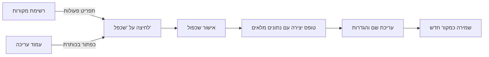

# שכפול מקור נתונים

## סקירה כללית

תכונת השכפול מאפשרת ליצור עותק מלא של מקור נתונים קיים בלחיצה אחת.
במקום להגדיר מאפס מקור נתונים חדש עם הגדרות דומות, ניתן לשכפל מקור קיים ולערוך רק את השדות הרלוונטיים.
זה שימושי במיוחד כאשר יש צורך ליצור מספר מקורות עם הגדרות חיבור דומות, סכמות זהות, או תצורות ארכיון משותפות.

ניתן להפעיל שכפול משני מקומות במערכת: מתפריט הפעולות בדף רשימת המקורות, או מכפתור השכפול בדף העריכה.

---

## תרשים זרימה

---

## שכפול מדף הרשימה

### שלב 1: ניווט לרשימת מקורות הנתונים

היכנסו לדף **מקורות נתונים** דרך תפריט הניווט הראשי. בדף זה תוכלו לראות את כל המקורות המוגדרים במערכת בתצוגת טבלה.

### שלב 2: בחירת מקור לשכפול

אתרו את מקור הנתונים שברצונכם לשכפל בטבלה. ניתן להשתמש בחיפוש או במסננים לאיתור מהיר.

### שלב 3: פתיחת תפריט הפעולות

לחצו על אייקון שלוש הנקודות (&#8230;) בשורה של המקור הרצוי כדי לפתוח את תפריט הפעולות.

### שלב 4: בחירת "שכפל"

מתפריט הפעולות, בחרו באפשרות **"שכפל"**. תופיע תיבת אישור.

### שלב 5: אישור השכפול

בתיבת האישור יופיע שם המקור שעומד להישכפל, יחד עם הערה שהתזמון יושבת בעותק החדש. לחצו **"שכפל"** לאישור.

### שלב 6: עריכת העותק החדש

טופס יצירת מקור חדש ייפתח עם כל השדות מלאים מהמקור המקורי. השם ישתנה אוטומטית ל-**"העתק של [שם מקורי]"**. ערכו את השדות הנדרשים ושמרו.

---

## שכפול מדף העריכה

### שלב 1: פתיחת מקור קיים

פתחו מקור נתונים קיים במצב עריכה על ידי לחיצה עליו ברשימה.

### שלב 2: לחיצה על כפתור "שכפל"

בכותרת דף העריכה, לחצו על הכפתור **"שכפל"**. תופיע אותה תיבת אישור כמו בדף הרשימה.

### שלב 3: אישור ועריכה

אשרו את השכפול. טופס יצירה חדש ייפתח עם כל הנתונים מהמקור המקורי, בדיוק כמו בתהליך מדף הרשימה.

---

## מה נשמר בשכפול?

הטבלה הבאה מפרטת מה מועתק ומה משתנה בעת שכפול מקור נתונים:

| הגדרה | התנהגות |
|--------|---------|
| **שם** | משתנה ל-"העתק של [שם מקורי]" |
| **סכמה** | מועתקת במלואה |
| **הגדרות חיבור** | מועתקות (שרת, נתיב, אישורים) |
| **הגדרות ארכיון** | מועתקות (פורמט, סיסמה, נתיב פנימי) |
| **יעדי פלט** | מועתקים עם מזהים ייחודיים חדשים |
| **תזמון** | מועתק אך **מושבת** |
| **אחוז שלמות** | מחושב מחדש בטופס החדש |

---

## טיפים

- **בדקו את יעדי הפלט** לאחר שכפול -- ייתכן שתרצו לשנות את היעד כדי להימנע מכתיבה כפולה לאותו מיקום.
- **העותק עצמאי לחלוטין** -- שינויים במקור המקורי לא ישפיעו על העותק, ולהיפך.
- **שנו את השם** לפני השמירה כדי למנוע בלבול בין מקורות דומים.

