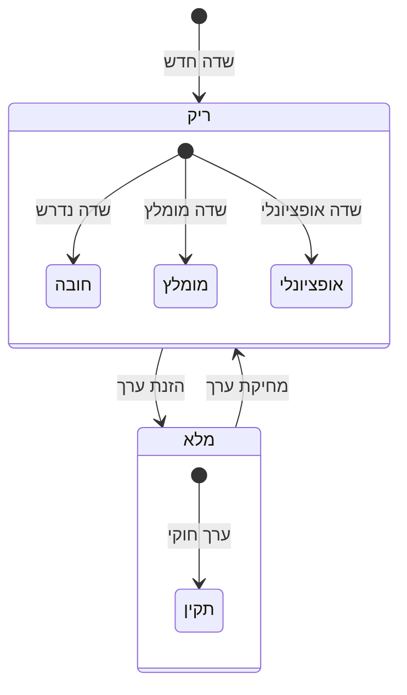

# רשימת שלמות מקור נתונים

## סקירה כללית

מערכת השלמות של EZ Platform עוקבת בזמן אמת אחר מילוי כל שדות הטופס בעת יצירה או עריכה של מקור נתונים. המערכת מחלקת את השדות לשלוש רמות עדיפות:

- **חובה** (אדום) -- שדות שחייבים להיות מלאים כדי שמקור הנתונים יוכל לפעול
- **מומלץ** (כתום) -- שדות שמומלץ למלא לתפעול מיטבי
- **אופציונלי** (אפור) -- שדות נוספים שאינם משפיעים על הפעלת המקור

פאנל השלמות מופיע בצד ימין של טופס היצירה והעריכה, ומציג טבעת התקדמות עם אחוז כללי ופירוט לפי לשונית.

---

## תרשים מצבי שדה

התרשים הבא מציג את מעברי המצב של כל שדה בטופס:

כאשר שדה ריק, הוא מסווג לפי רמת העדיפות שלו. ברגע שמוזן ערך חוקי, השדה עובר למצב "תקין" ונספר באחוז השלמות.

---

## צבעי גבולות שדות

כל שדה בטופס מקבל צבע גבול המציין את מצבו הנוכחי:

| צבע | שם | משמעות | דוגמה |
|------|------|---------|--------|
| 🔴 גבול אדום | חובה - ריק | שדה נדרש שטרם מולא | שם, סכמה |
| 🟢 גבול ירוק | מלא - תקין | שדה שמכיל ערך חוקי | שם שמולא |
| 🟠 גבול כתום | מומלץ - ריק | שדה מומלץ שטרם מולא | תיאור, תזמון |
| ⚪ גבול אפור | אופציונלי - ריק | שדה אופציונלי, ניתן להשאיר ריק | הערות, התראות |

צבעי הגבולות מתעדכנים באופן מיידי תוך כדי הקלדה -- אין צורך לשמור את הטופס כדי לראות את השינוי.

---

## פאנל השלמות

### טבעת התקדמות

בראש הפאנל מוצגת טבעת התקדמות עם אחוז השלמות הכולל. האחוז מחושב על סמך שדות החובה והמומלצים יחד. הטבעת משנה צבע בהתאם לאחוז:

- **ירוק** -- מעל 80% השלמה
- **כתום** -- בין 50% ל-80%
- **אדום** -- מתחת ל-50%

### פירוט לפי לשונית

מתחת לטבעת מוצגת רשימת כל הלשוניות עם סטטוס השלמה לכל אחת:

- **מידע בסיסי** -- שם, ספק, קטגוריה (חובה)
- **חיבור** -- סוג חיבור, שרת, נתיב (חובה)
- **הגדרות קובץ** -- סוג קובץ, קידוד (חובה)
- **סכמה** -- סכמת JSON עם שדות מוגדרים (חובה)
- **תזמון** -- תדירות, ביטוי Cron (מומלץ)
- **פלט** -- יעדי פלט מוגדרים (מומלץ)
- **אימות** -- הגדרות אימות (אופציונלי)
- **התראות** -- הגדרות התראות (אופציונלי)

לחיצה על פריט ברשימה מנווטת ישירות ללשונית המתאימה בטופס.

### פאנל שדות חסרים

בתחתית הפאנל מוצגת רשימת השדות שדורשים תשומת לב, ממוינת לפי עדיפות -- שדות חובה מופיעים ראשונים, ואחריהם שדות מומלצים. כל שדה מוצג עם שם הלשונית שאליה הוא שייך.

---

## מחוון שלמות ברשימה

בדף רשימת מקורות הנתונים, כל מקור מציג טבעת התקדמות מוקטנת. צבע הטבעת משקף את רמת השלמות:

- **ירוק** -- מעל 80% (מוכן להפעלה)
- **כתום** -- 50%-80% (דורש השלמה)
- **אדום** -- מתחת ל-50% (חסרים שדות קריטיים)

מחוון זה מאפשר לזהות במבט מהיר אילו מקורות נתונים דורשים תשומת לב נוספת.

---

## השבתה אוטומטית

מקורות נתונים שלא עומדים בדרישות המינימום (כל שדות החובה מלאים) מושבתים אוטומטית. מתג ההפעלה/השבתה ברשימה מושבת ומוצג באפור, עם הסבר בתפריט מרחף (tooltip) המפרט אילו שדות חסרים.

ברגע שכל שדות החובה מלאים, המתג הופך לפעיל ומאפשר הפעלת מקור הנתונים. מנגנון זה מונע הפעלת צינורות עיבוד עם הגדרות חסרות, ומבטיח שכל מקור נתונים פעיל מוגדר כראוי.

אם מקור נתונים פעיל נערך ושדה חובה נמחק, המערכת תשבית אותו אוטומטית ותציג הודעה מתאימה.

---

## טיפים לשימוש

:::tip טיפים להשלמה מהירה

1. **התחילו משדות חובה** -- מלאו קודם את השדות עם גבול אדום לפני שדות מומלצים
2. **השתמשו בפאנל שדות חסרים** -- לחצו על שדה חסר כדי לנווט ישירות ללשונית הרלוונטית
3. **אחוז השלמות כולל גם שדות מומלצים** -- שדות מומלצים (כתום) נספרים באחוז הכולל
4. **חישוב בזמן אמת** -- השלמות מתעדכנת מיידית תוך כדי הקלדה, ללא צורך בשמירה
5. **ייבוא מקובץ** -- פעולת ייבוא מקובץ ממלאת אוטומטית שדות רבים ומעלה את אחוז השלמות במהירות

:::

