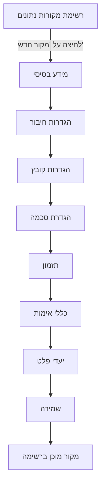

# יצירת מקור נתונים חדש

מדריך זה מפרט את תהליך יצירת מקור נתונים חדש באופן ידני, שלב אחר שלב דרך כל לשוניות הטופס.

:::tip דרך מהירה יותר
אם יש לך קובץ דוגמה, שקול להשתמש ב[ייבוא מקובץ](./import-from-file) שממלא אוטומטית שדות רבים.
ניתן גם [לשכפל מקור קיים](./clone-datasource) אם יש מקור עם הגדרות דומות.
:::

---

## תרשים זרימת יצירה

---

## שלב 1: מידע בסיסי

1. לחץ על "מקורות נתונים" בתפריט הצדדי
2. לחץ על כפתור "הוסף מקור נתונים"
3. מלא פרטים בסיסיים:

| שדה | חובה | תיאור |
|-----|------|--------|
| **שם מקור הנתונים** | כן | שם מזהה ייחודי (2-100 תווים). לדוגמה: "נתוני מכירות חודשיים" |
| **שם הספק** | כן | שם הגוף המספק את הנתונים (2-50 תווים). לדוגמה: "חברת ABC" |
| **קטגוריה** | כן | בחר קטגוריה מהרשימה (מכירות, כספים, מלאי וכו') |
| **תקופת שמירה** | לא | כמה ימים לשמור קבצים מעובדים (ברירת מחדל: 30 יום) |
| **שמירת רשומות שגויות (InvalidRecordsTtlDays)** | לא | כמה ימים לשמור רשומות שגויות לפני מחיקה אוטומטית. ברירת מחדל גלובלית: 4 ימים. ערך זה דורס את ברירת המחדל עבור מקור זה בלבד. ראה [אימות מחדש אוטומטי](./auto-revalidation) לפרטים |
| **תיאור** | לא | הסבר מפורט על מקור הנתונים (עד 500 תווים) |
| **סטטוס** | כן | פעיל / לא פעיל. רק מקורות פעילים מעובדים |

4. לחץ "המשך" למעבר לכרטיסייה הבאה

---

## שלב 2: הגדרות חיבור

בחר סוג חיבור:

### תיקיה מקומית (Local)
- נתיב מלא לתיקיה (לדוגמה: `/data/uploads`)
- המערכת תסרוק קבצים חדשים בתיקייה

### SFTP
- כתובת שרת (לדוגמה: `sftp.example.com`)
- שם משתמש וסיסמה
- נתיב בשרת
- יציאה (ברירת מחדל: 22)

### FTP
- כתובת שרת
- שם משתמש וסיסמה (אופציונלי)
- נתיב בשרת
- יציאה (ברירת מחדל: 21)

### HTTP API
- כתובת URL (לדוגמה: `https://api.example.com/data`)
- Headers (אופציונלי)
- שיטת אימות (API Key, Bearer Token)

### Kafka
- כתובת Broker (לדוגמה: `kafka.example.com:9092`)
- שם Topic
- Consumer Group
- פרוטוקול אבטחה (PLAINTEXT, SASL_SSL, וכו')

### NAS/NFS
- בחר התקן NAS מהרשימה הנפתחת
- ציין נתיב בתוך התקן ה-NAS
- ראה סעיף "ניהול התקני NAS" בפרק [ניטור מערכת](./monitoring) להגדרת התקנים

### S3/MinIO
- Endpoint URL
- Access Key ו-Secret Key
- שם Bucket
- Region (אופציונלי)

### SMB/CIFS
- כתובת שרת (לדוגמה: `\\server\share`)
- שם משתמש וסיסמה
- Domain (אופציונלי)

### בדיקת חיבור
- לחץ "בדוק חיבור" לאימות שהחיבור עובד
- סטטוס יופיע: מוצלח או נכשל עם הודעת שגיאה

---

## שלב 3: הגדרות קובץ

| הגדרה | תיאור |
|--------|--------|
| **פורמט קובץ** | CSV, JSON, XML, Excel. המערכת תמיר אוטומטית לפורמט אחיד |
| **מפריד (CSV)** | פסיק, נקודה-פסיק, Tab, צינור |
| **קידוד** | UTF-8 (מומלץ), Windows-1255, ISO-8859-8 |
| **שורת כותרת** | האם השורה הראשונה מכילה שמות עמודות |
| **תבנית שם קובץ** | Regex לסינון קבצים (לדוגמה: `sales-.*\.csv`). רק קבצים התואמים יעובדו |
| **גודל מקסימלי** | הגבלת גודל קובץ (MB). ברירת מחדל: 100MB |

### הגדרות ארכיון (אופציונלי)

אם מקור הנתונים מכיל ארכיונים:

1. **סמן** את האפשרות "מקור מכיל ארכיונים"
2. **בחר סוג ארכיון:** אוטומטי, ZIP, TAR.GZ, RAR, 7Z
3. **תבנית חילוץ** (אופציונלי): glob לסינון קבצים (לדוגמה: `*.csv`)
4. **סיסמת ארכיון** (אופציונלי): אם הארכיון מוגן בסיסמה
5. **ארכיונים מקוננים**: סמן אם יש ארכיונים בתוך ארכיונים

---

## שלב 4: הגדרת סכמה (לשונית Schema)

לשונית הסכמה מאפשרת להגדיר את מבנה הנתונים הצפוי. המערכת משתמשת בתקן JSON Schema 2020-12.

### אפשרויות הגדרה

#### בחירת סכמה קיימת
בחר סכמה שהוגדרה בעבר מהרשימה הנפתחת. כל סכמה מציגה שם, תיאור ומספר שדות.

#### שימוש בתבנית מוכנה
המערכת מציעה תבניות סכמה מוכנות:

| תבנית | שדות עיקריים |
|--------|-------------|
| **לקוח ישראלי** | ת"ז (9 ספרות), טלפון, כתובת, שם |
| **עסקה פיננסית** | סכום, תאריך, סוג עסקה, מטבע |
| **קטלוג מוצרים** | שם, מחיר, מלאי, קטגוריה |
| **רשומת עובד** | שם, תפקיד, משכורת, תאריך התחלה |
| **חשבונית מע"מ** | מספר, תאריך, סכום, מע"מ, ספק |

#### יצירת סכמה חדשה בעורך Monaco

עורך הסכמה מבוסס Monaco (אותו עורך כמו VS Code) ומאפשר עריכת JSON Schema ישירות:

**הוספת שדה:**
1. הגדר **שם שדה** באנגלית (lowercase, underscores): `customer_id`
2. הגדר **שם תצוגה** בעברית: "מספר לקוח"
3. בחר **סוג נתון**: string, integer, number, boolean, array, object

**אילוצי אימות לכל סוג:**

| סוג | אילוצים זמינים |
|------|----------------|
| **string** | minLength, maxLength, pattern (Regex), format (email/uri/date/date-time/uuid/ipv4), enum |
| **integer / number** | minimum, maximum, exclusiveMinimum, exclusiveMaximum, multipleOf |
| **boolean** | ערכים: true/false בלבד |
| **array** | minItems, maxItems, uniqueItems, items (סכמה של כל פריט) |
| **object** | properties, required, additionalProperties |

**הגדרת שדות חובה:**
הוסף שמות שדות למערך `required` כדי לדרוש את הופעתם בכל רשומה.

**עזרת Regex:**
עורך הסכמה כולל כלי עזרה לביטויי Regex עם תבניות נפוצות:

| תבנית | Regex | דוגמה |
|--------|-------|--------|
| ת"ז ישראלית | `^\d{9}$` | 123456789 |
| טלפון ישראלי | `^0\d{1,2}-?\d{7}$` | 03-1234567 |
| דוא"ל | `^[\w.-]+@[\w.-]+\.\w+$` | user@example.com |
| תאריך DD/MM/YYYY | `^\d{2}/\d{2}/\d{4}$` | 25/03/2026 |

#### ללא סכמה
ניתן לדלג על הגדרת סכמה. בצב זה המערכת תקבל את כל הנתונים ללא אימות. **לא מומלץ לסביבת ייצור** -- ללא סכמה, רשומות שגויות לא יזוהו.

---

## שלב 5: תזמון

### אפשרויות תזמון

| אפשרות | תיאור |
|---------|--------|
| **ידני** | הפעלה ידנית בלבד (כפתור ברק ברשימה) |
| **כל דקה** | סריקה כל דקה |
| **כל 5 דקות** | סריקה כל 5 דקות |
| **כל 15 דקות** | סריקה כל 15 דקות |
| **כל 30 דקות** | סריקה כל חצי שעה |
| **כל שעה** | סריקה כל שעה |
| **יומי** | פעם ביום בשעה קבועה |
| **שבועי** | פעם בשבוע ביום ובשעה קבועים |
| **חודשי** | פעם בחודש |
| **Cron מותאם** | ביטוי Cron חופשי (לדוגמה: `0 9 * * 1-5` -- כל יום עבודה ב-9:00) |

### חלון זמן
ניתן להגדיר טווח שעות לעיבוד (לדוגמה: 08:00-18:00). מחוץ לחלון, המערכת לא תעבד קבצים.

ראה פרק [תזמון ומעקב](./scheduling) לפירוט מלא על ביטויי Cron ומעקב.

---

## שלב 6: כללי אימות

| הגדרה | תיאור |
|--------|--------|
| **המשך עיבוד** | רשומות תקינות עוברות הלאה, שגויות נשלחות ל[רשומות לא תקינות](./invalid-records). **מומלץ לרוב המקרים** |
| **הפסק עיבוד** | כל שגיאת אימות עוצרת את העיבוד. מתאים לנתונים קריטיים שבהם כל שגיאה מצביעה על בעיה מערכתית |
| **אחוז מקסימלי** | הגדר סף (לדוגמה: 10%). אם אחוז השגיאות גבוה מהסף, העיבוד נעצר. מאזן בין סובלנות לשגיאות לבין זיהוי בעיות מערכתיות |

---

## שלב 7: התראות

**אירועים שניתן לקבל עליהם התראה:**

| אירוע | תיאור |
|--------|--------|
| **קובץ חדש התגלה** | המערכת זיהתה קובץ חדש במקור |
| **אימות הושלם** | הקובץ עבר אימות בהצלחה |
| **שגיאות באימות** | נמצאו רשומות שלא עברו אימות |
| **שגיאות בעיבוד** | שגיאה טכנית בעיבוד הקובץ |
| **פלט הושלם** | הנתונים נשלחו בהצלחה ליעד |

**ערוצי התראה:**
- **UI notifications** -- פעיל, הודעות בממשק המשתמש
- **Email** -- בגרסאות עתידיות
- **Webhook** -- בגרסאות עתידיות

ראה גם פרק [ניהול התרעות](./alerts) להגדרת התרעות מתקדמות מבוססות PromQL.

---

## שלב 8: יעדי פלט

**הגדר לאן לשלוח נתונים מעובדים.** ניתן להגדיר מספר יעדים -- כל היעדים מקבלים את אותם הנתונים.

### סוגי יעדים

#### תיקייה (Folder)

| שדה | תיאור |
|-----|--------|
| **נתיב יעד** | נתיב מלא לתיקייה (לדוגמה: `/output/processed`) |
| **פורמט** | JSON, CSV, XML |
| **תבנית שם קובץ** | שם עם placeholders: `{date}`, `{source}`, `{original}` |

#### Kafka Topic

| שדה | תיאור |
|-----|--------|
| **שרת Kafka** | בחר שרת Kafka מ[הגדרות מערכת](./system-settings) |
| **שם Topic** | שם ה-Topic לפרסום |
| **פורמט הודעה** | JSON |
| **כולל Invalid Records** | האם לכלול גם רשומות שנכשלו באימות |

#### NAS/NFS

| שדה | תיאור |
|-----|--------|
| **התקן NAS** | בחר מרשימת ההתקנים שהוגדרו ב[הגדרות מערכת](./system-settings) |
| **נתיב יעד** | נתיב בתוך התקן ה-NAS |

**יעדים מרובים:** לחץ **"הוסף יעד"** להוספת יעד נוסף. ניתן להפעיל/לבטל כל יעד בנפרד.

---

## שלב 9: שמירה

1. בדוק שכל השדות הנדרשים מולאו -- [פאנל השלמות](./completeness) מציג אחוז השלמה ושדות חסרים
2. לחץ **"צור"** (או **"עדכן"** במצב עריכה)
3. מקור הנתונים יופיע ברשימה
4. המערכת תתחיל לעבד קבצים לפי התזמון שהוגדר

---

## טיפים

- **התחל מייבוא מקובץ** -- [ייבוא מקובץ](./import-from-file) ממלא אוטומטית שם, סכמה, פורמט והגדרות ארכיון
- **בדוק חיבור לפני שמירה** -- תמיד לחץ "בדוק חיבור" בלשונית חיבור לפני שמירת המקור
- **התחל בתזמון ידני** -- צור מקור חדש עם תזמון ידני, בדוק שהכל עובד, ורק אז הפעל תזמון אוטומטי
- **עקוב אחר שלמות** -- [פאנל השלמות](./completeness) בצד ימין מראה בדיוק מה חסר ובאיזו עדיפות
- **הגדר קטגוריות מראש** -- ודא שהקטגוריות הנדרשות קיימות ב[הגדרות מערכת](./system-settings) לפני יצירת מקורות

