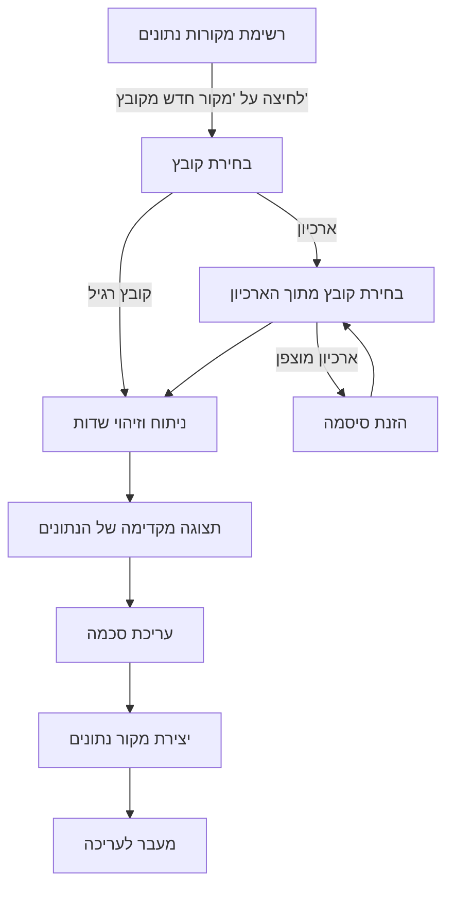
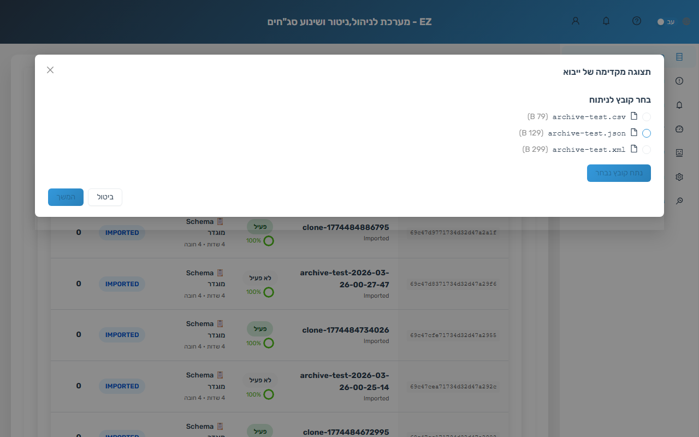
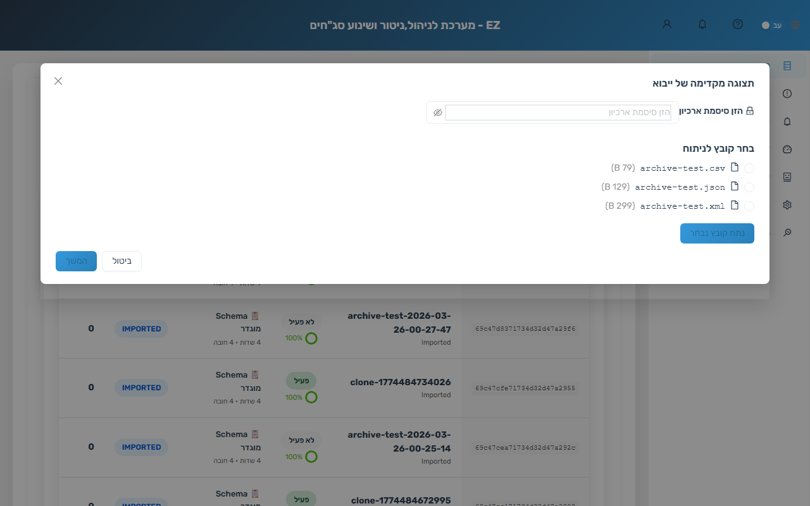
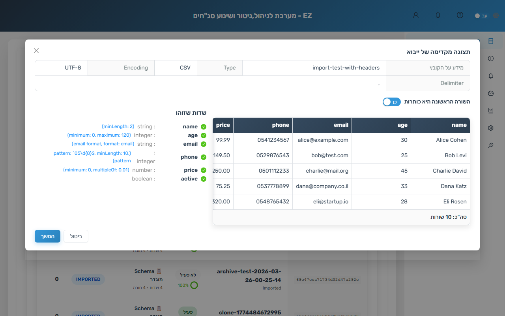
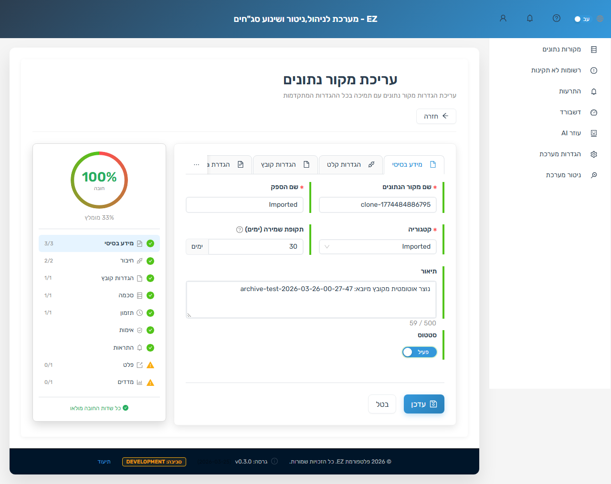

# ייבוא מקור נתונים מקובץ

## סקירה כללית

תכונת הייבוא מקובץ מאפשרת ליצור מקור נתונים חדש באופן אוטומטי על סמך קובץ דוגמה. במקום להגדיר ידנית את כל הפרמטרים -- שם, סכמה, פורמט, מפריד -- ניתן להעלות קובץ נתונים והמערכת תנתח אותו, תזהה את מבנה השדות, ותיצור מקור נתונים מוכן לעבודה.

**פורמטים נתמכים:** CSV, JSON, XML, Excel (XLSX/XLS)

**ארכיונים נתמכים:** ZIP, TAR.GZ/TGZ, 7Z, RAR -- כולל ארכיונים מוצפנים בסיסמה

---

## תרשים זרימת הייבוא

---

## שלבי העבודה

### שלב 1: פתיחת ייבוא מקובץ

נווט לדף **מקורות נתונים** בתפריט הראשי. בחלק העליון של הדף, לצד כפתור "מקור נתונים חדש", מופיע כפתור טורקיז בשם **"מקור נתונים חדש מקובץ"**. לחיצה על הכפתור תפתח חלון לבחירת קובץ מהמחשב.

ניתן גם לגרור קובץ ישירות לאזור הכפתור (drag & drop).

### שלב 2: בחירת קובץ

בחר קובץ נתונים מהמחשב. המערכת מקבלת את הפורמטים הבאים:

- **קבצי נתונים:** CSV, JSON, XML, Excel (.xlsx, .xls)
- **ארכיונים:** ZIP, TAR.GZ, TGZ, 7Z, RAR

גודל מקסימלי: **50MB**. קבצים מעל 10MB עשויים לדרוש זמן ניתוח ארוך יותר.

**אם נבחר קובץ ארכיון** -- המערכת תפתח דפדפן ארכיון המציג את כל קבצי הנתונים שבתוכו. בחר את הקובץ הרצוי מתוך הרשימה.

### שלב 3: ארכיון מוצפן (במידת הצורך)

אם הארכיון מוגן בסיסמה, המערכת תציג שדה להזנת הסיסמה. הזן את הסיסמה ולחץ **"נתח קובץ נבחר"** כדי לפתוח את הארכיון ולהמשיך בתהליך. הסיסמה נשמרת אוטומטית בהגדרות מקור הנתונים שייווצר.

### שלב 4: תצוגה מקדימה וזיהוי שדות

לאחר ניתוח הקובץ, מוצגת **תצוגה מקדימה** של הנתונים בטבלה. המערכת מבצעת זיהוי אוטומטי של:

- **סוגי שדות:** integer, number, boolean, date, string
- **תבניות חכמות:** דוא"ל, מספר טלפון, פורמטים של תאריך
- **מפריד CSV:** זיהוי אוטומטי של פסיק, נקודה-פסיק, Tab ועוד
- **כותרות:** אם קובץ CSV אינו מכיל כותרות, נוצרים שמות סינתטיים (field_1, field_2...)

בחלק העליון של חלון התצוגה מוצג מידע על הקובץ: שם, גודל, מספר שורות ומספר שדות שזוהו.

### שלב 5: עריכת סכמה

המערכת מייצרת סכמת JSON Schema 2020-12 באופן אוטומטי על סמך הנתונים שזוהו. הסכמה מוצגת בעורך Monaco ומאפשרת עריכה ידנית:

- שינוי סוגי שדות (למשל, שדה שזוהה כ-string אך הוא למעשה date)
- הוספת אילוצים: pattern, minimum, maximum, enum
- הגדרת שדות חובה (required)
- הוספת תיאורים לשדות

### שלב 6: יצירה אוטומטית של מקור נתונים

לחץ על **"המשך"** כדי ליצור את מקור הנתונים. המערכת ממלאת אוטומטית:

- **שם מקור הנתונים** -- על פי שם הקובץ שיובא
- **סכמה** -- הסכמה שנוצרה/נערכה בשלב הקודם
- **הגדרות פורמט** -- סוג הקובץ, מפריד (ל-CSV), כותרות
- **הגדרות ארכיון** (אם רלוונטי) -- פורמט ארכיון, סיסמה, נתיב פנימי

לאחר היצירה, המערכת פותחת אוטומטית את טופס העריכה של מקור הנתונים החדש.

### שלב 7: השלמת ההגדרות

בטופס העריכה, השלם את השדות הנותרים:

- **לשונית חיבור:** הגדר שרת מקור (FTP, SFTP, HTTP, Local, NAS) ונתיב לקבצים
- **לשונית תזמון:** הגדר תדירות סריקה ולוח זמנים
- **לשונית פלט:** הגדר יעדי פלט (תיקייה, Kafka topic)

פאנל **השלמה** בצד ימין מציג את אחוז ההשלמה ומסמן שדות חובה חסרים.

---

## פורמטים נתמכים

### קבצי נתונים

| פורמט | סיומות | הערות |
|--------|---------|-------|
| CSV | .csv | עם/ללא כותרות, זיהוי אוטומטי של מפריד (פסיק, נקודה-פסיק, Tab) |
| JSON | .json | אובייקטים ומערכים -- מבנים שטוחים ומקוננים |
| XML | .xml | מבנים שטוחים ומקוננים, אלמנטים ותכונות |
| Excel | .xlsx, .xls | הגיליון הראשון מעובד, זיהוי כותרות אוטומטי |

### ארכיונים

| פורמט | סיומות | הצפנה |
|--------|---------|-------|
| ZIP | .zip | נתמכת -- הזנת סיסמה בממשק |
| TAR.GZ | .tar.gz, .tgz | לא נתמכת (ארכיון ללא הצפנה) |
| 7-Zip | .7z | נתמכת -- הזנת סיסמה בממשק |
| RAR | .rar | נתמכת -- הזנת סיסמה בממשק |

---

## טיפים ושיטות עבודה מומלצות

- **השתמש בקובץ דוגמה מייצג** -- אין צורך בכל הנתונים, 100 שורות ראשונות מספיקות לזיהוי מבנה מדויק
- **CSV -- עקביות מפרידים:** ודא שהמפריד אחיד בכל שורות הקובץ. שורות עם מספר עמודות שונה עלולות לגרום לשגיאות ניתוח
- **בדוק סוגי שדות:** המערכת מזהה סוגים אוטומטית, אך תאריכים עלולים להיות מזוהים כמחרוזות אם הפורמט אינו סטנדרטי. תקן ידנית בעורך הסכמה
- **ארכיונים גדולים:** קבצי ארכיון מעל 100MB עשויים לדרוש מספר שניות לעיבוד -- המתן לסיום הטעינה
- **הסכמה ניתנת לעריכה תמיד:** גם לאחר היצירה, ניתן לחזור ללשונית Schema ולערוך את הסכמה בכל עת
- **ארכיון מוצפן:** הסיסמה נשמרת בהגדרות מקור הנתונים ותשמש אוטומטית בסריקות עתידיות

