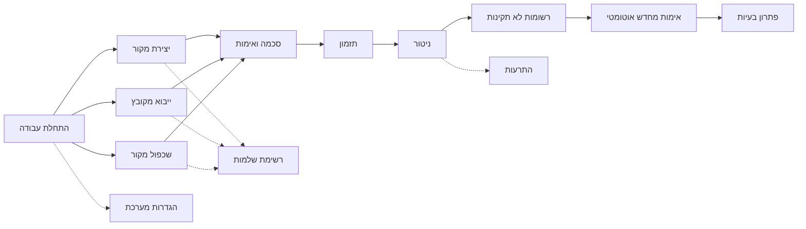

# מדריך למשתמש - EZ Platform v0.4.0

**גרסה:** v0.4.0
**עודכן לאחרונה:** מרץ 2026
**קהל יעד:** משתמשי קצה, מנהלי נתונים, אנליסטים

---

## סקירה כללית

פלטפורמת EZ היא מערכת לעיבוד אוטומטי של נתונים המאפשרת:

- **גילוי קבצים אוטומטי** ממקורות שונים (תיקיות, SFTP, FTP, HTTP, Kafka, NAS/NFS)
- **המרת פורמטים** (CSV, JSON, XML, Excel)
- **אימות נתונים** לפי סכמה שהוגדרה מראש (JSON Schema 2020-12)
- **שליחה ליעדים מרובים** (תיקיות, Kafka topics)
- **ניהול רשומות שגויות** וטיפול בשגיאות
- **מעקב ומדדים** בזמן אמת
- **ניהול התקני NAS** עם PV/PVC אוטומטי

---

## מה חדש בגרסה v0.4.0

- **ייבוא מקור נתונים מקובץ** -- יצירת מקור נתונים אוטומטית על סמך קובץ דוגמה (CSV, JSON, XML, Excel, ארכיונים)
- **שכפול מקור נתונים** -- העתקת מקור קיים בלחיצה אחת עם כל ההגדרות
- **רשימת שלמות** -- מעקב בזמן אמת אחר מילוי כל שדות הטופס עם צבעי עדיפות

---

## מפת ניווט במדריך

---

## תוכן עניינים

| פרק | נושא | תיאור |
|-----|-------|--------|
| 1 | [התחלת עבודה](/docs/user-guide/getting-started) | כניסה למערכת, ניווט וסקירת הממשק |
| 2 | [יצירת מקור נתונים](/docs/user-guide/create-datasource) | יצירת מקור נתונים חדש -- כל הלשוניות, השדות והאפשרויות |
| 3 | [ייבוא מקור נתונים מקובץ](/docs/user-guide/import-from-file) | יצירה אוטומטית ממקובץ דוגמה **חדש v0.4.0** |
| 4 | [שכפול מקור נתונים](/docs/user-guide/clone-datasource) | העתקת מקור קיים **חדש v0.4.0** |
| 5 | [רשימת שלמות](/docs/user-guide/completeness) | מעקב אחר השלמת הגדרות **חדש v0.4.0** |
| 6 | [הגדרת סכמה ואימות](/docs/user-guide/schema-validation) | הגדרת JSON Schema, תבניות, עורך Monaco, Regex |
| 7 | [תזמון ומעקב](/docs/user-guide/scheduling) | תזמון עיבוד, ביטויי Cron, הפעלה ידנית |
| 8 | [ניטור מערכת](/docs/user-guide/monitoring) | דשבורד ניטור, בריאות מכשירים, OTEL, Grafana |
| 9 | [רשומות לא תקינות](/docs/user-guide/invalid-records) | צפייה, סינון, תיקון ושליחה מחדש של רשומות שגויות |
| 10 | [אימות מחדש אוטומטי](/docs/user-guide/auto-revalidation) | אימות חוזר אוטומטי לאחר שינוי סכמה, TTL, גרסאות **חדש v0.5.0** |
| 11 | [ניהול התרעות](/docs/user-guide/alerts) | התרעות PromQL -- מקור, עסקיות ומערכת |
| 12 | [הגדרות מערכת](/docs/user-guide/system-settings) | קטגוריות, שרתי קלט/פלט, התקני NAS |
| 13 | [פתרון בעיות](/docs/user-guide/troubleshooting) | שגיאות נפוצות, שאלות נפוצות, מילון מונחים |

---

## למי המערכת מיועדת?

- **מנהלי נתונים**: הגדרה וניהול של מקורות נתונים והתקני NAS
- **אנליסטים**: הגדרת סכמות ותהליכי אימות
- **מפעילי מערכת**: מעקב אחר עיבוד ותזמון
- **מנהלי איכות**: זיהוי וטיפול בשגיאות

