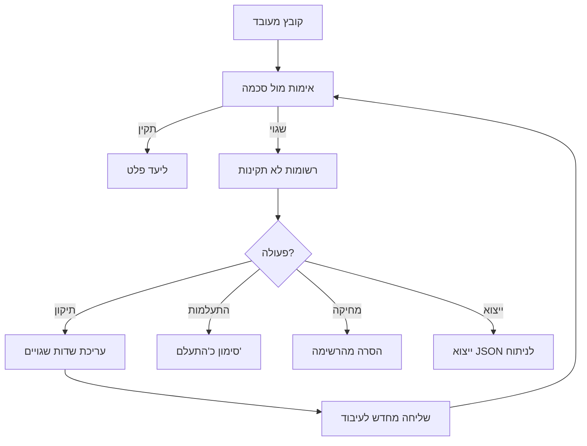

# רשומות לא תקינות

## סקירה כללית

דף רשומות לא תקינות מציג את כל הרשומות שנכשלו באימות מול סכמת JSON Schema. עבור כל רשומה, המערכת מציגה את נתוני המקור, השגיאות שהתגלו, והאפשרות לתקן ולשלוח מחדש לעיבוד.

הדף מתעדכן בזמן אמת באמצעות SignalR -- רשומות חדשות מופיעות אוטומטית ללא צורך ברענון.

---

## תרשים זרימת טיפול ברשומות

---

## סטטיסטיקות

בחלק העליון של הדף מוצג דשבורד סטטיסטיקות:

| מטריקה | תיאור |
|---------|--------|
| **סך רשומות** | מספר כולל של רשומות לא תקינות |
| **נבדקו** | רשומות שנבדקו ע"י משתמש |
| **הותעלמו** | רשומות שסומנו כ"התעלם" |
| **סוגי שגיאות** | מספר סוגי שגיאות ייחודיים |

כאשר מסנן פעיל, מוצגות גם סטטיסטיקות מסוננות (בגבול כחול) המציגות את המספרים המתאימים למסנן הנוכחי.

---

## סינון וחיפוש

### מסננים זמינים

| מסנן | סוג | תיאור |
|-------|------|--------|
| **קטגוריה** | רשימה נפתחת | סינון לפי קטגוריה עסקית (מסנן מדורג -- משפיע על רשימת מקורות) |
| **מקור נתונים** | רשימה נפתחת עם חיפוש | סינון לפי מקור נתונים ספציפי |
| **סוג שגיאה** | רשימה דינמית | סינון לפי סוג אימות שנכשל (עם מספר מופעים) |
| **טווח זמנים** | בחירה מהירה | כל הזמנים, שעה אחרונה, יום, שבוע, חודש, או מותאם אישית |
| **טווח מותאם אישית** | בורר תאריכים | בחירת טווח תאריכים מדויק (מופיע כשנבחר "מותאם אישית") |

### סוגי שגיאות אימות

| סוג שגיאה | תיאור | צבע |
|-----------|--------|------|
| **minimum** | ערך נמוך מהמינימום | מג'נטה |
| **maximum** | ערך גבוה מהמקסימום | וולקנו |
| **pattern** | לא תואם לתבנית Regex | כחול |
| **enum** | ערך לא ברשימת הערכים המותרים | ציאן |
| **format** | פורמט לא תקין (תאריך, דוא"ל, URI) | כתום |
| **type** | סוג נתון שגוי (מספר במקום מחרוזת) | ירוק |
| **minLength / maxLength** | אורך מחרוזת מחוץ לטווח | סגול |
| **required** | שדה חובה חסר | אדום |
| **properties** | מאפיין לא מוכר בסכמה | ברירת מחדל |

---

## תצוגת רשומות

כל רשומה מוצגת ככרטיס עם:

### מידע בסיסי
- **מקור נתונים** -- שם המקור שממנו הגיעה הרשומה
- **שם קובץ** -- שם הקובץ המקורי
- **מספר שורה** -- מיקום השורה בקובץ (אם רלוונטי)
- **תאריך** -- מתי נוצרה הרשומה

### שגיאות
רשימת כל שגיאות האימות, כל אחת עם:
- **שם שדה** -- השדה שנכשל
- **סוג שגיאה** -- תגית צבעונית (pattern, minimum, enum וכו')
- **הודעת שגיאה** -- הסבר מפורט בעברית

### נתונים מקוריים
תצוגת JSON מתקפלת של הנתונים המקוריים, עם **הדגשה באדום** של שדות שנכשלו באימות.

---

## עריכת ותיקון רשומה

### שלב 1: פתיחת עורך התיקון

לחץ על כפתור **"עבד מחדש"** בכרטיס הרשומה. ייפתח חלון עריכה מפורט.

### שלב 2: סקירת השגיאות

העורך מציג רק את **השדות שנכשלו** באימות, עם מידע מלא על כל שדה:

| רכיב | תיאור |
|-------|--------|
| **ערך מקורי** | הערך שנכשל (בתיבה אפורה) |
| **סוג שגיאה** | תגית עם סוג האימות שנכשל |
| **אילוצי סכמה** | תגיות צבעוניות המציגות את מה שהסכמה דורשת |

### אילוצי סכמה שמוצגים

| סוג | צבע | תיאור | דוגמה |
|------|------|--------|--------|
| **חובה** | אדום | שדה מוגדר כ-required | `required` |
| **ערכים מותרים** | כחול | רשימת enum | `male`, `female`, `other` |
| **תבנית Regex** | סגול | תבנית + דוגמה אוטומטית | `^\d{9}$` → `123456789` |
| **אורך מינימלי** | ציאן | מינימום תווים | `minLength: 2` |
| **אורך מקסימלי** | כתום | מקסימום תווים | `maxLength: 100` |
| **ערך מינימלי** | ציאן | ערך מספרי מינימלי | `minimum: 0` |
| **ערך מקסימלי** | כתום | ערך מספרי מקסימלי | `maximum: 999999` |
| **פורמט** | מג'נטה | פורמט נדרש + דוגמה | `email` → `user@example.com` |
| **סוג נתון** | ירוק | סוג הנתון הנדרש | `string`, `number`, `integer` |

### שלב 3: תיקון הערכים

- **שדה עם enum** -- מוצגת רשימה נפתחת עם הערכים המותרים
- **שדה אחר** -- שדה טקסט חופשי
- גבול השדה: **אדום** = שגוי, **ירוק** = תוקן

### שלב 4: תצוגה מקדימה

בצד שמאל של העורך מוצגת תצוגת JSON חיה שמתעדכנת תוך כדי עריכה:
- ערכים מתוקנים מוצגים ב**ירוק** עם הערך המקורי בקו חוצה
- כאשר כל השגיאות תוקנו, מופיע באנר **"כל השגיאות תוקנו"**

### שלב 5: שליחה מחדש

לחץ **"תקן ושלח לעיבוד מחדש"**. הרשומה נשלחת שוב דרך צינור האימות עם הערכים המתוקנים. אם הרשומה עוברת אימות בהצלחה, היא נמחקת מרשימת הרשומות הלא תקינות ונשלחת ליעד הפלט.

---

## פעולות נוספות

### מחיקה המונית

1. לחץ על כפתור **"מחק הכל"** (עם מספר הרשומות המתאימות למסנן)
2. אשר את הפעולה בתיבת אישור
3. כל הרשומות המתאימות למסנן הנוכחי יימחקו

:::warning זהירות
מחיקה המונית היא פעולה בלתי הפיכה. ודא שהמסננים נכונים לפני ביצוע.
:::

### ייצוא JSON

1. לחץ על כפתור **"יצא JSON"** (עם מספר הרשומות)
2. המערכת מייצאת את כל הרשומות המתאימות למסנן (לא רק העמוד הנוכחי)
3. הקובץ נשמר כ-`invalid-records-YYYY-MM-DD.json` עם תמיכה ב-UTF-8 עברית

---

## סנכרון בזמן אמת

הדף מתעדכן אוטומטית באמצעות חיבור SignalR WebSocket:
- **רשומה חדשה** -- מופיעה ברשימה ללא צורך ברענון
- **רשומה שתוקנה** -- נעלמת מהרשימה
- **שינוי מקור נתונים** -- סטטיסטיקות מתעדכנות

---

## טיפים

- **סנן לפי סוג שגיאה** -- אם רבות מהשגיאות הן מאותו סוג (למשל pattern), ייתכן שהסכמה דורשת עדכון
- **השתמש בייצוא** -- ייצוא JSON מאפשר ניתוח מתקדם בכלים חיצוניים
- **עדכן סכמה אם צריך** -- אם רשומות תקינות נכשלות שוב ושוב, עדכן את הסכמה ב[הגדרת סכמה](./schema-validation) במקום לתקן כל רשומה בנפרד
- **בדוק בכמויות קטנות** -- תקן 2-3 רשומות ידנית לפני מחיקה המונית, כדי לוודא שהבעיה מובנת

