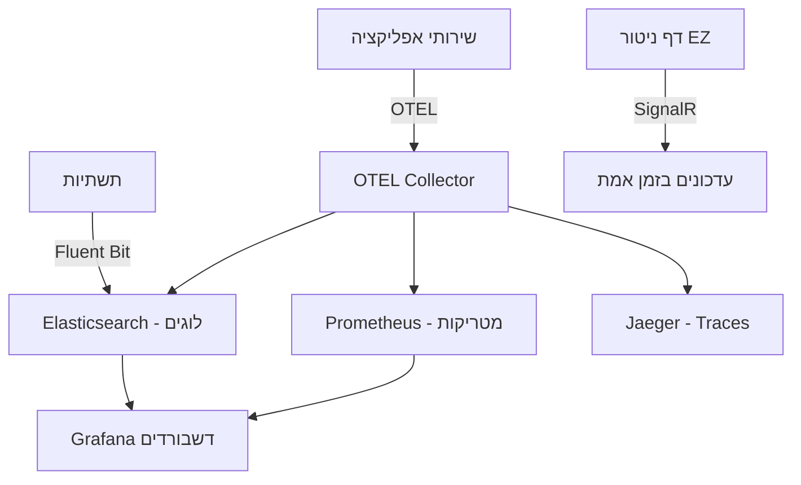

# ניטור מערכת

## תרשים ארכיטקטורת ניטור

---

## סקירה כללית

דף ניטור המערכת (System Monitoring) מציג בזמן אמת את מצב כל רכיבי הפלטפורמה. הדף משתמש בחיבור SignalR WebSocket לעדכונים חיים.

### גישה לניטור

1. לחץ על **"ניטור"** בתפריט הצדדי
2. הדף מציג כותרת עם מידע על ה-cluster וסטטוס החיבור

---

## סטטוס חיבור

בפינה העליונה מוצגת נקודת סטטוס:

| צבע | משמעות |
|------|---------|
| **ירוק** | מחובר -- עדכונים חיים באמצעות SignalR |
| **צהוב** | מתחבר מחדש -- ניתוק זמני, המערכת מנסה להתחבר |
| **אדום** | מנותק -- אין חיבור SignalR, המערכת משתמשת בנתוני גיבוי |

---

## לשוניות

הדף מחולק ללשוניות:

| לשונית | תוכן |
|---------|-------|
| **סקירה** | זרימת Pipeline, אירועים, בריאות שירותים, גרפי ביצועים |
| **בריאות מכשירים** | סטטוס התקני NAS ושרתי Admin |
| **Pods** | טבלת Pod Status ב-Kubernetes |
| **Traces** | מעקב מבוזר (Distributed Tracing) |
| **תורים** | סטטוס תורי RabbitMQ |
| **התרעות** | התראות מערכת אחרונות |

---

## עדכונים בזמן אמת

כאשר החיבור פעיל (SignalR), הנתונים מתעדכנים אוטומטית:
- **כל 5 שניות**: סטטוס שירותים, תורי Kafka, Pods, מטריקות
- **כל 30 שניות**: Traces, אירועים, התרעות, בריאות מכשירים

כאשר החיבור מנותק, המערכת עוברת אוטומטית ל-polling (רענון כל 30 שניות).

---

## בריאות מכשירים

לשונית "בריאות מכשירים" מציגה את מצב כל התקני ה-NAS ושרתי ה-Admin המוגדרים במערכת. המערכת בודקת אוטומטית את הזמינות כל 30 שניות.

### סטטוס מכשיר

| סטטוס | צבע | משמעות |
|--------|------|---------|
| **תקין (Healthy)** | ירוק | המכשיר מגיב כרגיל |
| **מושפל (Degraded)** | צהוב | תקלות לסירוגין או חביון גבוה |
| **מושבת (Down)** | אדום | המכשיר לא נגיש |

### כללי סטטוס

הסטטוס נקבע לפי כשלים רצופים:
- **0 כשלים**: תקין (Healthy)
- **1-2 כשלים**: מושפל (Degraded)
- **3+ כשלים**: מושבת (Down)

### ספי חביון

גם כאשר הבדיקה מצליחה, חביון גבוה גורם לסטטוס "מושפל":

| סוג מכשיר | סף מושפל |
|-----------|-----------|
| **NAS** | 2,000 מילישניות |
| **AdminServer** | 5,000 מילישניות |

### תצוגת כרטיסים

כל מכשיר מוצג ככרטיס עם:
- שם המכשיר וסוגו
- סטטוס בריאות (עם צבע)
- חביון אחרון (במילישניות)
- אחוז זמינות (24 שעות)
- זמן בדיקה אחרונה

### סרגל סיכום

בראש הלשונית מוצג סרגל סיכום:
- מספר מכשירים כולל
- מספר תקינים (ירוק)
- מספר מושפלים (צהוב)
- מספר מושבתים (אדום)

---

## ניהול התקני NAS

### הוספת התקן NAS חדש

1. עבור ל"הגדרות מערכת" בתפריט הצדדי
2. בחר בלשונית "התקני NAS"
3. לחץ על כפתור "הוסף התקן NAS"
4. מלא את הפרטים:

| שדה | חובה | תיאור |
|-----|------|--------|
| **שם התקן** | כן | שם מזהה ייחודי (לדוגמה: "NAS-Prod-01") |
| **כתובת שרת NFS** | כן | כתובת IP או hostname (לדוגמה: `192.168.1.100`) |
| **נתיב Export** | כן | הנתיב ב-NAS (לדוגמה: `/exports/data`) |
| **קיבולת (GB)** | לא | גודל האחסון המוקצה (ברירת מחדל: 100GB) |
| **תפקיד** | כן | קלט (כחול), פלט (ירוק), גיבוי (כתום), קלט ופלט (סגול) |
| **תיאור** | לא | הסבר על התקן ה-NAS |

5. לחץ "צור"
6. המערכת תיצור אוטומטית PersistentVolume ו-PersistentVolumeClaim ב-Kubernetes

### תגיות סטטוס

| תגית | צבע | משמעות |
|-------|------|---------|
| **מחובר** | ירוק | התקן NFS זמין ומגיב |
| **לא מחובר** | אדום | אין תקשורת עם ההתקן |
| **PVC מחובר** | ירוק | PersistentVolumeClaim מחובר ל-PV |
| **PV נוצר** | כחול | PersistentVolume נוצר ב-Kubernetes |
| **לא מוקצה** | אפור | התקן לא הוקצה עדיין |

התגיות מוצגות בעברית או באנגלית לפי שפת הממשק שנבחרה.

### מחיקת התקן NAS

מחיקת התקן NAS מסירה אוטומטית את משאבי Kubernetes (PV/PVC) ללא צורך בהסרה ידנית:
1. לחץ על כפתור המחיקה
2. אשר את הפעולה בחלון אישור
3. המערכת מסירה PV/PVC (אם קיימים)
4. ההתקן נמחק מהרשימה

---

## דשבורד מטריקות עסקיות

**גישה:** http://localhost:3001 (Grafana)

**התחברות:**
- שם משתמש: `admin`
- סיסמה: `EZPlatform2025!Beta`

### דשבורדים

**Business Metrics Dashboard:**
- רשומות מעובדות: מספר רשומות לשעה/יום
- קבצים מעובדים: מספר קבצים לאורך זמן
- רשומות שגויות: אחוז ומספר מוחלט
- זמן עיבוד: משך עיבוד ממוצע
- חביון End-to-End: זמן מגילוי ועד פלט

**Infrastructure Dashboard:**
- שימוש CPU/זיכרון של pods
- ביצועי MongoDB
- תפוקת Kafka
- סטטיסטיקות Hazelcast cache

---

## נראות OTEL

כל 8 השירותים בפלטפורמה מדווחים טלמטריה דרך OTEL Collector:
- **Logs**: ניתנים לצפייה ב-Grafana (מקור: Elasticsearch)
- **Traces**: ניתנים לצפייה ב-Jaeger (http://localhost:16686)
- **Metrics**: ניתנים לצפייה ב-Grafana (מקור: Prometheus)

### סמלי סטטוס בממשק

| סמל | משמעות |
|------|---------|
| נקודה ירוקה | מחובר / תקין |
| נקודה צהובה | מתחבר מחדש / מושפל |
| נקודה אדומה | מנותק / מושבת |
| תג ירוק "מחובר" | התקן NAS מחובר |
| תג אדום "לא מחובר" | התקן NAS לא זמין |
| תג כחול "PV נוצר" | משאב Kubernetes נוצר |
| תג אפור "לא מוקצה" | ממתין להקצאה |

---

## טיפים

- **בדוק בריאות מכשירים לפני הגדרת מקור חדש** -- ודא שהתקני NAS זמינים לפני שאתה מקשר אותם
- **השתמש ב-Grafana לניתוח מגמות** -- דשבורד הניטור של EZ מציג מצב נוכחי, Grafana מציגה היסטוריה
- **נקודת סטטוס ירוקה = הכל תקין** -- אם אתה רואה צהוב או אדום, בדוק את החיבור לשירותים
- **Jaeger ל-debugging** -- כאשר עיבוד קובץ נכשל, חפש את ה-Trace ב-Jaeger לראות באיזה שלב בדיוק כשל

