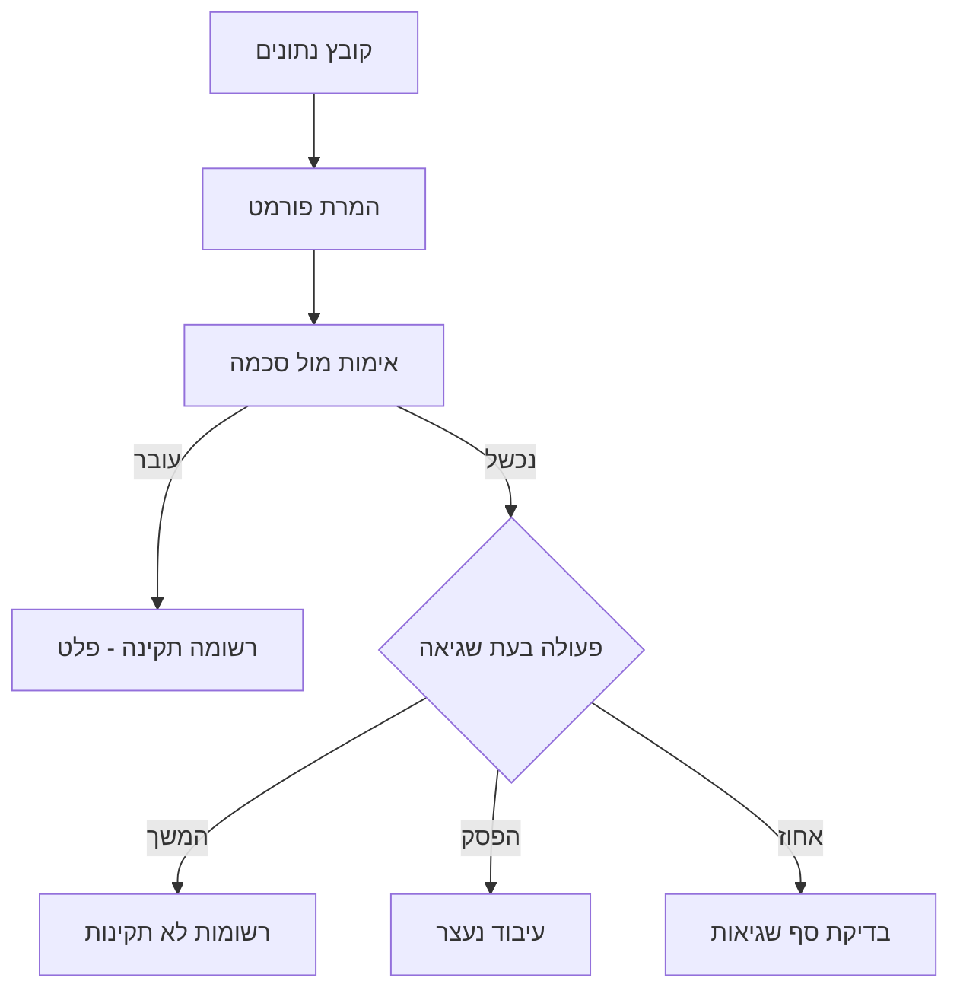

# הגדרת סכמה ואימות

## תרשים זרימת אימות

---

## סקירת Schema

JSON Schema מגדיר:
- **מבנה הנתונים**: אילו שדות צריכים להיות
- **סוג הנתונים**: מחרוזת, מספר, תאריך, וכו'
- **כללי אימות**: אורך, תבנית, טווח ערכים
- **שדות חובה**: אילו שדות חייבים להופיע

המערכת משתמשת בתקן JSON Schema 2020-12 לאימות נתונים באמצעות מנוע Corvus.Json.Validator.

---

## ניהול סכמות

דף **ניהול Schema** מציג את כל הסכמות המוגדרות במערכת. לכל סכמה מוצגים: שם, תיאור, מספר שדות, תאריך עדכון, וסטטוס.

**פעולות זמינות:**
- **צפה** -- תצוגת קריאה בלבד של הסכמה
- **ערוך** -- פתיחת הסכמה בעורך החזותי
- **מחק** -- מחיקת סכמה (לא ניתן למחוק סכמה בשימוש)
- **צור Schema חדש** -- פתיחת עורך חדש ריק
- **תבניות Schema** -- בחירת תבנית מוכנה

---

## עורך הסכמות החזותי (Schema Builder)

עורך הסכמות הוא כלי חזותי רב-עוצמה לבניה ועריכה של סכמות JSON Schema. הוא מספק תצוגת עץ וקוד בו-זמנית, עם כלי עזר מובנים.

### סרגל הכלים

סרגל הכלים בראש העורך מכיל:

| כפתור | פעולה |
|--------|--------|
| **תצוגת עץ** | מעבר בין תצוגת עץ חזותית לתצוגת קוד JSON גולמי |
| **הרחב הכל** | פריסת כל השדות והאובייקטים המקוננים בבת אחת |
| **כווץ הכל** | כיווץ כל השדות לתצוגה מצומצמת |
| **תבניות Schema** | פתיחת ספריית תבניות מוכנות |
| **עזרת Regex** | פתיחת כלי עזר לביטויים רגולריים |
| **הצג JSON לדוגמה** | יצירת JSON לדוגמה המתאים לסכמה הנוכחית |
| **אמת JSON** | בדיקת תקינות הסכמה |
| **הוסף שדה** | הוספת שדה חדש לסכמה |

### תצוגה מורחבת (Expand All)

לחיצה על **"הרחב הכל"** פורסת את כל השדות, כולל אובייקטים מקוננים ומערכים. מאפשרת לראות את כל מבנה הסכמה במבט אחד.

בצד שמאל מוצג קוד ה-JSON Schema המקורי בעורך Monaco (אותו עורך כמו VS Code), עם:
- **צביעת תחביר** -- JSON מוצג עם צבעים
- **מספרי שורות** -- לניווט קל
- **השלמה אוטומטית** -- הצעות ל-JSON Schema keywords
- **העתקת מקור** -- כפתור להעתקת הסכמה כטקסט

### עזרת Regex

כלי העזר ל-Regex מציע תבניות נפוצות לשימוש בשדות pattern:

**תבניות מוכנות:**

| תבנית | Regex | דוגמה |
|--------|-------|--------|
| ת"ז ישראלית (9 ספרות) | `^\d{9}$` | 123456789 |
| טלפון ישראלי | `^0\d{1,2}-?\d{7}$` | 03-1234567 |
| דוא"ל | `^[\w.-]+@[\w.-]+\.\w+$` | user@example.com |
| תאריך (DD/MM/YYYY) | `^\d{2}/\d{2}/\d{4}$` | 25/03/2026 |
| טלפון נייד | `^05\d-?\d{7}$` | 052-1234567 |
| מספר חשבונית | `^INV-\d+$` | INV-00123 |

לכל תבנית מוצגים: שם בעברית, ביטוי ה-Regex, דוגמה תואמת, ואפשרות להוסיף ישירות לשדה הנבחר.

### JSON לדוגמה

לחיצה על **"הצג JSON לדוגמה"** מייצרת אוטומטית אובייקט JSON שתואם לסכמה הנוכחית:

המערכת מייצרת ערכים אקראיים המתאימים לאילוצי הסכמה:
- **מחרוזת** -- טקסט לדוגמה בפורמט הנדרש
- **מספר** -- ערך בטווח min/max
- **תאריך** -- תאריך בפורמט הנדרש
- **boolean** -- true/false

כלי זה שימושי לבדיקת הסכמה לפני הפעלת עיבוד -- אם ה-JSON לדוגמה נראה הגיוני, הסכמה כנראה נכונה.

### ספריית תבניות

ספריית התבניות מציעה 6 סכמות מוכנות:

| תבנית | שדות עיקריים | שימוש |
|--------|-------------|--------|
| **לקוח ישראלי** | ת"ז, טלפון, כתובת, שם, דוא"ל | ניהול לקוחות ישראליים |
| **עסקה פיננסית** | סכום, תאריך, סוג עסקה, מטבע, הפניה | דוחות כספיים |
| **קטלוג מוצרים** | שם, מחיר, מק"ט, מלאי, קטגוריה | ניהול מלאי |
| **רשומת עובד** | שם, תפקיד, מחלקה, משכורת, תאריך התחלה | משאבי אנוש |
| **חשבונית מע"מ** | מספר, תאריך, סכום, מע"מ, ספק, סטטוס | הנהלת חשבונות |
| **הזמנת רכש** | מספר הזמנה, ספק, פריטים, סכום, תאריך אספקה | רכש ולוגיסטיקה |

בחירת תבנית טוענת את הסכמה לעורך, שם ניתן להתאים אותה לצורך הספציפי.

---

## סכמה בטופס מקור נתונים

בלשונית **"הגדרת Schema"** בטופס יצירה/עריכה של מקור נתונים, ניתן:

1. **לערוך ישירות** -- עורך Monaco מלא עם קוד JSON Schema
2. **לבחור סכמה קיימת** -- מרשימה נפתחת של סכמות שנוצרו בניהול Schema
3. **ללא סכמה** -- המערכת תקבל את כל הנתונים ללא אימות (לא מומלץ לייצור)

### סכמה אוטומטית מייבוא

בעת [ייבוא מקובץ](./import-from-file), המערכת מייצרת סכמה אוטומטית על סמך הנתונים שזוהו:

- **זיהוי סוגי שדות**: integer, number, boolean, date, string
- **תבניות חכמות**: דוא"ל, מספר טלפון, פורמטים של תאריך
- **מפריד CSV**: זיהוי אוטומטי של פסיק, נקודה-פסיק, Tab

הסכמה שנוצרת ניתנת לעריכה ידנית בעורך Monaco לפני ואחרי יצירת מקור הנתונים.

---

## כללי אימות

כאשר קובץ מעובד, כל רשומה נבדקת מול הסכמה:

- **רשומה תקינה**: עוברת ליעד הפלט
- **רשומה שגויה**: תלוי בהגדרת "פעולה בעת שגיאה":
  - **המשך עיבוד**: רשומות תקינות ממשיכות, שגויות נשלחות ל[רשומות לא תקינות](./invalid-records)
  - **הפסק עיבוד**: כל הקובץ נדחה
  - **אחוז מקסימלי**: אם אחוז השגיאות עובר את הסף, העיבוד נעצר

---

## טיפים

- **התחל מתבנית:** בחר תבנית קרובה לצורך שלך וערוך אותה, במקום לבנות סכמה מאפס
- **השתמש בהרחב הכל:** כשעובדים עם סכמה מורכבת, "הרחב הכל" נותן מבט מלא על המבנה
- **בדוק עם JSON לדוגמה:** לפני שמירה, לחץ "הצג JSON לדוגמה" -- אם הפלט נראה הגיוני, הסכמה כנראה נכונה
- **ייבוא אוטומטי:** בעת [ייבוא מקובץ](./import-from-file), המערכת מייצרת סכמה אוטומטית -- חוסך זמן רב
- **בדוק עם קובץ קטן:** לפני הפעלת עיבוד על קבצים גדולים, בדוק את הסכמה עם קובץ של 10-20 שורות
- **שדות חובה:** הגדר `required` רק לשדות שחייבים להופיע בכל רשומה -- סכמה מחמירה מדי תיצור הרבה [רשומות שגויות](./invalid-records)

