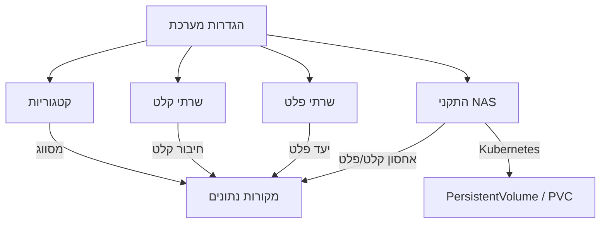

# הגדרות מערכת

## סקירה כללית

דף הגדרות המערכת הוא מרכז הניהול של תשתיות הפלטפורמה. כאן מגדירים את הקטגוריות העסקיות, שרתי הקלט והפלט (FTP, SFTP, HTTP, Kafka ועוד), והתקני אחסון NAS/NFS -- כולם נדרשים כדי שמקורות הנתונים יוכלו להתחבר, לעבד ולהפיץ קבצים.

הדף מחולק ל-4 לשוניות: **קטגוריות**, **שרתי קלט**, **שרתי פלט** ו-**התקני NAS**.

---

## תרשים קשרים

---

## לשונית 1: קטגוריות

קטגוריות עסקיות מסווגות את מקורות הנתונים לפי תחום. כל מקור נתונים חייב להשתייך לקטגוריה.

### טבלת קטגוריות

| עמודה | תיאור |
|--------|--------|
| **שם (עברית)** | שם הקטגוריה בעברית |
| **שם (אנגלית)** | שם הקטגוריה באנגלית |
| **תיאור** | תיאור הקטגוריה |
| **סטטוס** | פעיל / לא פעיל |
| **פעולות** | עריכה, הפעלה/השבתה, מחיקה |

### יצירת קטגוריה חדשה

1. לחץ על **"הוסף קטגוריה"**
2. מלא את הטופס:

| שדה | חובה | תיאור | דוגמה |
|-----|------|--------|--------|
| **שם (עברית)** | כן | שם הקטגוריה בעברית (עד 100 תווים) | מכירות |
| **שם (אנגלית)** | כן | שם הקטגוריה באנגלית (עד 100 תווים) | Sales |
| **תיאור** | לא | הסבר על הקטגוריה (עד 500 תווים) | נתוני מכירות חודשיים |

3. לחץ **"צור"** לשמירה

### עריכה ומחיקה

- **עריכה** -- לחץ על אייקון העריכה; שינוי שם ישפיע על כל מקורות הנתונים המשתמשים בקטגוריה זו
- **הפעלה/השבתה** -- קטגוריה מושבתת נעלמת מרשימות הבחירה אך נשמרת במסד הנתונים
- **מחיקה חכמה:**
  - **קטגוריה לא בשימוש** -- נמחקת לצמיתות
  - **קטגוריה בשימוש** -- מסומנת כלא פעילה (עם הודעה: "בשימוש ב-N מקורות נתונים")

### קטגוריות ברירת מחדל

המערכת מגיעה עם 10 קטגוריות מובנות: מכירות, כספים, משאבי אנוש, מלאי, שירות לקוחות, שיווק, לוגיסטיקה, תפעול, מחקר ופיתוח, רכש.

---

## לשונית 2: שרתי קלט

שרתי קלט מגדירים מהיכן המערכת תאסוף קבצים. ניתן להגדיר שרתים מסוגים שונים ולקשר אותם למקורות נתונים.

### טבלת שרתים

| עמודה | תיאור |
|--------|--------|
| **שם** | שם השרת (עם תגית "לא פעיל" אם מושבת) |
| **סוג** | תגית צבעונית: FTP, SFTP, S3/MinIO, HTTP, NFS, Kafka, Local, Folder |
| **כיוון** | קלט (כחול), פלט (ירוק), דו-כיווני (סגול) |
| **כתובת** | Host:Port (בפונט monospace); עבור Kafka -- Bootstrap Servers |
| **בדיקה אחרונה** | תוצאת בדיקת חיבור אחרונה (ירוק ✓ / אדום ✗ + תאריך) |
| **פעיל** | מתג הפעלה/השבתה |
| **פעולות** | בדוק חיבור, עריכה, מחיקה |

### הוספת שרת קלט חדש

1. לחץ על **"הוסף שרת"**
2. מלא את הטופס:

#### שדות משותפים לכל הסוגים

| שדה | חובה | תיאור |
|-----|------|--------|
| **שם** | כן | שם מזהה ייחודי (לדוגמה: "שרת FTP ייצור") |
| **תיאור** | לא | הסבר על השרת |
| **סוג שרת** | כן | FTP, SFTP, S3/MinIO, HTTP, NFS, Kafka, Local, Folder |
| **כיוון** | כן | קלט, פלט, או דו-כיווני |

#### שדות לפי סוג שרת

**FTP / SFTP / S3 / HTTP:**

| שדה | חובה | תיאור | דוגמה |
|-----|------|--------|--------|
| **כתובת (Host)** | כן | כתובת IP או hostname | `ftp.example.com` |
| **פורט** | לא | יציאה (ברירת מחדל: FTP=21, SFTP=22, S3=443, HTTP=80) | `22` |
| **Credential Secret** | לא | הפניה ל-Kubernetes Secret (namespace/secret-name) | `ez-platform/ftp-creds` |

**Local / NFS / Folder:**

| שדה | חובה | תיאור | דוגמה |
|-----|------|--------|--------|
| **נתיב בסיס** | כן | נתיב מלא לתיקיית המקור | `/data/input` |

**Kafka:**

| שדה | חובה | תיאור | דוגמה |
|-----|------|--------|--------|
| **Bootstrap Servers** | כן | כתובות שרתי Kafka (מופרדות בפסיקים) | `kafka1:9092,kafka2:9092` |
| **פרוטוקול אבטחה** | לא | PLAINTEXT, SSL, SASL_PLAINTEXT, SASL_SSL | `SASL_SSL` |
| **מנגנון SASL** | לא | PLAIN, SCRAM-SHA-256, SCRAM-SHA-512 | `SCRAM-SHA-256` |
| **Consumer Group** | לא | שם קבוצת הצרכנים | `ez-consumer` |
| **SSL** | לא | הפעלת SSL (מתג) | |

#### הגדרות מתקדמות (כל הסוגים)

| שדה | ברירת מחדל | תיאור |
|-----|------------|--------|
| **Connection Timeout** | 30 שניות | זמן המתנה מקסימלי לחיבור (1-300) |
| **Retry Count** | 3 | מספר ניסיונות חוזרים (0-10) |
| **פעיל** | כן | סטטוס השרת (בעריכה בלבד) |

3. לחץ **"צור"** לשמירה

### בדיקת חיבור

לחיצה על אייקון **"בדוק חיבור"** בעמודת הפעולות תבצע בדיקת נגישות לשרת:
- **הצלחה** -- הודעה ירוקה עם משך הבדיקה (לדוגמה: "חיבור תקין (245ms)")
- **כשלון** -- הודעה אדומה עם פירוט השגיאה

תוצאת הבדיקה נשמרת בשדות "בדיקה אחרונה" ו"תוצאה אחרונה".

---

## לשונית 3: שרתי פלט

שרתי פלט מגדירים לאן המערכת תשלח נתונים מעובדים. מבנה הלשונית זהה לשרתי קלט, עם סינון אוטומטי לשרתים בכיוון "פלט" או "דו-כיווני".

### הבדלים משרתי קלט

- **כיוון ברירת מחדל:** פלט (Output)
- **שימוש:** מוצגים כאפשרות בלשונית "יעדי פלט" בטופס מקור הנתונים
- **סוגי שרתים נפוצים:** Folder, Kafka, NFS, S3

---

## לשונית 4: התקני NAS

התקני NAS/NFS מאפשרים לחבר אחסון רשת כמקור קלט או יעד פלט. המערכת מנהלת אוטומטית את משאבי Kubernetes (PersistentVolume ו-PersistentVolumeClaim) עבור כל התקן.

### טבלת התקני NAS

| עמודה | תיאור |
|--------|--------|
| **שם** | שם ההתקן עם תגיות סטטוס: PVC מחובר (ירוק), PV נוצר (כחול), לא מוקצה (אפור), מחובר (ירוק), לא מחובר (אדום) |
| **כתובת:פורט** | כתובת NFS (פונט monospace) |
| **נתיב Export** | נתיב ב-NAS (פונט monospace) |
| **תפקיד** | קלט (כחול), פלט (ירוק), גיבוי (כתום), דו-כיווני (סגול) |
| **קיבולת** | גודל אחסון (לדוגמה: 10Gi, 1Ti) |
| **סטטוס** | PV/PVC/שגיאות |
| **פעולות** | בדוק חיבור, הקצאה, עריכה, מחיקה |

### הוספת התקן NAS חדש

1. לחץ על **"הוסף התקן NAS"**
2. מלא את הטופס:

#### מידע בסיסי

| שדה | חובה | תיאור | דוגמה |
|-----|------|--------|--------|
| **שם** | כן | שם מזהה ייחודי (עד 100 תווים) | NAS-Prod-01 |
| **תיאור** | לא | הסבר על ההתקן | אחסון קלט ייצור |

#### הגדרות חיבור

| שדה | חובה | תיאור | דוגמה |
|-----|------|--------|--------|
| **כתובת שרת (Host)** | כן | כתובת IP או hostname של שרת NFS | `192.168.1.100` |
| **פורט** | לא | פורט NFS (ברירת מחדל: 2049) | `2049` |
| **נתיב Export** | כן | נתיב Export בשרת NFS | `/data` או `/` |

#### תפקיד

| שדה | חובה | תיאור |
|-----|------|--------|
| **תפקיד** | כן | קלט -- מקור לקריאת קבצים; פלט -- יעד לכתיבת קבצים מעובדים; גיבוי -- אחסון גיבויים; קלט ופלט -- שימוש דו-כיווני |

#### הגדרות אחסון

| שדה | ברירת מחדל | תיאור | דוגמה |
|-----|------------|--------|--------|
| **קיבולת** | 10Gi | גודל האחסון בפורמט Kubernetes | `10Gi`, `1Ti`, `500Gi` |
| **מצב גישה** | ReadWriteMany | RWX (מרובה כותבים), ROX (קריאה בלבד מרובה), RWO (כותב יחיד) | `ReadWriteMany` |
| **מדיניות שחרור** | Retain | Retain (שמור PV), Delete (מחק PV), Recycle (מחזר) | `Retain` |

#### אפשרויות Mount

שדה רב-ערכי עם אפשרויות מוכנות:
- `nfsvers=4` -- גרסת NFS (מומלץ v4)
- `nfsvers=3` -- גרסת NFS ישנה
- `tcp` -- שימוש ב-TCP
- `hard` / `soft` -- mount mode
- `intr` -- ניתן לביטול
- `nolock` -- ללא נעילה
- `rsize=8192` / `wsize=8192` -- גודל buffer

ניתן גם להוסיף אפשרויות מותאמות אישית.

3. לחץ **"צור"** לשמירה

:::warning חשוב
לאחר יצירת ההתקן, יש ללחוץ **"הקצאה"** כדי ליצור את משאבי Kubernetes (PersistentVolume ו-PersistentVolumeClaim). ללא הקצאה, ההתקן לא יהיה זמין לשימוש במקורות נתונים.
:::

### הקצאה (Provision)

1. לחץ על כפתור **"הקצאה"** בעמודת הפעולות
2. אשר את הפעולה בתיבת אישור: "ליצור PersistentVolume ו-PersistentVolumeClaim עבור שם ההתקן?"
3. המערכת יוצרת אוטומטית PV ו-PVC ב-Kubernetes
4. סטטוס ההתקן מתעדכן ל-"PV נוצר" ו-"PVC מחובר"

אם ההקצאה כבר בוצעה, הכפתור משתנה ל-**"הקצאה מחדש"**.

### בדיקת חיבור NAS

בדיקת חיבור בודקת שני דברים:
- **נגישות רשת** -- האם שרת NFS מגיב
- **בדיקת mount** -- האם ניתן לעלות את הנתיב

תוצאות:
- **ירוק** -- חיבור תקין + mount תקין
- **כחול** -- נגישות רשת בלבד (mount לא נבדק)
- **אדום** -- כשלון עם הודעת שגיאה

### תגיות סטטוס

| תגית | צבע | משמעות |
|-------|------|---------|
| **PVC מחובר** | ירוק | PersistentVolumeClaim מחובר ל-PV |
| **PV נוצר** | כחול | PersistentVolume נוצר ב-Kubernetes |
| **לא מוקצה** | אפור | ההתקן לא הוקצה עדיין |
| **מחובר** | ירוק | בדיקת חיבור NFS הצליחה |
| **לא מחובר** | אדום | בדיקת חיבור NFS נכשלה |

---

## טיפים

- **הגדר קטגוריות לפני מקורות נתונים** -- מקור נתונים חייב להשתייך לקטגוריה, לכן הגדר אותן מראש
- **בדוק חיבור תמיד** -- לאחר הוספת שרת, בצע בדיקת חיבור לפני שמקשר אותו למקור נתונים
- **NAS -- הקצאה חובה** -- אל תשכח ללחוץ "הקצאה" אחרי יצירת התקן NAS
- **NFS v4 מומלץ** -- השתמש ב-`nfsvers=4` ו-`nolock` באפשרויות mount לביצועים מיטביים
- **שרת דו-כיווני** -- אם שרת משמש גם לקלט וגם לפלט, הגדר כיוון "דו-כיווני" כדי שיופיע בשתי הלשוניות

