# מדריך למשתמש - EZ Platform v0.4.0

---

## תוכן עניינים

| פרק | נושא | תיאור |
|-----|-------|--------|
| 1 | [סקירה כללית](#סקירה-כללית) | מבוא לפלטפורמת EZ ומה חדש בגרסה v0.4.0 |
| 2 | [התחלת עבודה](#התחלת-עבודה) | כניסה למערכת, ניווט וסקירת הממשק |
| 3 | [יצירת מקור נתונים חדש](#יצירת-מקור-נתונים-חדש) | יצירת מקור נתונים חדש -- כל הלשוניות, השדות והאפשרויות |
| 4 | [ייבוא מקור נתונים מקובץ](#ייבוא-מקור-נתונים-מקובץ) | יצירה אוטומטית ממקובץ דוגמה |
| 5 | [שכפול מקור נתונים](#שכפול-מקור-נתונים) | העתקת מקור קיים בלחיצה אחת |
| 6 | [רשימת שלמות מקור נתונים](#רשימת-שלמות-מקור-נתונים) | מעקב אחר השלמת הגדרות |
| 7 | [הגדרת סכמה ואימות](#הגדרת-סכמה-ואימות) | הגדרת JSON Schema, תבניות, עורך Monaco, Regex |
| 8 | [תזמון ומעקב](#תזמון-ומעקב) | תזמון עיבוד, ביטויי Cron, הפעלה ידנית |
| 9 | [ניטור מערכת](#ניטור-מערכת) | דשבורד ניטור, בריאות מכשירים, OTEL, Grafana |
| 10 | [אימות מחדש אוטומטי של רשומות שגויות](#אימות-מחדש-אוטומטי-של-רשומות-שגויות) | אימות חוזר אוטומטי לאחר שינוי סכמה, TTL, גרסאות |
| 11 | [ניהול התרעות](#ניהול-התרעות) | התרעות PromQL -- מקור, עסקיות ומערכת |
| 12 | [הגדרות מערכת](#הגדרות-מערכת) | קטגוריות, שרתי קלט/פלט, התקני NAS |
| 13 | [רשומות לא תקינות](#רשומות-לא-תקינות) | צפייה, סינון, תיקון ושליחה מחדש של רשומות שגויות |
| 14 | [פתרון בעיות](#פתרון-בעיות) | שגיאות נפוצות, שאלות נפוצות, מילון מונחים |

---

# סקירה כללית

**גרסה:** v0.4.0
**עודכן לאחרונה:** מרץ 2026
**קהל יעד:** משתמשי קצה, מנהלי נתונים, אנליסטים

---

## מהי פלטפורמת EZ?

פלטפורמת EZ היא מערכת לעיבוד אוטומטי של נתונים המאפשרת:

- **גילוי קבצים אוטומטי** ממקורות שונים (תיקיות, SFTP, FTP, HTTP, Kafka, NAS/NFS)
- **המרת פורמטים** (CSV, JSON, XML, Excel)
- **אימות נתונים** לפי סכמה שהוגדרה מראש (JSON Schema 2020-12)
- **שליחה ליעדים מרובים** (תיקיות, Kafka topics)
- **ניהול רשומות שגויות** וטיפול בשגיאות
- **מעקב ומדדים** בזמן אמת
- **ניהול התקני NAS** עם PV/PVC אוטומטי

---

## מה חדש בגרסה v0.4.0

- **ייבוא מקור נתונים מקובץ** -- יצירת מקור נתונים אוטומטית על סמך קובץ דוגמה (CSV, JSON, XML, Excel, ארכיונים)
- **שכפול מקור נתונים** -- העתקת מקור קיים בלחיצה אחת עם כל ההגדרות
- **רשימת שלמות** -- מעקב בזמן אמת אחר מילוי כל שדות הטופס עם צבעי עדיפות

---

## מפת ניווט במדריך

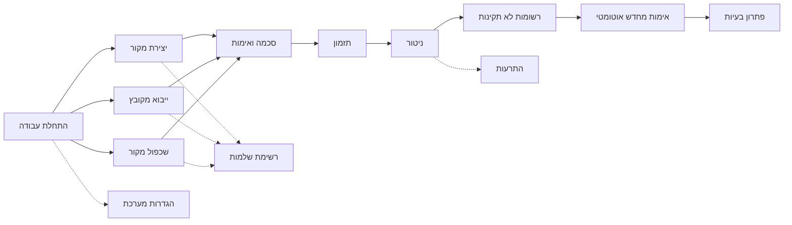


---

## למי המערכת מיועדת?

- **מנהלי נתונים**: הגדרה וניהול של מקורות נתונים והתקני NAS
- **אנליסטים**: הגדרת סכמות ותהליכי אימות
- **מפעילי מערכת**: מעקב אחר עיבוד ותזמון
- **מנהלי איכות**: זיהוי וטיפול בשגיאות

---

# התחלת עבודה

## תרשים ניווט

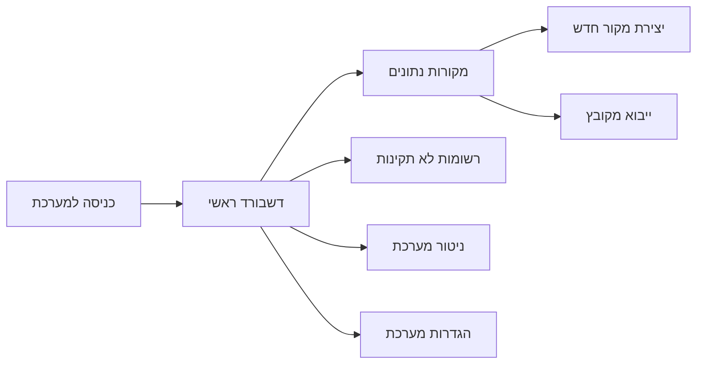

---

## גישה למערכת

**כתובת:** http://localhost:7000 (פיתוח) או כתובת הייצור שהוגדרה

**גרסה v0.4.0:**
- אין צורך בהתחברות (לא דורש שם משתמש וסיסמה)
- גישה ישירה לממשק המשתמש
- גרסאות עתידיות יכללו מערכת הרשאות


---

## תפריט ניווט

הסרגל הצדדי (מימין) כולל:
- **מקורות נתונים**: ניהול מקורות הנתונים שלך
- **רשומות לא תקינות**: צפייה ותיקון של רשומות שנכשלו באימות
- **התרעות**: ניהול התראות על אירועים במערכת
- **דשבורד**: תצוגה כללית של המערכת
- **הגדרות מערכת**: ניהול קטגוריות, התקני NAS והגדרות (מנהלי מערכת)


---

## שפת ממשק

המערכת תומכת בשתי שפות:
- **עברית** -- ברירת מחדל, עם תצוגה מימין לשמאל (RTL)
- **אנגלית** -- תצוגה משמאל לימין (LTR)

החלפת שפה מתבצעת באמצעות כפתור בחלק העליון של המסך. שדות טכניים (כתובות, ביטויי Regex, נתיבי קבצים) תמיד מוצגים משמאל לימין.


---

## כפתור עזרה

בחלק העליון של המסך תמצא כפתור עזרה (סימן שאלה). לחיצה עליו תפתח את פורטל התיעוד הזה בלשונית חדשה.

---

## סקירת דף מקורות הנתונים

דף מקורות הנתונים הוא הדף המרכזי במערכת. בו תוכלו:

1. **צפייה ברשימת מקורות** -- טבלה עם כל המקורות המוגדרים, כולל סטטוס, קטגוריה ומחוון שלמות
2. **יצירת מקור חדש** -- כפתור "מקור נתונים חדש" ליצירה ידנית
3. **ייבוא מקובץ** -- כפתור "מקור נתונים חדש מקובץ" ליצירה אוטומטית מקובץ דוגמה
4. **שכפול** -- תפריט פעולות בכל שורה כולל אפשרות שכפול
5. **חיפוש וסינון** -- חיפוש לפי שם, ספק, קטגוריה


---

## צפייה בפרטי מקור נתונים

לחיצה על אייקון **העין** בשורת המקור פותחת את דף **פרטי מקור הנתונים** בתצוגת קריאה בלבד. הדף מציג:

- **סטטיסטיקות** -- מספר קבצים שעובדו, סטטוס (פעיל/לא פעיל)
- **לשוניות מידע** -- מידע בסיסי, חיבור, סכמה, פלט, תזמון
- **היסטוריית עיבוד** -- קבצים שעובדו עם תאריכים וגדלים


מתצוגה זו ניתן לעבור למצב עריכה בלחיצה על כפתור **"ערוך"**.

---

## מה זה מקור נתונים?

מקור נתונים מגדיר:
- **מהיכן** לקחת קבצים (תיקייה, שרת SFTP, HTTP API, NAS, וכו')
- **איזה פורמט** הקבצים (CSV, JSON, XML, Excel)
- **איך לאמת** את הנתונים (JSON Schema)
- **לאן לשלוח** את הנתונים המעובדים
- **מתי לעבד** (תזמון אוטומטי או ידני)

---

## סנכרון בזמן אמת

שינויים שמבוצעים על ידי משתמשים אחרים במערכת מופיעים אוטומטית ללא צורך ברענון ידני. לדוגמה:
- משתמש אחר מוסיף מקור נתונים -- המקור מופיע ברשימה שלך מיד
- משתמש אחר מוחק מקור -- המקור נעלם מהרשימה שלך
- שינוי סטטוס -- הסטטוס מתעדכן בזמן אמת

סנכרון זה מתבצע באמצעות חיבור SignalR WebSocket.

---

## צעדים ראשונים מומלצים

1. **הגדר קטגוריות** -- עבור להגדרות מערכת וצור קטגוריות עסקיות (מכירות, כספים, מלאי וכו')
2. **הכן קובץ דוגמה** -- הכן קובץ CSV/JSON קטן (100 שורות) עם נתונים מייצגים
3. **נסה ייבוא מקובץ** -- השתמש ב[ייבוא מקובץ](#ייבוא-מקור-נתונים-מקובץ) ליצירה מהירה של מקור ראשון
4. **בדוק חיבור** -- ודא שהחיבור למקור הנתונים תקין
5. **הפעל ידנית** -- הפעל עיבוד ידני ובדוק שהנתונים מגיעים ליעד

---

## טיפים

- **קיצור דרך:** השתמש ב[ייבוא מקובץ](#ייבוא-מקור-נתונים-מקובץ) ליצירה מהירה -- המערכת תזהה אוטומטית את מבנה הנתונים מקובץ דוגמה
- **שכפול חוסך זמן:** אם יש מקור דומה קיים, [שכפל אותו](#שכפול-מקור-נתונים) וערוך רק את מה שצריך
- **עקוב אחר שלמות:** [מחוון השלמות](#רשימת-שלמות-מקור-נתונים) מציג בזמן אמת אילו שדות חסרים ומהי עדיפותם
- **שדות טכניים:** כתובות IP, נתיבים, ביטויי Regex ו-Cron תמיד מוצגים LTR גם בממשק עברית

---

# יצירת מקור נתונים חדש

מדריך זה מפרט את תהליך יצירת מקור נתונים חדש באופן ידני, שלב אחר שלב דרך כל לשוניות הטופס.

**דרך מהירה יותר:** אם יש לך קובץ דוגמה, שקול להשתמש ב[ייבוא מקובץ](#ייבוא-מקור-נתונים-מקובץ) שממלא אוטומטית שדות רבים. ניתן גם [לשכפל מקור קיים](#שכפול-מקור-נתונים) אם יש מקור עם הגדרות דומות.

---

## תרשים זרימת יצירה

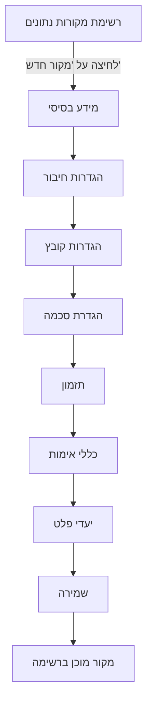

---

## שלב 1: מידע בסיסי

1. לחץ על "מקורות נתונים" בתפריט הצדדי
2. לחץ על כפתור "הוסף מקור נתונים"
3. מלא פרטים בסיסיים:

| שדה | חובה | תיאור |
|-----|------|--------|
| **שם מקור הנתונים** | כן | שם מזהה ייחודי (2-100 תווים). לדוגמה: "נתוני מכירות חודשיים" |
| **שם הספק** | כן | שם הגוף המספק את הנתונים (2-50 תווים). לדוגמה: "חברת ABC" |
| **קטגוריה** | כן | בחר קטגוריה מהרשימה (מכירות, כספים, מלאי וכו') |
| **תקופת שמירה** | לא | כמה ימים לשמור קבצים מעובדים (ברירת מחדל: 30 יום) |
| **שמירת רשומות שגויות (InvalidRecordsTtlDays)** | לא | כמה ימים לשמור רשומות שגויות לפני מחיקה אוטומטית. ברירת מחדל גלובלית: 4 ימים. ערך זה דורס את ברירת המחדל עבור מקור זה בלבד. ראה [אימות מחדש אוטומטי](#אימות-מחדש-אוטומטי-של-רשומות-שגויות) לפרטים |
| **תיאור** | לא | הסבר מפורט על מקור הנתונים (עד 500 תווים) |
| **סטטוס** | כן | פעיל / לא פעיל. רק מקורות פעילים מעובדים |

4. לחץ "המשך" למעבר לכרטיסייה הבאה


---

## שלב 2: הגדרות חיבור

בחר סוג חיבור:

### תיקיה מקומית (Local)
- נתיב מלא לתיקיה (לדוגמה: `/data/uploads`)
- המערכת תסרוק קבצים חדשים בתיקייה

### SFTP
- כתובת שרת (לדוגמה: `sftp.example.com`)
- שם משתמש וסיסמה
- נתיב בשרת
- יציאה (ברירת מחדל: 22)

### FTP
- כתובת שרת
- שם משתמש וסיסמה (אופציונלי)
- נתיב בשרת
- יציאה (ברירת מחדל: 21)

### HTTP API
- כתובת URL (לדוגמה: `https://api.example.com/data`)
- Headers (אופציונלי)
- שיטת אימות (API Key, Bearer Token)

### Kafka
- כתובת Broker (לדוגמה: `kafka.example.com:9092`)
- שם Topic
- Consumer Group
- פרוטוקול אבטחה (PLAINTEXT, SASL_SSL, וכו')

### NAS/NFS
- בחר התקן NAS מהרשימה הנפתחת
- ציין נתיב בתוך התקן ה-NAS
- ראה סעיף "ניהול התקני NAS" בפרק [ניטור מערכת](#ניטור-מערכת) להגדרת התקנים

### S3/MinIO
- Endpoint URL
- Access Key ו-Secret Key
- שם Bucket
- Region (אופציונלי)

### SMB/CIFS
- כתובת שרת (לדוגמה: `\\server\share`)
- שם משתמש וסיסמה
- Domain (אופציונלי)

### בדיקת חיבור
- לחץ "בדוק חיבור" לאימות שהחיבור עובד
- סטטוס יופיע: מוצלח או נכשל עם הודעת שגיאה


---

## שלב 3: הגדרות קובץ

| הגדרה | תיאור |
|--------|--------|
| **פורמט קובץ** | CSV, JSON, XML, Excel. המערכת תמיר אוטומטית לפורמט אחיד |
| **מפריד (CSV)** | פסיק, נקודה-פסיק, Tab, צינור |
| **קידוד** | UTF-8 (מומלץ), Windows-1255, ISO-8859-8 |
| **שורת כותרת** | האם השורה הראשונה מכילה שמות עמודות |
| **תבנית שם קובץ** | Regex לסינון קבצים (לדוגמה: `sales-.*\.csv`). רק קבצים התואמים יעובדו |
| **גודל מקסימלי** | הגבלת גודל קובץ (MB). ברירת מחדל: 100MB |

### הגדרות ארכיון (אופציונלי)

אם מקור הנתונים מכיל ארכיונים:

1. **סמן** את האפשרות "מקור מכיל ארכיונים"
2. **בחר סוג ארכיון:** אוטומטי, ZIP, TAR.GZ, RAR, 7Z
3. **תבנית חילוץ** (אופציונלי): glob לסינון קבצים (לדוגמה: `*.csv`)
4. **סיסמת ארכיון** (אופציונלי): אם הארכיון מוגן בסיסמה
5. **ארכיונים מקוננים**: סמן אם יש ארכיונים בתוך ארכיונים


---

## שלב 4: הגדרת סכמה (לשונית Schema)

לשונית הסכמה מאפשרת להגדיר את מבנה הנתונים הצפוי. המערכת משתמשת בתקן JSON Schema 2020-12.


### אפשרויות הגדרה

#### בחירת סכמה קיימת
בחר סכמה שהוגדרה בעבר מהרשימה הנפתחת. כל סכמה מציגה שם, תיאור ומספר שדות.

#### שימוש בתבנית מוכנה
המערכת מציעה תבניות סכמה מוכנות:

| תבנית | שדות עיקריים |
|--------|-------------|
| **לקוח ישראלי** | ת"ז (9 ספרות), טלפון, כתובת, שם |
| **עסקה פיננסית** | סכום, תאריך, סוג עסקה, מטבע |
| **קטלוג מוצרים** | שם, מחיר, מלאי, קטגוריה |
| **רשומת עובד** | שם, תפקיד, משכורת, תאריך התחלה |
| **חשבונית מע"מ** | מספר, תאריך, סכום, מע"מ, ספק |

#### יצירת סכמה חדשה בעורך Monaco

עורך הסכמה מבוסס Monaco (אותו עורך כמו VS Code) ומאפשר עריכת JSON Schema ישירות:

**הוספת שדה:**
1. הגדר **שם שדה** באנגלית (lowercase, underscores): `customer_id`
2. הגדר **שם תצוגה** בעברית: "מספר לקוח"
3. בחר **סוג נתון**: string, integer, number, boolean, array, object

**אילוצי אימות לכל סוג:**

| סוג | אילוצים זמינים |
|------|----------------|
| **string** | minLength, maxLength, pattern (Regex), format (email/uri/date/date-time/uuid/ipv4), enum |
| **integer / number** | minimum, maximum, exclusiveMinimum, exclusiveMaximum, multipleOf |
| **boolean** | ערכים: true/false בלבד |
| **array** | minItems, maxItems, uniqueItems, items (סכמה של כל פריט) |
| **object** | properties, required, additionalProperties |

**הגדרת שדות חובה:**
הוסף שמות שדות למערך `required` כדי לדרוש את הופעתם בכל רשומה.

**עזרת Regex:**
עורך הסכמה כולל כלי עזרה לביטויי Regex עם תבניות נפוצות:

| תבנית | Regex | דוגמה |
|--------|-------|--------|
| ת"ז ישראלית | `^\d{9}$` | 123456789 |
| טלפון ישראלי | `^0\d{1,2}-?\d{7}$` | 03-1234567 |
| דוא"ל | `^[\w.-]+@[\w.-]+\.\w+$` | user@example.com |
| תאריך DD/MM/YYYY | `^\d{2}/\d{2}/\d{4}$` | 25/03/2026 |

#### ללא סכמה
ניתן לדלג על הגדרת סכמה. בצב זה המערכת תקבל את כל הנתונים ללא אימות. **לא מומלץ לסביבת ייצור** -- ללא סכמה, רשומות שגויות לא יזוהו.

---

## שלב 5: תזמון


### אפשרויות תזמון

| אפשרות | תיאור |
|---------|--------|
| **ידני** | הפעלה ידנית בלבד (כפתור ברק ברשימה) |
| **כל דקה** | סריקה כל דקה |
| **כל 5 דקות** | סריקה כל 5 דקות |
| **כל 15 דקות** | סריקה כל 15 דקות |
| **כל 30 דקות** | סריקה כל חצי שעה |
| **כל שעה** | סריקה כל שעה |
| **יומי** | פעם ביום בשעה קבועה |
| **שבועי** | פעם בשבוע ביום ובשעה קבועים |
| **חודשי** | פעם בחודש |
| **Cron מותאם** | ביטוי Cron חופשי (לדוגמה: `0 9 * * 1-5` -- כל יום עבודה ב-9:00) |

### חלון זמן
ניתן להגדיר טווח שעות לעיבוד (לדוגמה: 08:00-18:00). מחוץ לחלון, המערכת לא תעבד קבצים.

ראה פרק [תזמון ומעקב](#תזמון-ומעקב) לפירוט מלא על ביטויי Cron ומעקב.

---

## שלב 6: כללי אימות


| הגדרה | תיאור |
|--------|--------|
| **המשך עיבוד** | רשומות תקינות עוברות הלאה, שגויות נשלחות ל[רשומות לא תקינות](#רשומות-לא-תקינות). **מומלץ לרוב המקרים** |
| **הפסק עיבוד** | כל שגיאת אימות עוצרת את העיבוד. מתאים לנתונים קריטיים שבהם כל שגיאה מצביעה על בעיה מערכתית |
| **אחוז מקסימלי** | הגדר סף (לדוגמה: 10%). אם אחוז השגיאות גבוה מהסף, העיבוד נעצר. מאזן בין סובלנות לשגיאות לבין זיהוי בעיות מערכתיות |

---

## שלב 7: התראות

**אירועים שניתן לקבל עליהם התראה:**

| אירוע | תיאור |
|--------|--------|
| **קובץ חדש התגלה** | המערכת זיהתה קובץ חדש במקור |
| **אימות הושלם** | הקובץ עבר אימות בהצלחה |
| **שגיאות באימות** | נמצאו רשומות שלא עברו אימות |
| **שגיאות בעיבוד** | שגיאה טכנית בעיבוד הקובץ |
| **פלט הושלם** | הנתונים נשלחו בהצלחה ליעד |

**ערוצי התראה:**
- **UI notifications** -- פעיל, הודעות בממשק המשתמש
- **Email** -- בגרסאות עתידיות
- **Webhook** -- בגרסאות עתידיות

ראה גם פרק [ניהול התרעות](#ניהול-התרעות) להגדרת התרעות מתקדמות מבוססות PromQL.

---

## שלב 8: יעדי פלט


**הגדר לאן לשלוח נתונים מעובדים.** ניתן להגדיר מספר יעדים -- כל היעדים מקבלים את אותם הנתונים.

### סוגי יעדים

#### תיקייה (Folder)

| שדה | תיאור |
|-----|--------|
| **נתיב יעד** | נתיב מלא לתיקייה (לדוגמה: `/output/processed`) |
| **פורמט** | JSON, CSV, XML |
| **תבנית שם קובץ** | שם עם placeholders: `{date}`, `{source}`, `{original}` |

#### Kafka Topic

| שדה | תיאור |
|-----|--------|
| **שרת Kafka** | בחר שרת Kafka מ[הגדרות מערכת](#הגדרות-מערכת) |
| **שם Topic** | שם ה-Topic לפרסום |
| **פורמט הודעה** | JSON |
| **כולל Invalid Records** | האם לכלול גם רשומות שנכשלו באימות |

#### NAS/NFS

| שדה | תיאור |
|-----|--------|
| **התקן NAS** | בחר מרשימת ההתקנים שהוגדרו ב[הגדרות מערכת](#הגדרות-מערכת) |
| **נתיב יעד** | נתיב בתוך התקן ה-NAS |

**יעדים מרובים:** לחץ **"הוסף יעד"** להוספת יעד נוסף. ניתן להפעיל/לבטל כל יעד בנפרד.

---

## שלב 9: שמירה

1. בדוק שכל השדות הנדרשים מולאו -- [פאנל השלמות](#רשימת-שלמות-מקור-נתונים) מציג אחוז השלמה ושדות חסרים
2. לחץ **"צור"** (או **"עדכן"** במצב עריכה)
3. מקור הנתונים יופיע ברשימה
4. המערכת תתחיל לעבד קבצים לפי התזמון שהוגדר


---

## טיפים

- **התחל מייבוא מקובץ** -- [ייבוא מקובץ](#ייבוא-מקור-נתונים-מקובץ) ממלא אוטומטית שם, סכמה, פורמט והגדרות ארכיון
- **בדוק חיבור לפני שמירה** -- תמיד לחץ "בדוק חיבור" בלשונית חיבור לפני שמירת המקור
- **התחל בתזמון ידני** -- צור מקור חדש עם תזמון ידני, בדוק שהכל עובד, ורק אז הפעל תזמון אוטומטי
- **עקוב אחר שלמות** -- [פאנל השלמות](#רשימת-שלמות-מקור-נתונים) בצד ימין מראה בדיוק מה חסר ובאיזו עדיפות
- **הגדר קטגוריות מראש** -- ודא שהקטגוריות הנדרשות קיימות ב[הגדרות מערכת](#הגדרות-מערכת) לפני יצירת מקורות

---

# ייבוא מקור נתונים מקובץ

## סקירה כללית

תכונת הייבוא מקובץ מאפשרת ליצור מקור נתונים חדש באופן אוטומטי על סמך קובץ דוגמה. במקום להגדיר ידנית את כל הפרמטרים -- שם, סכמה, פורמט, מפריד -- ניתן להעלות קובץ נתונים והמערכת תנתח אותו, תזהה את מבנה השדות, ותיצור מקור נתונים מוכן לעבודה.

**פורמטים נתמכים:** CSV, JSON, XML, Excel (XLSX/XLS)

**ארכיונים נתמכים:** ZIP, TAR.GZ/TGZ, 7Z, RAR -- כולל ארכיונים מוצפנים בסיסמה


---

## תרשים זרימת הייבוא

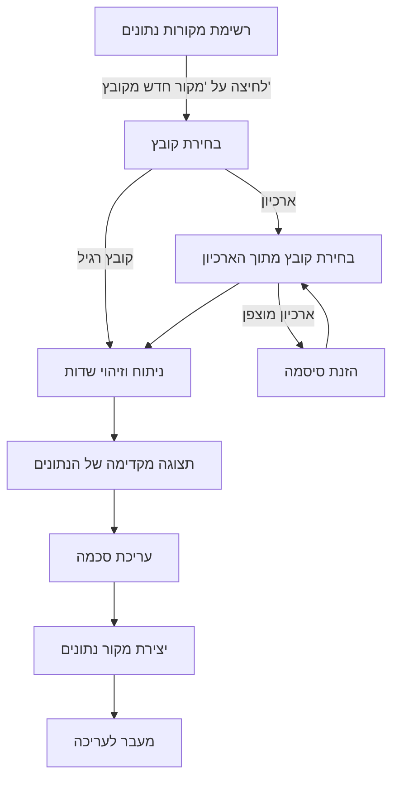

---

## שלבי העבודה

### שלב 1: פתיחת ייבוא מקובץ

נווט לדף **מקורות נתונים** בתפריט הראשי. בחלק העליון של הדף, לצד כפתור "מקור נתונים חדש", מופיע כפתור טורקיז בשם **"מקור נתונים חדש מקובץ"**. לחיצה על הכפתור תפתח חלון לבחירת קובץ מהמחשב.

ניתן גם לגרור קובץ ישירות לאזור הכפתור (drag & drop).


### שלב 2: בחירת קובץ

בחר קובץ נתונים מהמחשב. המערכת מקבלת את הפורמטים הבאים:

- **קבצי נתונים:** CSV, JSON, XML, Excel (.xlsx, .xls)
- **ארכיונים:** ZIP, TAR.GZ, TGZ, 7Z, RAR

גודל מקסימלי: **50MB**. קבצים מעל 10MB עשויים לדרוש זמן ניתוח ארוך יותר.

**אם נבחר קובץ ארכיון** -- המערכת תפתח דפדפן ארכיון המציג את כל קבצי הנתונים שבתוכו. בחר את הקובץ הרצוי מתוך הרשימה.


### שלב 3: ארכיון מוצפן (במידת הצורך)

אם הארכיון מוגן בסיסמה, המערכת תציג שדה להזנת הסיסמה. הזן את הסיסמה ולחץ **"נתח קובץ נבחר"** כדי לפתוח את הארכיון ולהמשיך בתהליך. הסיסמה נשמרת אוטומטית בהגדרות מקור הנתונים שייווצר.


### שלב 4: תצוגה מקדימה וזיהוי שדות

לאחר ניתוח הקובץ, מוצגת **תצוגה מקדימה** של הנתונים בטבלה. המערכת מבצעת זיהוי אוטומטי של:

- **סוגי שדות:** integer, number, boolean, date, string
- **תבניות חכמות:** דוא"ל, מספר טלפון, פורמטים של תאריך
- **מפריד CSV:** זיהוי אוטומטי של פסיק, נקודה-פסיק, Tab ועוד
- **כותרות:** אם קובץ CSV אינו מכיל כותרות, נוצרים שמות סינתטיים (field_1, field_2...)

בחלק העליון של חלון התצוגה מוצג מידע על הקובץ: שם, גודל, מספר שורות ומספר שדות שזוהו.


### שלב 5: עריכת סכמה

המערכת מייצרת סכמת JSON Schema 2020-12 באופן אוטומטי על סמך הנתונים שזוהו. הסכמה מוצגת בעורך Monaco ומאפשרת עריכה ידנית:

- שינוי סוגי שדות (למשל, שדה שזוהה כ-string אך הוא למעשה date)
- הוספת אילוצים: pattern, minimum, maximum, enum
- הגדרת שדות חובה (required)
- הוספת תיאורים לשדות

### שלב 6: יצירה אוטומטית של מקור נתונים

לחץ על **"המשך"** כדי ליצור את מקור הנתונים. המערכת ממלאת אוטומטית:

- **שם מקור הנתונים** -- על פי שם הקובץ שיובא
- **סכמה** -- הסכמה שנוצרה/נערכה בשלב הקודם
- **הגדרות פורמט** -- סוג הקובץ, מפריד (ל-CSV), כותרות
- **הגדרות ארכיון** (אם רלוונטי) -- פורמט ארכיון, סיסמה, נתיב פנימי

לאחר היצירה, המערכת פותחת אוטומטית את טופס העריכה של מקור הנתונים החדש.

### שלב 7: השלמת ההגדרות

בטופס העריכה, השלם את השדות הנותרים:

- **לשונית חיבור:** הגדר שרת מקור (FTP, SFTP, HTTP, Local, NAS) ונתיב לקבצים
- **לשונית תזמון:** הגדר תדירות סריקה ולוח זמנים
- **לשונית פלט:** הגדר יעדי פלט (תיקייה, Kafka topic)

פאנל **השלמה** בצד ימין מציג את אחוז ההשלמה ומסמן שדות חובה חסרים.


---

## פורמטים נתמכים

### קבצי נתונים

| פורמט | סיומות | הערות |
|--------|---------|-------|
| CSV | .csv | עם/ללא כותרות, זיהוי אוטומטי של מפריד (פסיק, נקודה-פסיק, Tab) |
| JSON | .json | אובייקטים ומערכים -- מבנים שטוחים ומקוננים |
| XML | .xml | מבנים שטוחים ומקוננים, אלמנטים ותכונות |
| Excel | .xlsx, .xls | הגיליון הראשון מעובד, זיהוי כותרות אוטומטי |

### ארכיונים

| פורמט | סיומות | הצפנה |
|--------|---------|-------|
| ZIP | .zip | נתמכת -- הזנת סיסמה בממשק |
| TAR.GZ | .tar.gz, .tgz | לא נתמכת (ארכיון ללא הצפנה) |
| 7-Zip | .7z | נתמכת -- הזנת סיסמה בממשק |
| RAR | .rar | נתמכת -- הזנת סיסמה בממשק |

---

## טיפים ושיטות עבודה מומלצות

- **השתמש בקובץ דוגמה מייצג** -- אין צורך בכל הנתונים, 100 שורות ראשונות מספיקות לזיהוי מבנה מדויק
- **CSV -- עקביות מפרידים:** ודא שהמפריד אחיד בכל שורות הקובץ. שורות עם מספר עמודות שונה עלולות לגרום לשגיאות ניתוח
- **בדוק סוגי שדות:** המערכת מזהה סוגים אוטומטית, אך תאריכים עלולים להיות מזוהים כמחרוזות אם הפורמט אינו סטנדרטי. תקן ידנית בעורך הסכמה
- **ארכיונים גדולים:** קבצי ארכיון מעל 100MB עשויים לדרוש מספר שניות לעיבוד -- המתן לסיום הטעינה
- **הסכמה ניתנת לעריכה תמיד:** גם לאחר היצירה, ניתן לחזור ללשונית Schema ולערוך את הסכמה בכל עת
- **ארכיון מוצפן:** הסיסמה נשמרת בהגדרות מקור הנתונים ותשמש אוטומטית בסריקות עתידיות

---

# שכפול מקור נתונים

## סקירה כללית

תכונת השכפול מאפשרת ליצור עותק מלא של מקור נתונים קיים בלחיצה אחת.
במקום להגדיר מאפס מקור נתונים חדש עם הגדרות דומות, ניתן לשכפל מקור קיים ולערוך רק את השדות הרלוונטיים.
זה שימושי במיוחד כאשר יש צורך ליצור מספר מקורות עם הגדרות חיבור דומות, סכמות זהות, או תצורות ארכיון משותפות.

ניתן להפעיל שכפול משני מקומות במערכת: מתפריט הפעולות בדף רשימת המקורות, או מכפתור השכפול בדף העריכה.


---

## תרשים זרימה

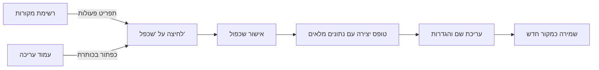

---

## שכפול מדף הרשימה

### שלב 1: ניווט לרשימת מקורות הנתונים

היכנסו לדף **מקורות נתונים** דרך תפריט הניווט הראשי. בדף זה תוכלו לראות את כל המקורות המוגדרים במערכת בתצוגת טבלה.

### שלב 2: בחירת מקור לשכפול

אתרו את מקור הנתונים שברצונכם לשכפל בטבלה. ניתן להשתמש בחיפוש או במסננים לאיתור מהיר.

### שלב 3: פתיחת תפריט הפעולות

לחצו על אייקון שלוש הנקודות (...) בשורה של המקור הרצוי כדי לפתוח את תפריט הפעולות.

### שלב 4: בחירת "שכפל"

מתפריט הפעולות, בחרו באפשרות **"שכפל"**. תופיע תיבת אישור.


### שלב 5: אישור השכפול

בתיבת האישור יופיע שם המקור שעומד להישכפל, יחד עם הערה שהתזמון יושבת בעותק החדש. לחצו **"שכפל"** לאישור.


### שלב 6: עריכת העותק החדש

טופס יצירת מקור חדש ייפתח עם כל השדות מלאים מהמקור המקורי. השם ישתנה אוטומטית ל-**"העתק של [שם מקורי]"**. ערכו את השדות הנדרשים ושמרו.


---

## שכפול מדף העריכה

### שלב 1: פתיחת מקור קיים

פתחו מקור נתונים קיים במצב עריכה על ידי לחיצה עליו ברשימה.

### שלב 2: לחיצה על כפתור "שכפל"

בכותרת דף העריכה, לחצו על הכפתור **"שכפל"**. תופיע אותה תיבת אישור כמו בדף הרשימה.

### שלב 3: אישור ועריכה

אשרו את השכפול. טופס יצירה חדש ייפתח עם כל הנתונים מהמקור המקורי, בדיוק כמו בתהליך מדף הרשימה.

---

## מה נשמר בשכפול?

הטבלה הבאה מפרטת מה מועתק ומה משתנה בעת שכפול מקור נתונים:

| הגדרה | התנהגות |
|--------|---------|
| **שם** | משתנה ל-"העתק של [שם מקורי]" |
| **סכמה** | מועתקת במלואה |
| **הגדרות חיבור** | מועתקות (שרת, נתיב, אישורים) |
| **הגדרות ארכיון** | מועתקות (פורמט, סיסמה, נתיב פנימי) |
| **יעדי פלט** | מועתקים עם מזהים ייחודיים חדשים |
| **תזמון** | מועתק אך **מושבת** |
| **אחוז שלמות** | מחושב מחדש בטופס החדש |

---

## טיפים

- **בדקו את יעדי הפלט** לאחר שכפול -- ייתכן שתרצו לשנות את היעד כדי להימנע מכתיבה כפולה לאותו מיקום.
- **העותק עצמאי לחלוטין** -- שינויים במקור המקורי לא ישפיעו על העותק, ולהיפך.
- **שנו את השם** לפני השמירה כדי למנוע בלבול בין מקורות דומים.

---

# רשימת שלמות מקור נתונים

## סקירה כללית

מערכת השלמות של EZ Platform עוקבת בזמן אמת אחר מילוי כל שדות הטופס בעת יצירה או עריכה של מקור נתונים. המערכת מחלקת את השדות לשלוש רמות עדיפות:

- **חובה** (אדום) -- שדות שחייבים להיות מלאים כדי שמקור הנתונים יוכל לפעול
- **מומלץ** (כתום) -- שדות שמומלץ למלא לתפעול מיטבי
- **אופציונלי** (אפור) -- שדות נוספים שאינם משפיעים על הפעלת המקור

פאנל השלמות מופיע בצד ימין של טופס היצירה והעריכה, ומציג טבעת התקדמות עם אחוז כללי ופירוט לפי לשונית.


---

## תרשים מצבי שדה

התרשים הבא מציג את מעברי המצב של כל שדה בטופס:

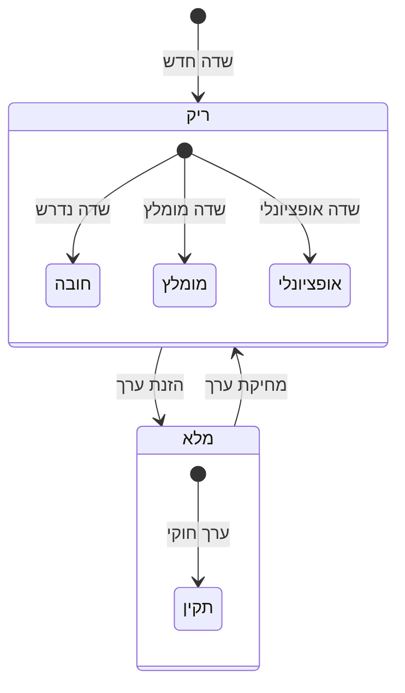

כאשר שדה ריק, הוא מסווג לפי רמת העדיפות שלו. ברגע שמוזן ערך חוקי, השדה עובר למצב "תקין" ונספר באחוז השלמות.

---

## צבעי גבולות שדות

כל שדה בטופס מקבל צבע גבול המציין את מצבו הנוכחי:

| צבע | שם | משמעות | דוגמה |
|------|------|---------|--------|
| גבול אדום | חובה - ריק | שדה נדרש שטרם מולא | שם, סכמה |
| גבול ירוק | מלא - תקין | שדה שמכיל ערך חוקי | שם שמולא |
| גבול כתום | מומלץ - ריק | שדה מומלץ שטרם מולא | תיאור, תזמון |
| גבול אפור | אופציונלי - ריק | שדה אופציונלי, ניתן להשאיר ריק | הערות, התראות |

צבעי הגבולות מתעדכנים באופן מיידי תוך כדי הקלדה -- אין צורך לשמור את הטופס כדי לראות את השינוי.


---

## פאנל השלמות

### טבעת התקדמות

בראש הפאנל מוצגת טבעת התקדמות עם אחוז השלמות הכולל. האחוז מחושב על סמך שדות החובה והמומלצים יחד. הטבעת משנה צבע בהתאם לאחוז:

- **ירוק** -- מעל 80% השלמה
- **כתום** -- בין 50% ל-80%
- **אדום** -- מתחת ל-50%

### פירוט לפי לשונית

מתחת לטבעת מוצגת רשימת כל הלשוניות עם סטטוס השלמה לכל אחת:

- **מידע בסיסי** -- שם, ספק, קטגוריה (חובה)
- **חיבור** -- סוג חיבור, שרת, נתיב (חובה)
- **הגדרות קובץ** -- סוג קובץ, קידוד (חובה)
- **סכמה** -- סכמת JSON עם שדות מוגדרים (חובה)
- **תזמון** -- תדירות, ביטוי Cron (מומלץ)
- **פלט** -- יעדי פלט מוגדרים (מומלץ)
- **אימות** -- הגדרות אימות (אופציונלי)
- **התראות** -- הגדרות התראות (אופציונלי)

לחיצה על פריט ברשימה מנווטת ישירות ללשונית המתאימה בטופס.

### פאנל שדות חסרים

בתחתית הפאנל מוצגת רשימת השדות שדורשים תשומת לב, ממוינת לפי עדיפות -- שדות חובה מופיעים ראשונים, ואחריהם שדות מומלצים. כל שדה מוצג עם שם הלשונית שאליה הוא שייך.


---

## מחוון שלמות ברשימה

בדף רשימת מקורות הנתונים, כל מקור מציג טבעת התקדמות מוקטנת. צבע הטבעת משקף את רמת השלמות:

- **ירוק** -- מעל 80% (מוכן להפעלה)
- **כתום** -- 50%-80% (דורש השלמה)
- **אדום** -- מתחת ל-50% (חסרים שדות קריטיים)

מחוון זה מאפשר לזהות במבט מהיר אילו מקורות נתונים דורשים תשומת לב נוספת.


---

## השבתה אוטומטית

מקורות נתונים שלא עומדים בדרישות המינימום (כל שדות החובה מלאים) מושבתים אוטומטית. מתג ההפעלה/השבתה ברשימה מושבת ומוצג באפור, עם הסבר בתפריט מרחף (tooltip) המפרט אילו שדות חסרים.

ברגע שכל שדות החובה מלאים, המתג הופך לפעיל ומאפשר הפעלת מקור הנתונים. מנגנון זה מונע הפעלת צינורות עיבוד עם הגדרות חסרות, ומבטיח שכל מקור נתונים פעיל מוגדר כראוי.

אם מקור נתונים פעיל נערך ושדה חובה נמחק, המערכת תשבית אותו אוטומטית ותציג הודעה מתאימה.

---

## טיפים לשימוש

**טיפים להשלמה מהירה:**

1. **התחילו משדות חובה** -- מלאו קודם את השדות עם גבול אדום לפני שדות מומלצים
2. **השתמשו בפאנל שדות חסרים** -- לחצו על שדה חסר כדי לנווט ישירות ללשונית הרלוונטית
3. **אחוז השלמות כולל גם שדות מומלצים** -- שדות מומלצים (כתום) נספרים באחוז הכולל
4. **חישוב בזמן אמת** -- השלמות מתעדכנת מיידית תוך כדי הקלדה, ללא צורך בשמירה
5. **ייבוא מקובץ** -- פעולת ייבוא מקובץ ממלאת אוטומטית שדות רבים ומעלה את אחוז השלמות במהירות

---

# הגדרת סכמה ואימות

## תרשים זרימת אימות

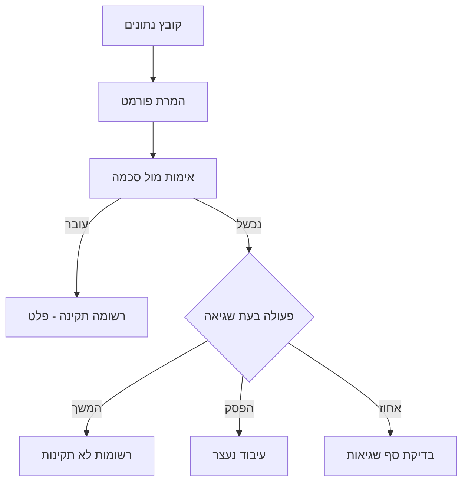

---

## סקירת Schema

JSON Schema מגדיר:
- **מבנה הנתונים**: אילו שדות צריכים להיות
- **סוג הנתונים**: מחרוזת, מספר, תאריך, וכו'
- **כללי אימות**: אורך, תבנית, טווח ערכים
- **שדות חובה**: אילו שדות חייבים להופיע

המערכת משתמשת בתקן JSON Schema 2020-12 לאימות נתונים באמצעות מנוע Corvus.Json.Validator.

---

## ניהול סכמות

דף **ניהול Schema** מציג את כל הסכמות המוגדרות במערכת. לכל סכמה מוצגים: שם, תיאור, מספר שדות, תאריך עדכון, וסטטוס.


**פעולות זמינות:**
- **צפה** -- תצוגת קריאה בלבד של הסכמה
- **ערוך** -- פתיחת הסכמה בעורך החזותי
- **מחק** -- מחיקת סכמה (לא ניתן למחוק סכמה בשימוש)
- **צור Schema חדש** -- פתיחת עורך חדש ריק
- **תבניות Schema** -- בחירת תבנית מוכנה

---

## עורך הסכמות החזותי (Schema Builder)

עורך הסכמות הוא כלי חזותי רב-עוצמה לבניה ועריכה של סכמות JSON Schema. הוא מספק תצוגת עץ וקוד בו-זמנית, עם כלי עזר מובנים.

### סרגל הכלים


סרגל הכלים בראש העורך מכיל:

| כפתור | פעולה |
|--------|--------|
| **תצוגת עץ** | מעבר בין תצוגת עץ חזותית לתצוגת קוד JSON גולמי |
| **הרחב הכל** | פריסת כל השדות והאובייקטים המקוננים בבת אחת |
| **כווץ הכל** | כיווץ כל השדות לתצוגה מצומצמת |
| **תבניות Schema** | פתיחת ספריית תבניות מוכנות |
| **עזרת Regex** | פתיחת כלי עזר לביטויים רגולריים |
| **הצג JSON לדוגמה** | יצירת JSON לדוגמה המתאים לסכמה הנוכחית |
| **אמת JSON** | בדיקת תקינות הסכמה |
| **הוסף שדה** | הוספת שדה חדש לסכמה |

### תצוגה מורחבת (Expand All)

לחיצה על **"הרחב הכל"** פורסת את כל השדות, כולל אובייקטים מקוננים ומערכים. מאפשרת לראות את כל מבנה הסכמה במבט אחד.


בצד שמאל מוצג קוד ה-JSON Schema המקורי בעורך Monaco (אותו עורך כמו VS Code), עם:
- **צביעת תחביר** -- JSON מוצג עם צבעים
- **מספרי שורות** -- לניווט קל
- **השלמה אוטומטית** -- הצעות ל-JSON Schema keywords
- **העתקת מקור** -- כפתור להעתקת הסכמה כטקסט

### עזרת Regex

כלי העזר ל-Regex מציע תבניות נפוצות לשימוש בשדות pattern:


**תבניות מוכנות:**

| תבנית | Regex | דוגמה |
|--------|-------|--------|
| ת"ז ישראלית (9 ספרות) | `^\d{9}$` | 123456789 |
| טלפון ישראלי | `^0\d{1,2}-?\d{7}$` | 03-1234567 |
| דוא"ל | `^[\w.-]+@[\w.-]+\.\w+$` | user@example.com |
| תאריך (DD/MM/YYYY) | `^\d{2}/\d{2}/\d{4}$` | 25/03/2026 |
| טלפון נייד | `^05\d-?\d{7}$` | 052-1234567 |
| מספר חשבונית | `^INV-\d+$` | INV-00123 |

לכל תבנית מוצגים: שם בעברית, ביטוי ה-Regex, דוגמה תואמת, ואפשרות להוסיף ישירות לשדה הנבחר.

### JSON לדוגמה

לחיצה על **"הצג JSON לדוגמה"** מייצרת אוטומטית אובייקט JSON שתואם לסכמה הנוכחית:


המערכת מייצרת ערכים אקראיים המתאימים לאילוצי הסכמה:
- **מחרוזת** -- טקסט לדוגמה בפורמט הנדרש
- **מספר** -- ערך בטווח min/max
- **תאריך** -- תאריך בפורמט הנדרש
- **boolean** -- true/false

כלי זה שימושי לבדיקת הסכמה לפני הפעלת עיבוד -- אם ה-JSON לדוגמה נראה הגיוני, הסכמה כנראה נכונה.

### ספריית תבניות


ספריית התבניות מציעה 6 סכמות מוכנות:

| תבנית | שדות עיקריים | שימוש |
|--------|-------------|--------|
| **לקוח ישראלי** | ת"ז, טלפון, כתובת, שם, דוא"ל | ניהול לקוחות ישראליים |
| **עסקה פיננסית** | סכום, תאריך, סוג עסקה, מטבע, הפניה | דוחות כספיים |
| **קטלוג מוצרים** | שם, מחיר, מק"ט, מלאי, קטגוריה | ניהול מלאי |
| **רשומת עובד** | שם, תפקיד, מחלקה, משכורת, תאריך התחלה | משאבי אנוש |
| **חשבונית מע"מ** | מספר, תאריך, סכום, מע"מ, ספק, סטטוס | הנהלת חשבונות |
| **הזמנת רכש** | מספר הזמנה, ספק, פריטים, סכום, תאריך אספקה | רכש ולוגיסטיקה |

בחירת תבנית טוענת את הסכמה לעורך, שם ניתן להתאים אותה לצורך הספציפי.

---

## סכמה בטופס מקור נתונים

בלשונית **"הגדרת Schema"** בטופס יצירה/עריכה של מקור נתונים, ניתן:


1. **לערוך ישירות** -- עורך Monaco מלא עם קוד JSON Schema
2. **לבחור סכמה קיימת** -- מרשימה נפתחת של סכמות שנוצרו בניהול Schema
3. **ללא סכמה** -- המערכת תקבל את כל הנתונים ללא אימות (לא מומלץ לייצור)

### סכמה אוטומטית מייבוא

בעת [ייבוא מקובץ](#ייבוא-מקור-נתונים-מקובץ), המערכת מייצרת סכמה אוטומטית על סמך הנתונים שזוהו:

- **זיהוי סוגי שדות**: integer, number, boolean, date, string
- **תבניות חכמות**: דוא"ל, מספר טלפון, פורמטים של תאריך
- **מפריד CSV**: זיהוי אוטומטי של פסיק, נקודה-פסיק, Tab

הסכמה שנוצרת ניתנת לעריכה ידנית בעורך Monaco לפני ואחרי יצירת מקור הנתונים.

---

## כללי אימות

כאשר קובץ מעובד, כל רשומה נבדקת מול הסכמה:

- **רשומה תקינה**: עוברת ליעד הפלט
- **רשומה שגויה**: תלוי בהגדרת "פעולה בעת שגיאה":
  - **המשך עיבוד**: רשומות תקינות ממשיכות, שגויות נשלחות ל[רשומות לא תקינות](#רשומות-לא-תקינות)
  - **הפסק עיבוד**: כל הקובץ נדחה
  - **אחוז מקסימלי**: אם אחוז השגיאות עובר את הסף, העיבוד נעצר


---

## טיפים

- **התחל מתבנית:** בחר תבנית קרובה לצורך שלך וערוך אותה, במקום לבנות סכמה מאפס
- **השתמש בהרחב הכל:** כשעובדים עם סכמה מורכבת, "הרחב הכל" נותן מבט מלא על המבנה
- **בדוק עם JSON לדוגמה:** לפני שמירה, לחץ "הצג JSON לדוגמה" -- אם הפלט נראה הגיוני, הסכמה כנראה נכונה
- **ייבוא אוטומטי:** בעת [ייבוא מקובץ](#ייבוא-מקור-נתונים-מקובץ), המערכת מייצרת סכמה אוטומטית -- חוסך זמן רב
- **בדוק עם קובץ קטן:** לפני הפעלת עיבוד על קבצים גדולים, בדוק את הסכמה עם קובץ של 10-20 שורות
- **שדות חובה:** הגדר `required` רק לשדות שחייבים להופיע בכל רשומה -- סכמה מחמירה מדי תיצור הרבה [רשומות שגויות](#רשומות-לא-תקינות)

---

# תזמון ומעקב

## תרשים זרימת עיבוד

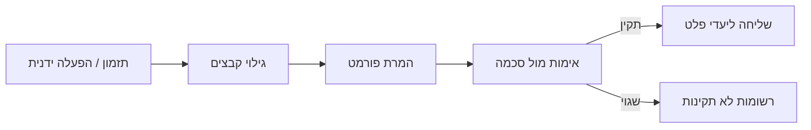

---

## מעגל החיים של קובץ

כל קובץ עובר את שלבי העיבוד הבאים:

1. **גילוי (FileDiscovery)** -- סריקת מקור הנתונים לקבצים חדשים
2. **המרת פורמט (FileProcessor)** -- המרה לפורמט אחיד
3. **אימות (Validation)** -- בדיקה מול סכמה
4. **פלט (Output)** -- שליחה ליעדים מוגדרים

**זמן עיבוד ממוצע:**

| גודל קובץ | זמן עיבוד |
|-----------|-----------|
| פחות מ-1,000 רשומות | 1-3 שניות |
| 1,000-5,000 רשומות | 5-15 שניות |
| 5,000-10,000 רשומות | 20-60 שניות |

---

## תדירות עיבוד

### ידני
- המערכת לא תעבד אוטומטית
- ניתן להפעיל ידנית מרשימת מקורות הנתונים

### מתוזמן

| תדירות | תיאור |
|---------|--------|
| כל דקה | בדיקה כל דקה |
| כל 5 דקות | בדיקה כל 5 דקות |
| כל 15 דקות | בדיקה כל 15 דקות |
| כל 30 דקות | בדיקה כל חצי שעה |
| כל שעה | בדיקה כל שעה |
| יומי | פעם ביום בשעה קבועה |
| שבועי | פעם בשבוע ביום ובשעה קבועים |
| חודשי | פעם בחודש ביום ובשעה קבועים |
| מותאם אישית (Cron) | ביטוי Cron מותאם |


### ביטויי Cron

```
*/5 * * * *    - כל 5 דקות
0 9 * * *      - כל יום ב-9:00
0 0 * * 0      - כל יום ראשון ב-00:00
0 9 1 * *      - ב-1 לחודש ב-9:00
```

### חלון זמן
- הגדר טווח שעות לעיבוד (לדוגמה: 08:00-18:00)
- מחוץ לחלון, המערכת לא תעבד קבצים

---

## מעקב אחר עיבוד

### ברשימת מקורות נתונים
- עמודת "קבצים": מספר קבצים שעובדו
- עמודת "תזמון": תדירות העיבוד
- כפתור ברק: הפעלה ידנית
- [מחוון שלמות](#רשימת-שלמות-מקור-נתונים): אחוז השלמת ההגדרות


### בדשבורד
- גרפים של קבצים שעובדו לאורך זמן
- מספר רשומות מעובדות
- אחוז שגיאות

---

## הפעלה ידנית

**מתי להשתמש:**
- בדיקת מקור נתונים חדש
- עיבוד מיידי של קבצים דחופים
- לאחר תיקון שגיאות

**איך:**
1. מצא את מקור הנתונים ברשימה
2. לחץ כפתור ברק
3. המערכת מתחילה עיבוד מיידי
4. עקוב אחר הסטטוס בדשבורד או ברשומות לא תקינות

**שכפול עם תזמון מושבת:** בעת [שכפול מקור נתונים](#שכפול-מקור-נתונים), התזמון מושבת אוטומטית בעותק החדש. זה מאפשר לך לבדוק ולהתאים את ההגדרות לפני הפעלת תזמון.

---

## מעקב אחר פעילות

### רשומות לא תקינות
1. לחץ "רשומות לא תקינות" בתפריט
2. צפה ברשומות שנכשלו באימות
3. סנן לפי מקור נתונים, סוג שגיאה
4. ערוך רשומה לתיקון
5. שלח מחדש לעיבוד

### התרעות
1. לחץ "התרעות" בתפריט
2. צפה בהתראות פעילות
3. הגדר כללי התראה חדשים
4. נהל חומרת התראות

---

# ניטור מערכת

## תרשים ארכיטקטורת ניטור

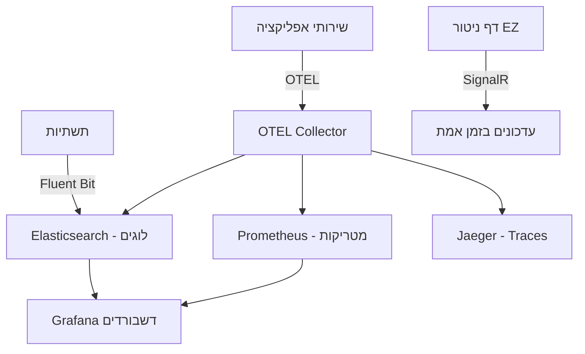

---

## סקירה כללית

דף ניטור המערכת (System Monitoring) מציג בזמן אמת את מצב כל רכיבי הפלטפורמה. הדף משתמש בחיבור SignalR WebSocket לעדכונים חיים.


### גישה לניטור

1. לחץ על **"ניטור"** בתפריט הצדדי
2. הדף מציג כותרת עם מידע על ה-cluster וסטטוס החיבור

---

## סטטוס חיבור

בפינה העליונה מוצגת נקודת סטטוס:

| צבע | משמעות |
|------|---------|
| **ירוק** | מחובר -- עדכונים חיים באמצעות SignalR |
| **צהוב** | מתחבר מחדש -- ניתוק זמני, המערכת מנסה להתחבר |
| **אדום** | מנותק -- אין חיבור SignalR, המערכת משתמשת בנתוני גיבוי |

---

## לשוניות

הדף מחולק ללשוניות:

| לשונית | תוכן |
|---------|-------|
| **סקירה** | זרימת Pipeline, אירועים, בריאות שירותים, גרפי ביצועים |
| **בריאות מכשירים** | סטטוס התקני NAS ושרתי Admin |
| **Pods** | טבלת Pod Status ב-Kubernetes |
| **Traces** | מעקב מבוזר (Distributed Tracing) |
| **תורים** | סטטוס תורי RabbitMQ |
| **התרעות** | התראות מערכת אחרונות |

---

## עדכונים בזמן אמת

כאשר החיבור פעיל (SignalR), הנתונים מתעדכנים אוטומטית:
- **כל 5 שניות**: סטטוס שירותים, תורי Kafka, Pods, מטריקות
- **כל 30 שניות**: Traces, אירועים, התרעות, בריאות מכשירים

כאשר החיבור מנותק, המערכת עוברת אוטומטית ל-polling (רענון כל 30 שניות).

---

## בריאות מכשירים

לשונית "בריאות מכשירים" מציגה את מצב כל התקני ה-NAS ושרתי ה-Admin המוגדרים במערכת. המערכת בודקת אוטומטית את הזמינות כל 30 שניות.

### סטטוס מכשיר

| סטטוס | צבע | משמעות |
|--------|------|---------|
| **תקין (Healthy)** | ירוק | המכשיר מגיב כרגיל |
| **מושפל (Degraded)** | צהוב | תקלות לסירוגין או חביון גבוה |
| **מושבת (Down)** | אדום | המכשיר לא נגיש |

### כללי סטטוס

הסטטוס נקבע לפי כשלים רצופים:
- **0 כשלים**: תקין (Healthy)
- **1-2 כשלים**: מושפל (Degraded)
- **3+ כשלים**: מושבת (Down)

### ספי חביון

גם כאשר הבדיקה מצליחה, חביון גבוה גורם לסטטוס "מושפל":

| סוג מכשיר | סף מושפל |
|-----------|-----------|
| **NAS** | 2,000 מילישניות |
| **AdminServer** | 5,000 מילישניות |

### תצוגת כרטיסים

כל מכשיר מוצג ככרטיס עם:
- שם המכשיר וסוגו
- סטטוס בריאות (עם צבע)
- חביון אחרון (במילישניות)
- אחוז זמינות (24 שעות)
- זמן בדיקה אחרונה


### סרגל סיכום

בראש הלשונית מוצג סרגל סיכום:
- מספר מכשירים כולל
- מספר תקינים (ירוק)
- מספר מושפלים (צהוב)
- מספר מושבתים (אדום)

---

## ניהול התקני NAS

### הוספת התקן NAS חדש

1. עבור ל"הגדרות מערכת" בתפריט הצדדי
2. בחר בלשונית "התקני NAS"
3. לחץ על כפתור "הוסף התקן NAS"
4. מלא את הפרטים:

| שדה | חובה | תיאור |
|-----|------|--------|
| **שם התקן** | כן | שם מזהה ייחודי (לדוגמה: "NAS-Prod-01") |
| **כתובת שרת NFS** | כן | כתובת IP או hostname (לדוגמה: `192.168.1.100`) |
| **נתיב Export** | כן | הנתיב ב-NAS (לדוגמה: `/exports/data`) |
| **קיבולת (GB)** | לא | גודל האחסון המוקצה (ברירת מחדל: 100GB) |
| **תפקיד** | כן | קלט (כחול), פלט (ירוק), גיבוי (כתום), קלט ופלט (סגול) |
| **תיאור** | לא | הסבר על התקן ה-NAS |

5. לחץ "צור"
6. המערכת תיצור אוטומטית PersistentVolume ו-PersistentVolumeClaim ב-Kubernetes

### תגיות סטטוס

| תגית | צבע | משמעות |
|-------|------|---------|
| **מחובר** | ירוק | התקן NFS זמין ומגיב |
| **לא מחובר** | אדום | אין תקשורת עם ההתקן |
| **PVC מחובר** | ירוק | PersistentVolumeClaim מחובר ל-PV |
| **PV נוצר** | כחול | PersistentVolume נוצר ב-Kubernetes |
| **לא מוקצה** | אפור | התקן לא הוקצה עדיין |

התגיות מוצגות בעברית או באנגלית לפי שפת הממשק שנבחרה.

### מחיקת התקן NAS

מחיקת התקן NAS מסירה אוטומטית את משאבי Kubernetes (PV/PVC) ללא צורך בהסרה ידנית:
1. לחץ על כפתור המחיקה
2. אשר את הפעולה בחלון אישור
3. המערכת מסירה PV/PVC (אם קיימים)
4. ההתקן נמחק מהרשימה

---

## דשבורד מטריקות עסקיות

**גישה:** http://localhost:3001 (Grafana)

**התחברות:**
- שם משתמש: `admin`
- סיסמה: `EZPlatform2025!Beta`

### דשבורדים

**Business Metrics Dashboard:**
- רשומות מעובדות: מספר רשומות לשעה/יום
- קבצים מעובדים: מספר קבצים לאורך זמן
- רשומות שגויות: אחוז ומספר מוחלט
- זמן עיבוד: משך עיבוד ממוצע
- חביון End-to-End: זמן מגילוי ועד פלט

**Infrastructure Dashboard:**
- שימוש CPU/זיכרון של pods
- ביצועי MongoDB
- תפוקת Kafka
- סטטיסטיקות Hazelcast cache

---

## נראות OTEL

כל 8 השירותים בפלטפורמה מדווחים טלמטריה דרך OTEL Collector:
- **Logs**: ניתנים לצפייה ב-Grafana (מקור: Elasticsearch)
- **Traces**: ניתנים לצפייה ב-Jaeger (http://localhost:16686)
- **Metrics**: ניתנים לצפייה ב-Grafana (מקור: Prometheus)

### סמלי סטטוס בממשק

| סמל | משמעות |
|------|---------|
| נקודה ירוקה | מחובר / תקין |
| נקודה צהובה | מתחבר מחדש / מושפל |
| נקודה אדומה | מנותק / מושבת |
| תג ירוק "מחובר" | התקן NAS מחובר |
| תג אדום "לא מחובר" | התקן NAS לא זמין |
| תג כחול "PV נוצר" | משאב Kubernetes נוצר |
| תג אפור "לא מוקצה" | ממתין להקצאה |

---

## טיפים

- **בדוק בריאות מכשירים לפני הגדרת מקור חדש** -- ודא שהתקני NAS זמינים לפני שאתה מקשר אותם
- **השתמש ב-Grafana לניתוח מגמות** -- דשבורד הניטור של EZ מציג מצב נוכחי, Grafana מציגה היסטוריה
- **נקודת סטטוס ירוקה = הכל תקין** -- אם אתה רואה צהוב או אדום, בדוק את החיבור לשירותים
- **Jaeger ל-debugging** -- כאשר עיבוד קובץ נכשל, חפש את ה-Trace ב-Jaeger לראות באיזה שלב בדיוק כשל

---

# אימות מחדש אוטומטי של רשומות שגויות

## סקירה כללית

כאשר סכמת אימות של מקור נתונים מתעדכנת, ייתכן שרשומות שנכשלו בעבר כבר עומדות בכללים החדשים. תכונת **אימות מחדש אוטומטי** מזהה את שינוי הסכמה ומבצעת בדיקה חוזרת של כל הרשומות הלא תקינות -- ללא התערבות ידנית.

רשומות שעוברות בהצלחה את האימות החדש מועברות אוטומטית לצינור העיבוד ונשלחות ליעדי הפלט. רשומות שעדיין נכשלות מתעדכנות עם הודעות שגיאה חדשות המשקפות את הסכמה המעודכנת.

**יתרונות עיקריים:**
- חיסכון בעבודה ידנית -- אין צורך לבדוק כל רשומה בנפרד
- שחרור רשומות תקועות אוטומטית לאחר תיקון הסכמה
- מעקב גרסאות סכמה לכל רשומה

---

## תרשים זרימה

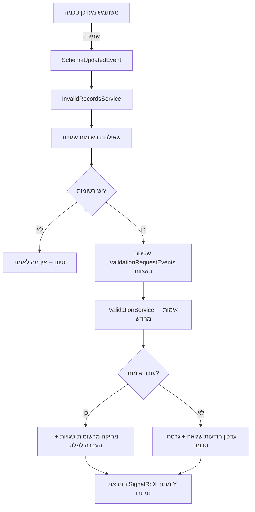

---

## אימות מחדש אוטומטי -- איך זה עובד?

### הפעלה אוטומטית בעת שינוי סכמה

כאשר אתה שומר שינוי בסכמת JSON Schema של מקור נתונים, המערכת מפעילה אוטומטית אימות מחדש של כל הרשומות הלא תקינות של אותו מקור. **אין צורך באישור נוסף** -- התהליך מתחיל ברקע מיד עם השמירה.

### מגבלת קצב לנתונים גדולים

עבור מקורות עם מספר רב של רשומות שגויות (מעל 1,000), המערכת מבצעת את האימות באצוות:
- **100 רשומות** בכל אצווה
- **השהיה של שנייה** בין אצוות
- מניעת עומס על שירות האימות

### התראות בזמן אמת

בסיום האימות מחדש, מוצגת הודעת toast:

> **"X מתוך Y רשומות נפתרו על ידי שינוי הסכמה"**

ההודעה נעלמת לאחר כ-10 שניות. בנוסף, דשבורד הסטטיסטיקות בדף רשומות לא תקינות מתעדכן בזמן אמת דרך SignalR.


---

## כפתור "אמת מחדש הכל"

בנוסף לאימות האוטומטי, ניתן להפעיל אימות מחדש ידנית משני מיקומים:

### מיקום 1: דף רשומות לא תקינות

בכותרת הדף, לצד כפתורי "מחק הכל" ו"ייצא JSON", מופיע כפתור **"אמת מחדש הכל"**. לחיצה על הכפתור מציגה חלונית אישור עם מספר הרשומות שיאומתו מחדש.


הכפתור מכבד את המסננים הפעילים -- אם סיננת לפי מקור נתונים ספציפי, רק הרשומות המסוננות יאומתו מחדש.

### מיקום 2: לשונית סכמה בעריכת מקור נתונים

בלשונית Schema בטופס עריכת מקור נתונים, מופיע כפתור **"אמת מחדש הכל"** עם תג המראה את מספר הרשומות השגויות. הכפתור מכוון לאותו מקור נתונים בלבד.


**מתי להשתמש בכפתור הידני?** האימות האוטומטי מכסה 95% מהמקרים. הכפתור הידני מיועד למקרי קצה:
- רשומות שהגיעו **אחרי** שינוי הסכמה
- כשלים זמניים במהלך האימות האוטומטי
- רשומות שתוקנו ידנית ומוכנות לאימות חוזר

---

## גרסאות סכמה

### מעקב אוטומטי אחר גרסאות

המערכת מנהלת מספר גרסה (SchemaVersion) לכל מקור נתונים. בכל פעם שהסכמה משתנה, מספר הגרסה עולה אוטומטית ב-1.

| שדה | תיאור |
|-----|--------|
| **SchemaVersion** | מספר גרסת הסכמה הנוכחית של מקור הנתונים. עולה אוטומטית בכל שינוי סכמה |
| **ValidatedWithSchemaVersion** | מספר גרסת הסכמה שנגדה אומתה הרשומה. מתעדכן בכל אימות מחדש |

### תגיות גרסה על רשומות

בדף רשומות לא תקינות, כל רשומה מציגה תגית המראה באיזו גרסת סכמה היא אומתה לאחרונה. תגית זו מאפשרת לזהות בקלות אילו רשומות עברו אימות מחדש ואילו טרם נבדקו מול הסכמה העדכנית.

---

## TTL -- שמירת רשומות שגויות

רשומות שגויות צורכות מקום במסד הנתונים. כדי למנוע הצטברות בלתי מבוקרת, המערכת מוחקת אוטומטית רשומות שפג תוקפן.

### ברירת מחדל גלובלית

**4 ימים** -- רשומות שגויות שלא טופלו תוך 4 ימים נמחקות אוטומטית.

### דריסה לפי מקור נתונים

בלשונית **מידע בסיסי** בטופס עריכת מקור נתונים, ניתן להגדיר ערך TTL שונה בשדה **"שמירת רשומות שגויות"** (InvalidRecordsTtlDays). ערך זה דורס את ברירת המחדל הגלובלית עבור אותו מקור בלבד.


| הגדרה | ערך |
|--------|------|
| ברירת מחדל גלובלית | 4 ימים |
| דריסה לפי מקור | אופציונלי, שדה מספרי בלשונית מידע בסיסי |
| תזמון מחיקה | יומי בשעה 03:00 UTC |
| סוג מחיקה | מחיקה קשיחה (hard delete) |

**שימו לב:** רשומות שנמחקו על ידי TTL אינן ניתנות לשחזור. ודאו שערך ה-TTL מספק מספיק זמן לטיפול ברשומות שגויות.

---

## הורדת סכמה בפורמט YAML

בלשונית Schema בעורך מקור הנתונים, לצד כפתור "הורד JSON" הקיים, מופיע כפתור **"הורד YAML"**.

**שימושים:**
- ייצוא הסכמה לכלים חיצוניים שעובדים עם YAML
- שיתוף הגדרות סכמה עם צוותים אחרים
- גיבוי הגדרות הסכמה בפורמט קריא

הקובץ נשמר עם סיומת `.yaml` ואותו שם כמו קובץ ה-JSON. ההמרה מתבצעת בדפדפן ללא צורך בפנייה לשרת.

---

## פתרון בעיות -- אימות מחדש

### שאלה: למה הרשומות שלי לא עברו אימות מחדש?

**בדוק את הנקודות הבאות:**
1. **רשומות מסומנות כ"התעלם"** -- רשומות שסומנו כ-Ignored לא נכללות באימות מחדש אוטומטי
2. **הסכמה לא באמת השתנתה** -- אם שמרת את הסכמה ללא שינוי בפועל, לא יופעל אימות מחדש
3. **בדוק את כפתור "אמת מחדש הכל"** -- נסה להפעיל אימות מחדש ידני מלשונית Schema

### שאלה: הרשומות עדיין נכשלות אחרי שינוי הסכמה

הסכמה החדשה עשויה לא לפתור את כל סוגי השגיאות. לדוגמה:
- שינוי pattern לא ישפיע על שגיאות מסוג `required`
- הוספת שדה ל-required לא תתקן שגיאות ערך (type mismatch)
- בדוק את הודעות השגיאה המעודכנות -- הן משקפות את הסכמה החדשה

### שאלה: מתי נמחקות רשומות שפג תוקפן?

משימת הניקוי רצה **יומית בשעה 03:00 UTC**. רשומות שעברו את תקופת ה-TTL שלהן (ברירת מחדל: 4 ימים, או הערך שהוגדר למקור הנתונים) נמחקות באופן קבוע.

### שאלה: כפתור "אמת מחדש הכל" לא מופיע בלשונית סכמה

הכפתור מופיע רק כאשר קיימות רשומות שגויות למקור הנתונים הנוכחי. אם אין רשומות שגויות, אין צורך באימות מחדש.

---

# ניהול התרעות

## סקירה כללית

מערכת ההתרעות של EZ Platform מאפשרת ליצור כללי התראה המבוססים על ביטויי PromQL שמנטרים את ביצועי המערכת והנתונים. כאשר תנאי ההתרעה מתקיים, המערכת מפעילה התראה בהתאם לחומרה שהוגדרה.

המערכת תומכת בשלושה סוגי התרעות:
- **התרעות מקור נתונים** (כחול) -- מטריקות הקשורות למקור נתונים ספציפי
- **התרעות עסקיות** (ירוק) -- מטריקות עסקיות גלובליות (רשומות מעובדות, קבצים, חביון)
- **התרעות מערכת** (כתום) -- מטריקות תשתית (CPU, זיכרון, דיסק, רשת, Kubernetes)


---

## תרשים זרימת התרעות

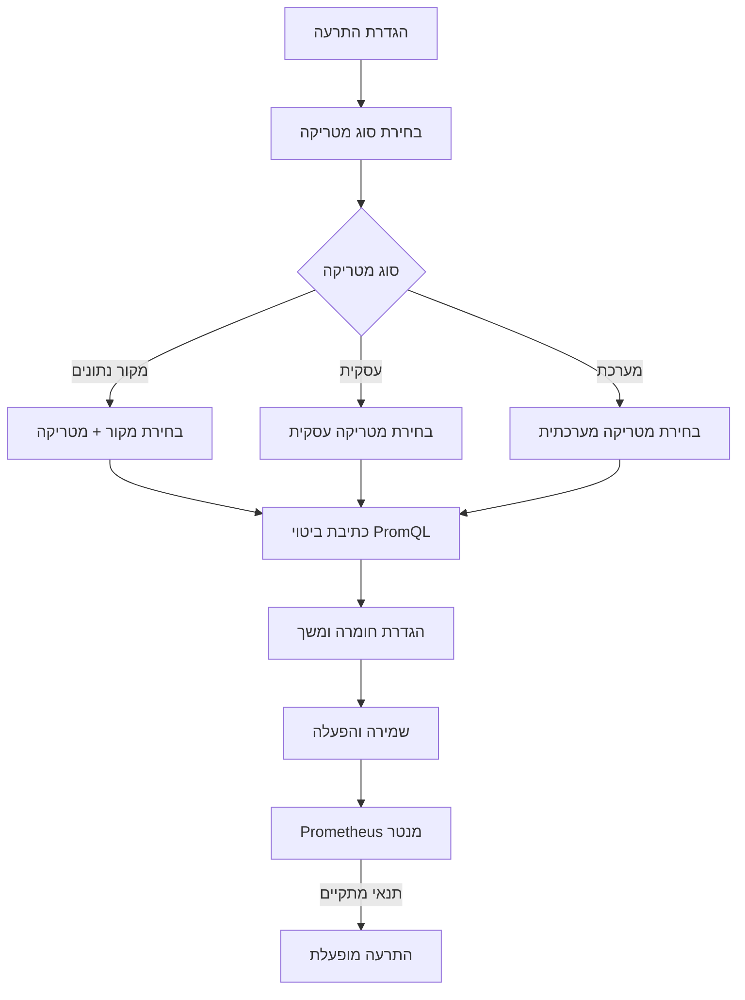

---

## דף ניהול ההתרעות

### טבלת ההתרעות

דף ההתרעות מציג טבלה עם כל ההתרעות המוגדרות במערכת:

| עמודה | תיאור |
|--------|--------|
| **שם** | שם ההתרעה עם תיאור מקוצר |
| **מטריקה** | שם המטריקה עם תגית צבעונית לפי סוג (כחול=מקור, ירוק=עסקית, כתום=מערכת) |
| **חומרה** | קריטי (אדום), אזהרה (כתום), מידע (כחול) |
| **ביטוי** | ביטוי PromQL של ההתרעה |
| **סטטוס** | מופעל / מושבת |
| **תוויות** | תגיות סינון (עד 3 מוצגות) |
| **פעולות** | עריכה, מחיקה |

### סינון וחיפוש

בחלק העליון של הדף מופיעים מסנני חיפוש מתקדמים:

- **חיפוש חופשי** -- חיפוש לפי שם, ביטוי, תיאור או שם מטריקה
- **סינון לפי חומרה** -- קריטי, אזהרה, מידע
- **סינון לפי סטטוס** -- מופעל, מושבת
- **סינון לפי קטגוריה** -- מסנן מדורג
- **סינון לפי מקור נתונים** -- מסנן מדורג
- **סינון לפי מטריקה** -- מסנן מדורג

---

## יצירת התרעה חדשה

### שלב 1: פתיחת טופס ההתרעה

לחץ על כפתור **"הוסף התרעה"** בפינה העליונה של דף ההתרעות. ייפתח חלון דיאלוג ליצירת התרעה חדשה.


### שלב 2: בחירת סוג המטריקה

בחר את סוג המטריקה עליה תבוסס ההתרעה:

#### מטריקות מקור נתונים (23 מטריקות)
מטריקות הקשורות למקור נתונים ספציפי. בחר קטגוריה ומקור נתונים לסינון.

#### מטריקות עסקיות (23 מטריקות ב-7 קטגוריות)

| קטגוריה | מטריקות עיקריות |
|----------|-----------------|
| **רשומות** | רשומות מעובדות, רשומות שגויות, רשומות שדולגו, רשומות פלט, dead letter |
| **קבצים** | קבצים מעובדים, קבצים ממתינים, גודל קובץ בבתים |
| **נפח** | בתים מעובדים, בתים בפלט |
| **משימות** | משימות פעילות, משימות שהושלמו, משימות שנכשלו, batches |
| **חביון** | משך עיבוד, חביון end-to-end, זמן המתנה בתור, חביון אימות |
| **אימות** | אחוז שגיאות אימות |
| **הודעות** | הודעות שנשלחו, הודעות שהתקבלו |

#### מטריקות מערכת (25 מטריקות ב-7 קטגוריות)

| קטגוריה | מטריקות עיקריות |
|----------|-----------------|
| **CPU** | שניות CPU תהליך, שימוש CPU תהליך, CPU צומת |
| **זיכרון** | זיכרון תהליך (resident/virtual), GC heap, זיכרון צומת |
| **דיסק** | מקום פנוי, גודל כולל |
| **רשת** | בתים שהתקבלו, בתים שנשלחו |
| **HTTP** | בקשות כולל, משך בקשה, בקשות בתהליך |
| **Kubernetes** | סטטוס Pod, replicas זמינים, CPU/זיכרון container |
| **בריאות** | up status, משך scrape |

### שלב 3: בניית ביטוי PromQL

ישנן שתי דרכים לבנות ביטוי PromQL:

#### שימוש בתבניות מוכנות (7 תבניות + מותאם אישית)

| תבנית | ביטוי | שימוש |
|--------|--------|--------|
| **קצב גבוה** | `rate({metric}[{duration}]) > {threshold}` | זיהוי קצב חריג של אירועים |
| **אחוז מעל סף** | `({numerator} / {denominator}) * 100 > {threshold}` | אחוז שגיאות, אחוז כשלים |
| **השוואת ערך** | `{metric} {operator} {threshold}` | ערך מעל/מתחת לסף |
| **זיהוי היעדרות** | `absent({metric}[{duration}])` | מטריקה שהפסיקה לדווח |
| **זיהוי קפיצה** | שינוי באחוזים לאורך זמן | קפיצה חריגה בערכים |
| **ממוצע מעל סף** | `avg_over_time({metric}[{duration}]) > {threshold}` | ממוצע חורג |
| **סכום חורג** | `sum(rate({metric}[{duration}])) > {threshold}` | סכום מצטבר חורג |
| **מותאם אישית** | ביטוי חופשי | כתיבת PromQL ידנית |

כל תבנית מציעה שדות פרמטרים דינמיים שממלאים אוטומטית את הביטוי הסופי.

#### כתיבה ידנית של PromQL

ניתן גם לכתוב ביטוי PromQL ישירות. המערכת מבצעת אימות בזמן אמת:
- בדיקת סוגריים מאוזנים
- אין רווחים כפולים
- קיום פונקציה או מטריקה תקינה

לחיצה על תגית שם מטריקה מוסיפה אותה אוטומטית לביטוי.

### שלב 4: הגדרת פרמטרים

| פרמטר | תיאור | ערכים |
|--------|--------|--------|
| **שם ההתרעה** | שם ייחודי (מתחיל באות, אלפאנומרי + קו תחתון) | טקסט |
| **תיאור** | הסבר על ההתרעה | טקסט חופשי |
| **חומרה** | רמת חומרה | קריטי (אדום), אזהרה (כתום), מידע (כחול) |
| **For (משך)** | כמה זמן התנאי צריך להתקיים לפני הפעלת ההתרעה | לדוגמה: `5m`, `1h` |
| **Keep Firing For** | כמה זמן להמשיך לדווח אחרי שהתנאי כבר לא מתקיים | לדוגמה: `10m` |
| **מופעל/מושבת** | האם ההתרעה פעילה | מתג |

### שלב 5: שמירה

לחץ **"שמור"** ליצירת ההתרעה. ההתרעה תתווסף לרשימה ותתחיל לפעול מיד (אם מופעלת).

---

## הגדרות גלובליות

לשונית **"הגדרות"** בדף ההתרעות מאפשרת לקבוע הגדרות גלובליות:


| הגדרה | תיאור |
|--------|--------|
| **נמעני דוא"ל** | כתובות דוא"ל לקבלת התראות (ברירת מחדל) |
| **Webhook URL (Slack)** | כתובת Webhook לשליחת התראות ל-Slack |
| **תדירות התראות** | מיידית, כל 5 דקות, כל 15 דקות, כל שעה |
| **הפעלה/השבתה גלובלית** | מתג להפעלה/השבתה של כל ההתרעות |
| **תבנית דוא"ל** | התאמה אישית של תבנית הודעת דוא"ל |
| **תבנית Slack** | התאמה אישית של תבנית הודעת Slack |

---

## יצירת מדד (Metric) חדש

בנוסף להתרעות, ניתן ליצור מדדים מותאמים אישית שמנטרים היבטים ספציפיים של מקורות הנתונים. מדדים אלו נרשמים ב-Prometheus וניתנים לצפייה ב-Grafana.

### אשף יצירת מדד

נווט אל אשף יצירת המדד דרך **כפתור "יצירת מדד"** בדף ההתרעות או ישירות דרך הנתיב `/metrics/create`.


האשף מנחה בארבעה שלבים:

| שלב | תיאור |
|------|--------|
| **מידע בסיסי** | שם המדד, תיאור, בחירת מקור נתונים |
| **ביטוי PromQL** | הגדרת ביטוי Prometheus לחישוב הערך. סוגי מדדים: Counter (מונה), Gauge (מד), Histogram (היסטוגרמה) |
| **התראות** | הגדרת כללי התראה אופציונליים על המדד (חומרה, סף, משך) |
| **סיכום** | סקירת כל ההגדרות לפני שמירה |

---

## טיפים

- **התחל מתבניות** -- השתמש בתבניות המוכנות במקום לכתוב PromQL מאפס
- **הגדר For** -- תמיד הגדר משך "For" (לפחות 5 דקות) כדי למנוע התרעות על תנודות רגעיות
- **חומרה נכונה** -- השתמש ב"קריטי" רק למצבים שדורשים תגובה מיידית, "אזהרה" לבעיות שצריך לטפל בהן, "מידע" לניטור שוטף
- **בדוק ביטויים** -- לפני שמירה, ודא שהביטוי מחזיר תוצאות ב-Grafana (http://localhost:3001)

---

# הגדרות מערכת

## סקירה כללית

דף הגדרות המערכת הוא מרכז הניהול של תשתיות הפלטפורמה. כאן מגדירים את הקטגוריות העסקיות, שרתי הקלט והפלט (FTP, SFTP, HTTP, Kafka ועוד), והתקני אחסון NAS/NFS -- כולם נדרשים כדי שמקורות הנתונים יוכלו להתחבר, לעבד ולהפיץ קבצים.

הדף מחולק ל-4 לשוניות: **קטגוריות**, **שרתי קלט**, **שרתי פלט** ו-**התקני NAS**.


---

## תרשים קשרים

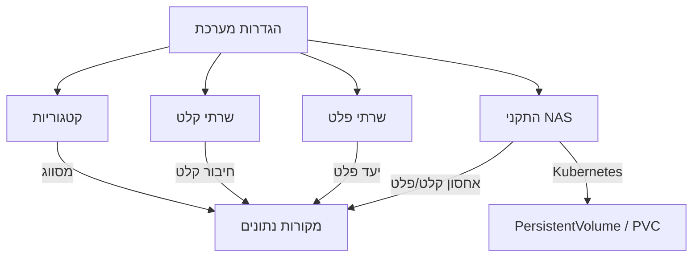

---

## לשונית 1: קטגוריות

קטגוריות עסקיות מסווגות את מקורות הנתונים לפי תחום. כל מקור נתונים חייב להשתייך לקטגוריה.


### טבלת קטגוריות

| עמודה | תיאור |
|--------|--------|
| **שם (עברית)** | שם הקטגוריה בעברית |
| **שם (אנגלית)** | שם הקטגוריה באנגלית |
| **תיאור** | תיאור הקטגוריה |
| **סטטוס** | פעיל / לא פעיל |
| **פעולות** | עריכה, הפעלה/השבתה, מחיקה |

### יצירת קטגוריה חדשה

1. לחץ על **"הוסף קטגוריה"**
2. מלא את הטופס:


| שדה | חובה | תיאור | דוגמה |
|-----|------|--------|--------|
| **שם (עברית)** | כן | שם הקטגוריה בעברית (עד 100 תווים) | מכירות |
| **שם (אנגלית)** | כן | שם הקטגוריה באנגלית (עד 100 תווים) | Sales |
| **תיאור** | לא | הסבר על הקטגוריה (עד 500 תווים) | נתוני מכירות חודשיים |

3. לחץ **"צור"** לשמירה

### עריכה ומחיקה

- **עריכה** -- לחץ על אייקון העריכה; שינוי שם ישפיע על כל מקורות הנתונים המשתמשים בקטגוריה זו
- **הפעלה/השבתה** -- קטגוריה מושבתת נעלמת מרשימות הבחירה אך נשמרת במסד הנתונים
- **מחיקה חכמה:**
  - **קטגוריה לא בשימוש** -- נמחקת לצמיתות
  - **קטגוריה בשימוש** -- מסומנת כלא פעילה (עם הודעה: "בשימוש ב-N מקורות נתונים")

### קטגוריות ברירת מחדל

המערכת מגיעה עם 10 קטגוריות מובנות: מכירות, כספים, משאבי אנוש, מלאי, שירות לקוחות, שיווק, לוגיסטיקה, תפעול, מחקר ופיתוח, רכש.

---

## לשונית 2: שרתי קלט

שרתי קלט מגדירים מהיכן המערכת תאסוף קבצים. ניתן להגדיר שרתים מסוגים שונים ולקשר אותם למקורות נתונים.


### טבלת שרתים

| עמודה | תיאור |
|--------|--------|
| **שם** | שם השרת (עם תגית "לא פעיל" אם מושבת) |
| **סוג** | תגית צבעונית: FTP, SFTP, S3/MinIO, HTTP, NFS, Kafka, Local, Folder |
| **כיוון** | קלט (כחול), פלט (ירוק), דו-כיווני (סגול) |
| **כתובת** | Host:Port (בפונט monospace); עבור Kafka -- Bootstrap Servers |
| **בדיקה אחרונה** | תוצאת בדיקת חיבור אחרונה (ירוק / אדום + תאריך) |
| **פעיל** | מתג הפעלה/השבתה |
| **פעולות** | בדוק חיבור, עריכה, מחיקה |

### הוספת שרת קלט חדש

1. לחץ על **"הוסף שרת"**
2. מלא את הטופס:


#### שדות משותפים לכל הסוגים

| שדה | חובה | תיאור |
|-----|------|--------|
| **שם** | כן | שם מזהה ייחודי (לדוגמה: "שרת FTP ייצור") |
| **תיאור** | לא | הסבר על השרת |
| **סוג שרת** | כן | FTP, SFTP, S3/MinIO, HTTP, NFS, Kafka, Local, Folder |
| **כיוון** | כן | קלט, פלט, או דו-כיווני |

#### שדות לפי סוג שרת

**FTP / SFTP / S3 / HTTP:**

| שדה | חובה | תיאור | דוגמה |
|-----|------|--------|--------|
| **כתובת (Host)** | כן | כתובת IP או hostname | `ftp.example.com` |
| **פורט** | לא | יציאה (ברירת מחדל: FTP=21, SFTP=22, S3=443, HTTP=80) | `22` |
| **Credential Secret** | לא | הפניה ל-Kubernetes Secret (namespace/secret-name) | `ez-platform/ftp-creds` |

**Local / NFS / Folder:**

| שדה | חובה | תיאור | דוגמה |
|-----|------|--------|--------|
| **נתיב בסיס** | כן | נתיב מלא לתיקיית המקור | `/data/input` |

**Kafka:**

| שדה | חובה | תיאור | דוגמה |
|-----|------|--------|--------|
| **Bootstrap Servers** | כן | כתובות שרתי Kafka (מופרדות בפסיקים) | `kafka1:9092,kafka2:9092` |
| **פרוטוקול אבטחה** | לא | PLAINTEXT, SSL, SASL_PLAINTEXT, SASL_SSL | `SASL_SSL` |
| **מנגנון SASL** | לא | PLAIN, SCRAM-SHA-256, SCRAM-SHA-512 | `SCRAM-SHA-256` |
| **Consumer Group** | לא | שם קבוצת הצרכנים | `ez-consumer` |
| **SSL** | לא | הפעלת SSL (מתג) | |

#### הגדרות מתקדמות (כל הסוגים)

| שדה | ברירת מחדל | תיאור |
|-----|------------|--------|
| **Connection Timeout** | 30 שניות | זמן המתנה מקסימלי לחיבור (1-300) |
| **Retry Count** | 3 | מספר ניסיונות חוזרים (0-10) |
| **פעיל** | כן | סטטוס השרת (בעריכה בלבד) |

3. לחץ **"צור"** לשמירה

### בדיקת חיבור

לחיצה על אייקון **"בדוק חיבור"** בעמודת הפעולות תבצע בדיקת נגישות לשרת:
- **הצלחה** -- הודעה ירוקה עם משך הבדיקה (לדוגמה: "חיבור תקין (245ms)")
- **כשלון** -- הודעה אדומה עם פירוט השגיאה

תוצאת הבדיקה נשמרת בשדות "בדיקה אחרונה" ו"תוצאה אחרונה".

---

## לשונית 3: שרתי פלט

שרתי פלט מגדירים לאן המערכת תשלח נתונים מעובדים. מבנה הלשונית זהה לשרתי קלט, עם סינון אוטומטי לשרתים בכיוון "פלט" או "דו-כיווני".


### הבדלים משרתי קלט

- **כיוון ברירת מחדל:** פלט (Output)
- **שימוש:** מוצגים כאפשרות בלשונית "יעדי פלט" בטופס מקור הנתונים
- **סוגי שרתים נפוצים:** Folder, Kafka, NFS, S3

---

## לשונית 4: התקני NAS

התקני NAS/NFS מאפשרים לחבר אחסון רשת כמקור קלט או יעד פלט. המערכת מנהלת אוטומטית את משאבי Kubernetes (PersistentVolume ו-PersistentVolumeClaim) עבור כל התקן.


### טבלת התקני NAS

| עמודה | תיאור |
|--------|--------|
| **שם** | שם ההתקן עם תגיות סטטוס: PVC מחובר (ירוק), PV נוצר (כחול), לא מוקצה (אפור), מחובר (ירוק), לא מחובר (אדום) |
| **כתובת:פורט** | כתובת NFS (פונט monospace) |
| **נתיב Export** | נתיב ב-NAS (פונט monospace) |
| **תפקיד** | קלט (כחול), פלט (ירוק), גיבוי (כתום), דו-כיווני (סגול) |
| **קיבולת** | גודל אחסון (לדוגמה: 10Gi, 1Ti) |
| **סטטוס** | PV/PVC/שגיאות |
| **פעולות** | בדוק חיבור, הקצאה, עריכה, מחיקה |

### הוספת התקן NAS חדש

1. לחץ על **"הוסף התקן NAS"**
2. מלא את הטופס:


#### מידע בסיסי

| שדה | חובה | תיאור | דוגמה |
|-----|------|--------|--------|
| **שם** | כן | שם מזהה ייחודי (עד 100 תווים) | NAS-Prod-01 |
| **תיאור** | לא | הסבר על ההתקן | אחסון קלט ייצור |

#### הגדרות חיבור

| שדה | חובה | תיאור | דוגמה |
|-----|------|--------|--------|
| **כתובת שרת (Host)** | כן | כתובת IP או hostname של שרת NFS | `192.168.1.100` |
| **פורט** | לא | פורט NFS (ברירת מחדל: 2049) | `2049` |
| **נתיב Export** | כן | נתיב Export בשרת NFS | `/data` או `/` |

#### תפקיד

| שדה | חובה | תיאור |
|-----|------|--------|
| **תפקיד** | כן | קלט -- מקור לקריאת קבצים; פלט -- יעד לכתיבת קבצים מעובדים; גיבוי -- אחסון גיבויים; קלט ופלט -- שימוש דו-כיווני |

#### הגדרות אחסון

| שדה | ברירת מחדל | תיאור | דוגמה |
|-----|------------|--------|--------|
| **קיבולת** | 10Gi | גודל האחסון בפורמט Kubernetes | `10Gi`, `1Ti`, `500Gi` |
| **מצב גישה** | ReadWriteMany | RWX (מרובה כותבים), ROX (קריאה בלבד מרובה), RWO (כותב יחיד) | `ReadWriteMany` |
| **מדיניות שחרור** | Retain | Retain (שמור PV), Delete (מחק PV), Recycle (מחזר) | `Retain` |

#### אפשרויות Mount

שדה רב-ערכי עם אפשרויות מוכנות:
- `nfsvers=4` -- גרסת NFS (מומלץ v4)
- `nfsvers=3` -- גרסת NFS ישנה
- `tcp` -- שימוש ב-TCP
- `hard` / `soft` -- mount mode
- `intr` -- ניתן לביטול
- `nolock` -- ללא נעילה
- `rsize=8192` / `wsize=8192` -- גודל buffer

ניתן גם להוסיף אפשרויות מותאמות אישית.

3. לחץ **"צור"** לשמירה

**חשוב:** לאחר יצירת ההתקן, יש ללחוץ **"הקצאה"** כדי ליצור את משאבי Kubernetes (PersistentVolume ו-PersistentVolumeClaim). ללא הקצאה, ההתקן לא יהיה זמין לשימוש במקורות נתונים.

### הקצאה (Provision)

1. לחץ על כפתור **"הקצאה"** בעמודת הפעולות
2. אשר את הפעולה בתיבת אישור: "ליצור PersistentVolume ו-PersistentVolumeClaim עבור שם ההתקן?"
3. המערכת יוצרת אוטומטית PV ו-PVC ב-Kubernetes
4. סטטוס ההתקן מתעדכן ל-"PV נוצר" ו-"PVC מחובר"

אם ההקצאה כבר בוצעה, הכפתור משתנה ל-**"הקצאה מחדש"**.

### בדיקת חיבור NAS

בדיקת חיבור בודקת שני דברים:
- **נגישות רשת** -- האם שרת NFS מגיב
- **בדיקת mount** -- האם ניתן לעלות את הנתיב

תוצאות:
- **ירוק** -- חיבור תקין + mount תקין
- **כחול** -- נגישות רשת בלבד (mount לא נבדק)
- **אדום** -- כשלון עם הודעת שגיאה

### תגיות סטטוס

| תגית | צבע | משמעות |
|-------|------|---------|
| **PVC מחובר** | ירוק | PersistentVolumeClaim מחובר ל-PV |
| **PV נוצר** | כחול | PersistentVolume נוצר ב-Kubernetes |
| **לא מוקצה** | אפור | ההתקן לא הוקצה עדיין |
| **מחובר** | ירוק | בדיקת חיבור NFS הצליחה |
| **לא מחובר** | אדום | בדיקת חיבור NFS נכשלה |

---

## טיפים

- **הגדר קטגוריות לפני מקורות נתונים** -- מקור נתונים חייב להשתייך לקטגוריה, לכן הגדר אותן מראש
- **בדוק חיבור תמיד** -- לאחר הוספת שרת, בצע בדיקת חיבור לפני שמקשר אותו למקור נתונים
- **NAS -- הקצאה חובה** -- אל תשכח ללחוץ "הקצאה" אחרי יצירת התקן NAS
- **NFS v4 מומלץ** -- השתמש ב-`nfsvers=4` ו-`nolock` באפשרויות mount לביצועים מיטביים
- **שרת דו-כיווני** -- אם שרת משמש גם לקלט וגם לפלט, הגדר כיוון "דו-כיווני" כדי שיופיע בשתי הלשוניות

---

# רשומות לא תקינות

## סקירה כללית

דף רשומות לא תקינות מציג את כל הרשומות שנכשלו באימות מול סכמת JSON Schema. עבור כל רשומה, המערכת מציגה את נתוני המקור, השגיאות שהתגלו, והאפשרות לתקן ולשלוח מחדש לעיבוד.

הדף מתעדכן בזמן אמת באמצעות SignalR -- רשומות חדשות מופיעות אוטומטית ללא צורך ברענון.


---

## תרשים זרימת טיפול ברשומות

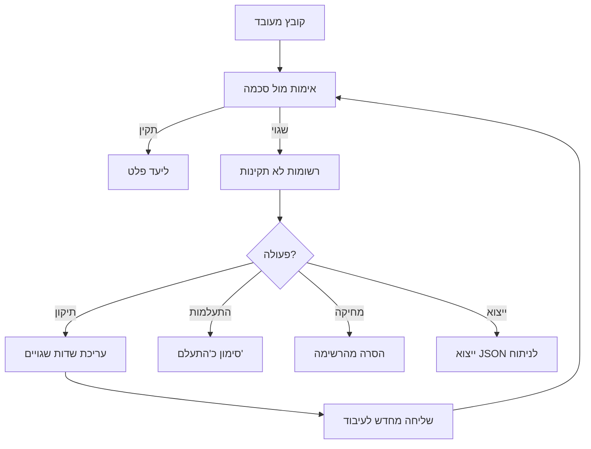

---

## סטטיסטיקות

בחלק העליון של הדף מוצג דשבורד סטטיסטיקות:

| מטריקה | תיאור |
|---------|--------|
| **סך רשומות** | מספר כולל של רשומות לא תקינות |
| **נבדקו** | רשומות שנבדקו ע"י משתמש |
| **הותעלמו** | רשומות שסומנו כ"התעלם" |
| **סוגי שגיאות** | מספר סוגי שגיאות ייחודיים |

כאשר מסנן פעיל, מוצגות גם סטטיסטיקות מסוננות (בגבול כחול) המציגות את המספרים המתאימים למסנן הנוכחי.

---

## סינון וחיפוש


### מסננים זמינים

| מסנן | סוג | תיאור |
|-------|------|--------|
| **קטגוריה** | רשימה נפתחת | סינון לפי קטגוריה עסקית (מסנן מדורג -- משפיע על רשימת מקורות) |
| **מקור נתונים** | רשימה נפתחת עם חיפוש | סינון לפי מקור נתונים ספציפי |
| **סוג שגיאה** | רשימה דינמית | סינון לפי סוג אימות שנכשל (עם מספר מופעים) |
| **טווח זמנים** | בחירה מהירה | כל הזמנים, שעה אחרונה, יום, שבוע, חודש, או מותאם אישית |
| **טווח מותאם אישית** | בורר תאריכים | בחירת טווח תאריכים מדויק (מופיע כשנבחר "מותאם אישית") |

### סוגי שגיאות אימות

| סוג שגיאה | תיאור | צבע |
|-----------|--------|------|
| **minimum** | ערך נמוך מהמינימום | מג'נטה |
| **maximum** | ערך גבוה מהמקסימום | וולקנו |
| **pattern** | לא תואם לתבנית Regex | כחול |
| **enum** | ערך לא ברשימת הערכים המותרים | ציאן |
| **format** | פורמט לא תקין (תאריך, דוא"ל, URI) | כתום |
| **type** | סוג נתון שגוי (מספר במקום מחרוזת) | ירוק |
| **minLength / maxLength** | אורך מחרוזת מחוץ לטווח | סגול |
| **required** | שדה חובה חסר | אדום |
| **properties** | מאפיין לא מוכר בסכמה | ברירת מחדל |

---

## תצוגת רשומות

כל רשומה מוצגת ככרטיס עם:

### מידע בסיסי
- **מקור נתונים** -- שם המקור שממנו הגיעה הרשומה
- **שם קובץ** -- שם הקובץ המקורי
- **מספר שורה** -- מיקום השורה בקובץ (אם רלוונטי)
- **תאריך** -- מתי נוצרה הרשומה

### שגיאות
רשימת כל שגיאות האימות, כל אחת עם:
- **שם שדה** -- השדה שנכשל
- **סוג שגיאה** -- תגית צבעונית (pattern, minimum, enum וכו')
- **הודעת שגיאה** -- הסבר מפורט בעברית

### נתונים מקוריים
תצוגת JSON מתקפלת של הנתונים המקוריים, עם **הדגשה באדום** של שדות שנכשלו באימות.


---

## עריכת ותיקון רשומה

### שלב 1: פתיחת עורך התיקון

לחץ על כפתור **"עבד מחדש"** בכרטיס הרשומה. ייפתח חלון עריכה מפורט.


### שלב 2: סקירת השגיאות

העורך מציג רק את **השדות שנכשלו** באימות, עם מידע מלא על כל שדה:

| רכיב | תיאור |
|-------|--------|
| **ערך מקורי** | הערך שנכשל (בתיבה אפורה) |
| **סוג שגיאה** | תגית עם סוג האימות שנכשל |
| **אילוצי סכמה** | תגיות צבעוניות המציגות את מה שהסכמה דורשת |

### אילוצי סכמה שמוצגים

| סוג | צבע | תיאור | דוגמה |
|------|------|--------|--------|
| **חובה** | אדום | שדה מוגדר כ-required | `required` |
| **ערכים מותרים** | כחול | רשימת enum | `male`, `female`, `other` |
| **תבנית Regex** | סגול | תבנית + דוגמה אוטומטית | `^\d{9}$` -> `123456789` |
| **אורך מינימלי** | ציאן | מינימום תווים | `minLength: 2` |
| **אורך מקסימלי** | כתום | מקסימום תווים | `maxLength: 100` |
| **ערך מינימלי** | ציאן | ערך מספרי מינימלי | `minimum: 0` |
| **ערך מקסימלי** | כתום | ערך מספרי מקסימלי | `maximum: 999999` |
| **פורמט** | מג'נטה | פורמט נדרש + דוגמה | `email` -> `user@example.com` |
| **סוג נתון** | ירוק | סוג הנתון הנדרש | `string`, `number`, `integer` |

### שלב 3: תיקון הערכים

- **שדה עם enum** -- מוצגת רשימה נפתחת עם הערכים המותרים
- **שדה אחר** -- שדה טקסט חופשי
- גבול השדה: **אדום** = שגוי, **ירוק** = תוקן

### שלב 4: תצוגה מקדימה

בצד שמאל של העורך מוצגת תצוגת JSON חיה שמתעדכנת תוך כדי עריכה:
- ערכים מתוקנים מוצגים ב**ירוק** עם הערך המקורי בקו חוצה
- כאשר כל השגיאות תוקנו, מופיע באנר **"כל השגיאות תוקנו"**


### קישור לעריכת סכמה

בחלון התיקון מופיע קישור **"ערוך Schema"** שמנווט ישירות ללשונית הסכמה של מקור הנתונים המתאים. שימושי כאשר אתה מזהה שהבעיה היא בסכמה עצמה ולא בנתונים.


### שלב 5: שליחה מחדש

לחץ **"תקן ושלח לעיבוד מחדש"**. הרשומה נשלחת שוב דרך צינור האימות עם הערכים המתוקנים. אם הרשומה עוברת אימות בהצלחה, היא נמחקת מרשימת הרשומות הלא תקינות ונשלחת ליעד הפלט.

---

## פעולות נוספות

### מחיקה המונית

1. לחץ על כפתור **"מחק הכל"** (עם מספר הרשומות המתאימות למסנן)
2. אשר את הפעולה בתיבת אישור
3. כל הרשומות המתאימות למסנן הנוכחי יימחקו

**זהירות:** מחיקה המונית היא פעולה בלתי הפיכה. ודא שהמסננים נכונים לפני ביצוע.

### ייצוא JSON

1. לחץ על כפתור **"יצא JSON"** (עם מספר הרשומות)
2. המערכת מייצאת את כל הרשומות המתאימות למסנן (לא רק העמוד הנוכחי)
3. הקובץ נשמר כ-`invalid-records-YYYY-MM-DD.json` עם תמיכה ב-UTF-8 עברית

---

## סנכרון בזמן אמת

הדף מתעדכן אוטומטית באמצעות חיבור SignalR WebSocket:
- **רשומה חדשה** -- מופיעה ברשימה ללא צורך ברענון
- **רשומה שתוקנה** -- נעלמת מהרשימה
- **שינוי מקור נתונים** -- סטטיסטיקות מתעדכנות

---

## טיפים

- **סנן לפי סוג שגיאה** -- אם רבות מהשגיאות הן מאותו סוג (למשל pattern), ייתכן שהסכמה דורשת עדכון
- **השתמש בייצוא** -- ייצוא JSON מאפשר ניתוח מתקדם בכלים חיצוניים
- **עדכן סכמה אם צריך** -- אם רשומות תקינות נכשלות שוב ושוב, עדכן את הסכמה ב[הגדרת סכמה](#הגדרת-סכמה-ואימות) במקום לתקן כל רשומה בנפרד
- **בדוק בכמויות קטנות** -- תקן 2-3 רשומות ידנית לפני מחיקה המונית, כדי לוודא שהבעיה מובנת

---

# פתרון בעיות

## תרשים זרימת פתרון בעיות

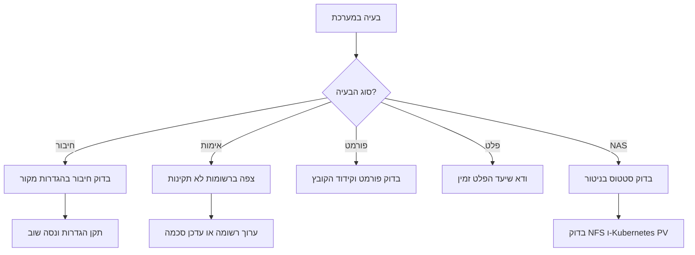

---

## שגיאות נפוצות

### 1. שגיאות חיבור

**תסמינים:**
- "לא ניתן להתחבר למקור הנתונים"
- "Connection refused"
- "Authentication failed"

**פתרון:**
1. בדוק את פרטי החיבור (כתובת, נתיב, אישורים)
2. לחץ "בדוק חיבור" בעריכת מקור נתונים
3. ודא שהשרת זמין ונגיש
4. בדוק חומת אש/הרשאות

### 2. שגיאות אימות

**תסמינים:**
- רשומות מופיעות ב"רשומות לא תקינות"
- הודעה: "Validation failed"

**פתרון:**
1. בדוק את הרשומה ב"רשומות לא תקינות"
2. צפה בשגיאת האימות (איזה שדה כשל)
3. אפשרויות:
   - **ערוך רשומה**: תקן את הערך ושלח מחדש
   - **עדכן סכמה**: אם הנתונים תקינים אך הסכמה מחמירה מדי
   - **התעלם**: סמן כ"התעלם" אם לא רלוונטי

### 3. שגיאות המרת פורמט

**תסמינים:**
- "Failed to parse file"
- "Unsupported format"
- "Encoding error"

**פתרון:**
1. ודא שפורמט הקובץ תואם להגדרה
2. בדוק קידוד (UTF-8 מומלץ)
3. בעיות CSV: בדוק מפריד, escape characters
4. בעיות Excel: ודא שהגליון הראשון מכיל נתונים

### 4. שגיאות פלט

**תסמינים:**
- "Failed to write to destination"
- "Topic not found" (Kafka)
- "Permission denied" (Folder)

**פתרון:**
1. ודא שיעד הפלט זמין
2. בדוק הרשאות כתיבה
3. Kafka: ודא ש-Topic קיים
4. תיקייה: ודא שהנתיב קיים והרשאות נכונות

### 5. שגיאות NAS

**תסמינים:**
- "PersistentVolume not bound"
- "Mount failed"
- "NFS connection refused"

**פתרון:**
1. בדוק את הסטטוס בלשונית "התקני NAS" ב[ניטור](#ניטור-מערכת)
2. ודא ששרת ה-NFS פעיל ונגיש
3. בדוק את כתובת ה-IP והנתיב
4. ודא שיש הרשאות מתאימות ל-export

### 6. שגיאות ייבוא מקובץ

**תסמינים:**
- "ניתוח הקובץ נכשל"
- קובץ לא מזוהה

**פתרון:**
1. ודא שהקובץ בפורמט נתמך (CSV, JSON, XML, Excel, ZIP, TAR.GZ, 7Z, RAR)
2. בדוק שגודל הקובץ אינו עולה על 50MB
3. ארכיון מוצפן -- ודא שהסיסמה נכונה
4. CSV -- ודא שיש עקביות במפרידים בכל השורות

---

## צפייה ברשומות לא תקינות


1. לחץ **"רשומות לא תקינות"** בתפריט
2. רשימת רשומות שנכשלו באימות
3. לכל רשומה:
   - **מקור**: מאיזה מקור נתונים
   - **שגיאה**: מה השגיאה (שדה חסר, ערך לא תקין, וכו')
   - **נתונים**: הנתונים המקוריים
   - **תאריך**: מתי התגלתה השגיאה

**פעולות:**
- **צפה**: הצג פרטים מלאים
- **ערוך**: תקן את הנתונים
- **שלח מחדש**: עבד שוב לאחר תיקון
- **התעלם**: סמן כלא רלוונטי
- **מחק**: הסר מהרשימה

---

## שאלות נפוצות

### כללי

**ש: מה הגודל המקסימלי של קובץ?**
ת: ברירת מחדל 100MB. ניתן להגדיר ערך שונה בהגדרות מקור הנתונים.

**ש: כמה זמן נשמרים קבצים מעובדים?**
ת: לפי תקופת השמירה שהוגדרה (ברירת מחדל: 30 יום).

**ש: האם המערכת תומכת בקבצים דחוסים?**
ת: כן! המערכת תומכת בחילוץ אוטומטי של ארכיונים בפורמטים: ZIP, TAR.GZ, RAR, 7Z.

### מקורות נתונים

**ש: האם ניתן לעבד אותו קובץ פעמיים?**
ת: לא. המערכת משתמשת ב-deduplication כדי למנוע עיבוד כפול. TTL: 15 דקות.

**ש: מה קורה אם מקור הנתונים לא זמין זמנית?**
ת: המערכת תנסה שוב לפי מדיניות retry (3 ניסיונות, delays: 100ms, 500ms, 1s, 2s, 5s).

**ש: האם ניתן לעבד קבצים היסטוריים?**
ת: כן. הנח קבצים בתיקיית המקור והפעל ידנית (כפתור ברק).

### סכמה ואימות

**ש: מה קורה לרשומות שלא עוברות אימות?**
ת: תלוי בהגדרת "פעולה בעת שגיאה" -- המשך עיבוד או הפסקה.

**ש: האם ניתן לשנות סכמה אחרי שנוצרה?**
ת: כן, אבל זה משפיע רק על קבצים עתידיים.

### ארכיונים

**ש: האם אפשר לחלץ רק קבצים מסוימים מארכיון?**
ת: כן. השתמש בתבנית חילוץ (לדוגמה: `*.csv` לחילוץ רק קבצי CSV).

**ש: מה קורה אם הארכיון מוגן בסיסמה?**
ת: הזן את הסיסמה בהגדרות מקור הנתונים. אם הסיסמה שגויה, העיבוד ייכשל.

### NAS/NFS

**ש: האם אפשר להשתמש ב-NAS קיים?**
ת: כן. הוסף את ההתקן בהגדרות מערכת עם כתובת ה-IP והנתיב.

**ש: האם אפשר להשתמש באותו NAS לקלט ופלט?**
ת: כן. בחר "קלט ופלט" בתפקיד ההתקן.

### אימות מחדש (v0.5.0)

**ש: הרשומות לא עברו אימות מחדש לאחר שינוי הסכמה**
ת: ודא שהרשומות אינן מסומנות כ"התעלם" (Ignored). רשומות שסומנו להתעלמות לא נכללות באימות מחדש אוטומטי. בנוסף, ודא שהסכמה באמת השתנתה -- שמירה ללא שינוי לא מפעילה אימות מחדש.

**ש: כפתור "אמת מחדש הכל" לא מופיע בלשונית סכמה**
ת: הכפתור מופיע רק כאשר קיימות רשומות שגויות למקור הנתונים. אם אין רשומות שגויות, אין צורך באימות מחדש והכפתור מוסתר.

**ש: הרשומות עדיין נכשלות לאחר אימות מחדש**
ת: הסכמה החדשה עשויה לא לפתור את כל סוגי השגיאות. לדוגמה, שינוי pattern לא ישפיע על שגיאות מסוג required. בדוק את הודעות השגיאה המעודכנות -- הן משקפות את הסכמה החדשה. ראה [אימות מחדש אוטומטי](#אימות-מחדש-אוטומטי-של-רשומות-שגויות).

**ש: מתי נמחקות רשומות שגויות שפג תוקפן?**
ת: משימת ניקוי רצה יומית בשעה 03:00 UTC. רשומות שעברו את תקופת ה-TTL (ברירת מחדל: 4 ימים, או ערך מותאם למקור) נמחקות לצמיתות. ניתן להגדיר TTL שונה בלשונית "מידע בסיסי" בעריכת מקור נתונים.

### ייבוא ושכפול (v0.4.0)

**ש: איזה פורמטים נתמכים בייבוא מקובץ?**
ת: CSV, JSON, XML, Excel, וארכיונים (ZIP, TAR.GZ, 7Z, RAR). ראה [ייבוא מקובץ](#ייבוא-מקור-נתונים-מקובץ).

**ש: האם שכפול מקור שומר את התזמון?**
ת: התזמון מועתק אך מושבת אוטומטית בעותק החדש. ראה [שכפול מקור](#שכפול-מקור-נתונים).

**ש: למה מחוון השלמות מציג פחות מ-100%?**
ת: מחוון [השלמות](#רשימת-שלמות-מקור-נתונים) כולל גם שדות מומלצים (כתום), לא רק שדות חובה.

---

## טיפים ומומלצות

### בהתחלת השימוש
1. **התחל עם קטגוריות**: הגדר קטגוריות לפני יצירת מקורות נתונים
2. **השתמש בתבניות סכמה**: חוסך זמן ומונע שגיאות
3. **בדוק חיבור**: תמיד בדוק חיבור לפני שמירה
4. **התחל בידני**: צור מקור חדש עם תזמון ידני, בדוק שהכל עובד, ואז הפעל תזמון
5. **התחל קטן**: נסה עם קובץ קטן לפני עיבוד המוני

### מה לא לעשות
- **אל תמחק מקור נתונים פעיל בתזמון** (השבת קודם)
- **אל תשנה סכמה באמצע עיבוד** (המתן לסיום)
- **אל תשכח לבדוק חיבור** אחרי שינוי הגדרות
- **אל תתעלם משגיאות חוזרות** (בדוק logs ותקן בעיה בשורש)
- **אל תגדיר תזמון תכוף מדי** (יעמיס על המערכת ללא צורך)

---

## מילון מונחים

| מונח | הסבר |
|------|-------|
| **מקור נתונים (DataSource)** | הגדרה של מקום לאיסוף קבצים ממנו |
| **סכמה (Schema)** | מבנה הנתונים הצפוי וכללי אימות |
| **אימות (Validation)** | בדיקה שהנתונים תואמים לסכמה |
| **רשומה (Record)** | שורה בקובץ או אובייקט JSON |
| **קטגוריה** | סיווג של מקור נתונים לפי תחום עסקי |
| **תזמון (Schedule)** | מתי המערכת תבדוק קבצים חדשים |
| **יעד פלט (Output Destination)** | לאן לשלוח נתונים מעובדים |
| **שלמות (Completeness)** | אחוז מילוי שדות הטופס |
| **ייבוא מקובץ (Import from File)** | יצירת מקור נתונים אוטומטית מקובץ דוגמה |
| **שכפול (Clone)** | העתקת מקור נתונים קיים עם כל ההגדרות |
| **NAS** | התקן אחסון ברשת (Network Attached Storage) |
| **NFS** | פרוטוקול שיתוף קבצים (Network File System) |
| **PV/PVC** | משאבי אחסון ב-Kubernetes |
| **Pipeline** | שרשרת העיבוד: גילוי - המרה - אימות - פלט |
| **SignalR** | טכנולוגיית WebSocket לעדכונים בזמן אמת |
| **OTEL** | OpenTelemetry - תקן לאיסוף טלמטריה |
| **Cron Expression** | ביטוי לתזמון מתקדם |
| **אימות מחדש (Revalidation)** | בדיקה חוזרת של רשומות שגויות מול סכמה מעודכנת |
| **TTL (Time To Live)** | תקופת שמירה -- כמה זמן לשמור רשומות שגויות לפני מחיקה |
| **גרסת סכמה (SchemaVersion)** | מספר גרסה שעולה אוטומטית בכל שינוי סכמה |

---

## תמיכה ועזרה

**במערכת:**
- עזרת Regex: בעורך סכמה, כלי עזרה לביטויים רגולריים
- תבניות סכמה: דוגמאות מוכנות לשימוש
- הודעות שגיאה: בעברית עם הסבר ברור
- כפתור עזרה: פותח את פורטל התיעוד

**תיעוד:**
- [מדריך מנהל מערכת](/docs/admin)
- [מדריך התקנה](/docs/installation)
- [הערות גרסה](/docs/release-notes)
- [רכיבי ממשק](/docs/components/)
